# CizreApp AdMob Ödülünü Puan Sistemine Dönüştürme Teknik Planı

**Tarih:** 29 Temmuz 2026  
**Durum:** Uygulama öncesi teknik tasarım  
**Kapsam:** SQL migration, Supabase RPC/RLS, Edge Function, Flutter model-servis-UI, dijital sipariş ödeme/iade, geçiş, gözlemlenebilirlik ve testler  
**Kapsam dışı:** Bu belge kod veya migration uygulamaz.

## 1. Karar özeti ve politika sınırı

Bu plan kullanıcı talebindeki belirsizliği güvenli biçimde şu şekilde çözer:

- Reklam izleyerek kazanılan değer **TL bakiye değil, tam sayı puandır**.
- **100 puan, yalnız uygun dijital ürün/hizmet ödemesinde 1 TL indirim değeri** taşır.
- Puanların nakit değeri, nakde çevrilme hakkı veya ödeme vaadi yoktur.
- Puanlar IBAN çekimine, satıcı çekimine, banka transferine, kullanıcılar arası transfere, fiziksel ürün ödemesine, kurye ödemesine veya satıcı hakedişine kaynak olamaz.
- Uygun dijital siparişte ödeme önceliği **önce puan, kalan tutar TL bakiyesi** şeklindedir.
- Puan kullanımı, dijital ürünün sunucu tarafındaki uygunluk işaretine bağlıdır; istemci bu kararı veremez.
- Kullanıcının ifadesi “nakite harcama” anlamına geliyorsa bu özellik plana **bilinçli olarak dahil edilmemiştir**. AdMob ödüllü reklam karşılığının doğrudan veya dolaylı olarak nakit, banka ödemesi ya da transfer edilebilir değer haline getirilmesi politika ve kötüye kullanım riski doğurur. Bu nedenle ürün vaadi ve teknik değişmez, yalnız uygulama içi uygun dijital tüketimdir.

> Ürün metinlerinde “para kazan”, “TL kazan”, “çekilebilir”, “nakit değer”, “kazananlar” ve benzeri ifadeler kaldırılmalıdır. “Puan kazan” ve “uygun dijital ürünlerde kullan” ifadeleri kullanılmalıdır.

## 2. İncelenen mevcut durum

### 2.1 Reklam ayarları ve ödül kaydı

- İlk şema, reklam ödülünü TL cinsinden tanımlıyor; ayarlarda ödül tutarı ve günlük TL bütçesi, izleme kaydında TL ödülü ve bakiye işlemine bağ bulunmaktadır: [`20260715000006_ad_reward_system.sql`](../supabase/migrations/20260715000006_ad_reward_system.sql:9).
- Rastgele min/max TL aralığı sonradan eklenmiştir: [`20260715000007_ad_reward_random_range.sql`](../supabase/migrations/20260715000007_ad_reward_random_range.sql:9).
- Kart açıklaması admin tarafından değiştirilebilir durumdadır: [`20260715000008_ad_settings_card_description.sql`](../supabase/migrations/20260715000008_ad_settings_card_description.sql:1).
- Mevcut atomik ödül RPC’si kullanıcı bazlı advisory lock alıyor, limitleri değerlendiriyor, TL bakiyeyi artırıyor, bakiye işlem kaydı ve reklam izleme kaydı oluşturuyor: [`grant_ad_reward()`](../supabase/migrations/20260720000003_grant_ad_reward_atomic_rpc.sql:10).
- RPC yalnız servis rolüne açık olacak şekilde sınırlandırılmıştır: [`grant_ad_reward()`](../supabase/migrations/20260720000003_grant_ad_reward_atomic_rpc.sql:142).
- Edge Function JWT ile kullanıcıyı doğruluyor fakat istemcinin bildirdiği izlenme süresini ve SDK callback’ini temel alıyor; gerçek SSV doğrulaması yoktur: [`grant-ad-reward`](../supabase/functions/grant-ad-reward/index.ts:21).
- Başarı yanıtı hâlen ödül tutarı ve yeni TL bakiye döndürüyor: [`grant-ad-reward`](../supabase/functions/grant-ad-reward/index.ts:72).

### 2.2 TL bakiye ve çekim yüzeyi

- TL cüzdanı; kullanıcı bakiyesi, toplam kazanılan/harcanan/iade/çekilen alanları ve para işlem defteri üzerinden yürür: [`20260621_CREATE_BALANCE_SYSTEM.sql`](../supabase/migrations/20260621_CREATE_BALANCE_SYSTEM.sql:10).
- Bakiye düşme işlemi atomik RPC ile yapılmaktadır; son izin sertleştirmesi istemci kullanımını belirli bağlama sınırlar: [`deduct_from_balance()`](../supabase/migrations/20260727000008_harden_balance_rpc_permissions.sql:42).
- Bakiye tablolarına istemci yazma politikaları sonradan servis rolüne daraltılmıştır: [`20260715000001_restrict_balance_rls_to_service_role.sql`](../supabase/migrations/20260715000001_restrict_balance_rls_to_service_role.sql:7).
- Kullanıcı çekim ekranı TL tutarı ve IBAN alır: [`withdrawal_request_screen.dart`](../lib/features/wallet/screens/withdrawal_request_screen.dart:85).
- Çekim Edge Function’ı esas olarak satıcı kazançlarını sorgular; mevcut hesaplama ile oluşturma arasında tek DB transaction ve satır kilidi bulunmaması ayrıca yarış koşulu riskidir: [`request-withdrawal`](../supabase/functions/request-withdrawal/index.ts:90).
- Puan mimarisi TL bakiyeye hiç yazmayacağı için puanın çekime sızması tasarım gereği engellenir; yine de çekim tarafında savunma amaçlı negatif kabul testleri zorunludur.

### 2.3 Dijital ürün ve ödeme/iade akışı

- Dijital sipariş bağımsız tabloda tutuluyor ve oluşturma RPC’si ürün doğrulama, TL bakiye düşme ve sipariş eklemeyi tek transaction içinde yapıyor: [`create_digital_order()`](../supabase/migrations/20260715000004_digital_max_orders_per_user.sql:8).
- Edge Function sipariş RPC’sini çağırdıktan sonra harici sağlayıcıya gider: [`smm-order-create`](../supabase/functions/smm-order-create/index.ts:61).
- Sağlayıcı hatasında mevcut iade yalnız TL bakiyeye tam tutar eklemektedir: [`refundAndFail()`](../supabase/functions/smm-order-create/index.ts:172).
- Proje hafızası; iptal, kısmi teslim ve başarısızlıkta iade ile satıcı kredilendirmesini Edge Function seviyesinde tarif eder: [`PROJE_HAVIZA_FUNCTIONS.md`](../PROJE_HAVIZA_FUNCTIONS.md:47).
- Bu yapı karma puan/TL ödeme için yetersizdir; siparişin hangi kaynaktan ne kadar ödendiğinin değişmez snapshot’ı yoktur ve mevcut iade puan kaynağını koruyamaz.

### 2.4 Flutter ve admin yüzeyi

- Ayar modeli TL min/max ve günlük TL bütçesi taşır: [`AdSettings`](../lib/core/models/ad_settings_model.dart:1).
- Reklam servisi istemci callback’inden sonra ödül talep eder ve sonuçta yeni TL bakiye bekler: [`RewardedAdService.showAndClaim()`](../lib/core/services/rewarded_ad_service.dart:80).
- Cüzdan kartı TL kazanç metni gösterir ve TL bakiye yenilemesini tetikler: [`WatchAdEarnCard`](../lib/features/wallet/widgets/watch_ad_earn_card.dart:7).
- Admin ekranı TL ödül aralığı, TL günlük tavan ve “kazananlar” listesi sunar: [`AdminAdSettingsScreen`](../lib/features/admin/screens/ad_settings_screen.dart:361).
- Admin ekranı SSV’yi gelecekte yapılabilecek seçenek gibi göstermektedir; hedef sistemde SSV üretim açılışının zorunlu kapısı olmalıdır: [`AdminAdSettingsScreen`](../lib/features/admin/screens/ad_settings_screen.dart:500).

### 2.5 Test ve proje hafızası

- Kritik güvenlik testi reklam izleme tablosu RLS’sini ve ödül RPC’sinin istemci rollerine kapalı olmasını kontrol eder: [`001_critical_security_invariants.test.sql`](../supabase/tests/database/001_critical_security_invariants.test.sql:63).
- Ayar modeli için mevcut birim testleri vardır ve alan dönüşümü nedeniyle güncellenmelidir: [`ad_settings_model_test.dart`](../test/models/ad_settings_model_test.dart:4).
- Dijital sipariş model testleri yeni ödeme bileşenlerini kapsayacak şekilde genişletilmelidir: [`digital_order_model_test.dart`](../test/models/digital_order_model_test.dart:6).
- Şema hafızası hâlen reklam ödülünü TL ve bakiye işlemi olarak tanımlar: [`PROJE_HAVIZA_SCHEMA.md`](../PROJE_HAVIZA_SCHEMA.md:70).
- RPC hafızası mevcut para mutasyon güvenlik modelini açıklar fakat reklam puanı ve karma ödeme RPC’lerini içermemektedir: [`PROJE_HAVIZA_RPCS.md`](../PROJE_HAVIZA_RPCS.md:40).

## 3. Mevcut risk analizi

| Risk | Mevcut bulgu | Hedef kontrol |
|---|---|---|
| Politika ihlali | Reklam ödülü doğrudan çekilebilir/harcanabilir TL bakiyeye yazılıyor | Puan ledger’ı TL tablolarından fiziksel ve yetkisel olarak ayrılır |
| Sahte ödül | İstemci SDK callback’i ve istemcinin gönderdiği süre ödül için yeterli | Google SSV imzası, zaman damgası ve tekil işlem kimliği doğrulanmadan kredi yok |
| Tekrar oynatma | SSV işlem kimliği veya istemci talep kimliği için unique anahtar yok | Sağlayıcı işlem kimliği ve idempotency anahtarına unique constraint |
| Ledger değiştirilebilirliği | Reklam kaydı ile bakiye işlem kaydı ayrı anlam katmanlarında | Append-only puan ledger; UPDATE/DELETE tüm uygulama rollerine kapalı |
| Günlük bütçe yarışı | Kullanıcı kilidi platform genelindeki toplam bütçe yarışını tam seri hale getirmez | Günlük bütçe bucket satırını kilitle veya atomik sayaç kullan |
| Kimlik sahteciliği | SECURITY DEFINER RPC parametre olarak kullanıcı kimliği alıyor | İç RPC sadece servis rolü; kullanıcı kimliği doğrulanmış SSV custom data veya auth bağından türetilir |
| Arama yolu/gölgeleme | Arama yolu yalnız public | Boş/güvenli arama yolu ve şema nitelikli nesne adları |
| Karma ödeme iadesi | Mevcut iade toplamı bütünüyle TL’ye ekler | Ödeme kaynak snapshot’ına göre puan puana, TL TL’ye iade edilir |
| Kısmi iade yuvarlama | 100 puan = 1 TL nedeniyle kuruş/puan bölüşümü belirsiz | Oransal iade, floor ve son iade kalanı kuralları deterministik olur |
| Çekime sızma | Reklam TL’si normal bakiye ile birleşiyor | Eski kaynak ayrıştırılır; yeni puan hiçbir TL toplamında yer almaz |
| Transfer edilebilirlik | Gelecekte genel transfer RPC’si puanı yanlışlıkla kapsayabilir | Puan için transfer RPC/policy yok; kaynak ve hedef kullanıcı aynı değişmezi |
| Admin kötüye kullanımı | Admin ayar ekranı doğrudan tablo update ediyor | Ayar güncellemesi doğrulamalı admin RPC üzerinden, audit kaydıyla yapılır |
| Veri minimizasyonu | Ham IP ve kalıcı cihaz kimliği tutuluyor | Tuzlu hash, sınırlı saklama, açık gizlilik metni ve erişim kısıtı |
| Harici sağlayıcı belirsizliği | DB transaction harici API çağrısını kapsamaz | Sipariş state machine, idempotent finalize/refund ve mutabakat işi |

## 4. Hedef mimari

```mermaid
flowchart LR
  A[Flutter ödüllü reklam] --> B[Google AdMob]
  B --> C[Google SSV callback]
  C --> D[SSV doğrulama Edge Function]
  D --> E[İmza ve replay doğrulama]
  E --> F[Puan kazanma RPC]
  F --> G[Append only puan ledger]
  G --> H[Kullanıcı puan bakiyesi projection]
  H --> I[Uygun dijital sipariş RPC]
  J[TL kullanıcı bakiyesi] --> I
  I --> K[Ödeme kaynak snapshotlı dijital sipariş]
  K --> L[Harici dijital sağlayıcı]
  L --> M[Kaynağına göre puan ve TL iadesi]
  N[IBAN çekim akışı] --> J
  G -. hiçbir bağlantı yok .-> N
```

### 4.1 Güven sınırları

1. Flutter sadece reklamı gösterir, SSV için opaque custom data üretme oturumunu başlatır ve sonucu sorgular; kredi verme yetkisi yoktur.
2. Google SSV callback’i imzası doğrulanmış kanıttır; kullanıcı cihazından gelen “izledim” beyanı kanıt değildir.
3. Edge Function ağ protokolü, Google anahtar cache’i ve callback doğrulamasından sorumludur; mali mutasyon tek DB transaction içindeki servis-rolü RPC’sindedir.
4. Puan bakiyesi gerçeğin kaynağı değildir; ledger toplamının hızlı projection’ıdır. Mutabakat ledger toplamına göre yapılır.
5. Dijital sipariş RPC’si uygunluk, fiyat, puan oranı, puan limiti, ödeme sırası ve iki hesabın kilidini tek transaction içinde yönetir.
6. Çekim sistemi yalnız TL kaynaklarını görür; puan tablolarına FK, view, union veya dönüşüm RPC’si bulunmaz.

## 5. Veri modeli ve puan ledger tasarımı

Yeni migration, uygulama anındaki bir sonraki kronolojik migration adıyla oluşturulmalıdır; örnek hedef yol [`supabase/migrations`](../supabase/migrations/) altındadır. Tarih/sıra çakışması kontrol edilmeden sabit dosya adı seçilmemelidir.

### 5.1 Puan hesap tablosu

Önerilen **user_point_accounts** tablosu:

| Alan | Tip/constraint | Amaç |
|---|---|---|
| user_id | UUID PK, profiles FK | Kullanıcı başına tek hesap |
| balance_points | BIGINT, sıfır veya pozitif | Hızlı mevcut bakiye projection’ı |
| lifetime_earned_points | BIGINT, sıfır veya pozitif | Toplam kazanım |
| lifetime_spent_points | BIGINT, sıfır veya pozitif | Toplam harcama |
| lifetime_refunded_points | BIGINT, sıfır veya pozitif | Toplam iade |
| version | BIGINT | Optimistic gözlem/mutabakat sürümü |
| created_at, updated_at | zaman damgası | Audit |

Kurallar:

- Tam sayı puan kullanılır; kayan nokta kullanılmaz.
- Bakiye hiçbir transaction sonunda negatif olamaz.
- Hesap satırı ilk kredi/ödeme sırasında güvenli upsert ile oluşturulur ve ardından satır kilitlenir.
- Kullanıcı SELECT yapabilir; INSERT/UPDATE/DELETE yalnız iç SECURITY DEFINER fonksiyonlarının sahibi tarafından yapılır.

### 5.2 Append-only puan ledger

Önerilen **point_ledger_entries** tablosu:

| Alan | Tip/constraint | Amaç |
|---|---|---|
| id | UUID PK | Ledger kayıt kimliği |
| user_id | UUID, index | Sahip |
| entry_type | enum/check | ad_reward_credit, digital_order_debit, digital_order_refund, migration_credit, admin_correction_credit, admin_correction_debit, expiry_debit rezervi |
| direction | credit/debit | İşaret semantiği |
| points | BIGINT ve pozitif | Mutlak miktar |
| balance_before_points | BIGINT | Değişmez önceki snapshot |
| balance_after_points | BIGINT | Değişmez sonraki snapshot |
| reference_type | sınırlı metin/enum | ad_reward_view, digital_order, migration_batch, admin_case |
| reference_id | UUID | Kaynak kayıt |
| idempotency_key | TEXT unique | Tekrar çağrı güvenliği |
| reversal_of_entry_id | self FK, unique gerektiğinde | İade/ters kayıt bağı |
| metadata | JSONB boyut sınırlı | SSV kimliği, oran sürümü, gerekçe; sır/seçilebilir PII yok |
| created_at | zaman damgası | Oluşturulma |

Değişmezler:

- UPDATE ve DELETE yetkisi uygulama rollerinden ve servis rolüyle doğrudan PostgREST kullanımından kaldırılır; düzeltme yeni ters kayıtla yapılır.
- Aynı referans için iş kuralına uygun partial unique index’ler tanımlanır. Örneğin bir doğrulanmış reklam olayı yalnız bir kredi; bir sipariş için debit seti yalnız bir kez; her iade olayı yalnız bir kez.
- Entry yönü ile önce/sonra hesabı check constraint veya trigger ile doğrulanır.
- Ledger entry ile hesap projection güncellemesi aynı transaction’da gerçekleşir.
- Doğrudan tablo yazımı yerine yalnız dar kapsamlı iç fonksiyonlar kullanılır.

### 5.3 Reklam görüntüleme/SSV olayı

Mevcut **ad_reward_views** tablosu korunarak mali bağlantısı değiştirilir:

- Yeni tam sayı **reward_points** alanı eklenir.
- Yeni **point_ledger_entry_id** FK eklenir.
- Eski **reward_amount** ve **balance_transaction_id** salt geçmiş/migrasyon denetimi için geçici olarak tutulur; yeni kayıtlar için boş/0 olma constraint’i rollout sonunda etkinleştirilir.
- Durumlar; initiated, pending_ssv, verified, credited, blocked, rejected, duplicate biçiminde açık state machine’e dönüştürülür.
- SSV için ad_network, ad_unit_id, custom_data_nonce_hash, provider_transaction_id, provider_user_id_hash, signature_key_id, callback_timestamp, verified_at ve verification_error_code alanları eklenir.
- provider_transaction_id üzerinde AdMob ağı kapsamlı unique constraint bulunur.
- Cihaz/IP ham değerleri yerine sunucu secret ile HMAC hash tercih edilir; gerekiyorsa güvenlik incelemesi için ham veriye kısa TTL uygulanır.

### 5.4 Ayarlar ve sürümlü oran

**ad_settings** alan dönüşümü:

- reward_min_try → reward_min_points
- reward_max_try → reward_max_points
- max_daily_payout_try → max_daily_reward_points
- points_per_try alanı **100** varsayılan ve pozitif tam sayı olarak eklenir.
- reward_policy_version eklenir; puan oranı veya dağılım değiştiğinde artırılır.
- ssv_required, ssv_enabled, reward_feature_mode, point_spend_enabled ve migration_cutover_at feature flag’leri eklenir.
- Eski TL alanları önce deprecated olur; dual-read süresi bitince ayrı cleanup migration ile kaldırılır.

Önemli karar: 100 puan = 1 TL, bir **uygulama içi indirim hesap oranıdır**; kullanıcıya nakit kur veya geri alım garantisi olarak sunulmaz. Sipariş snapshot’ında kullanılan oran saklanır; sonraki admin değişikliği eski sipariş/iade hesabını etkilemez.

### 5.5 Dijital ürün ve sipariş snapshot’ı

**products** tablosuna sunucu tarafından yönetilen **is_points_eligible** alanı eklenir; varsayılan false ile güvenli açılış yapılır. İsteğe bağlı **max_points_coverage_percent** alanı geleceğe dönük eklenebilir ancak ilk sürümde uygun ürünler için yüzde 100’e kadar puan kullanımına izin verilir.

**digital_orders** tablosuna:

- gross_total_try
- points_spent
- points_per_try_snapshot
- points_discount_try
- cash_balance_paid_try
- point_debit_entry_id
- cash_balance_transaction_id mevcut alanının açık anlamı
- payment_composition_version
- refund_points_total
- refund_cash_total_try

alanları eklenir. Constraint toplamı şu şekilde doğrular: brüt tutar = puan indirimi + TL bakiye ödemesi; kuruş yuvarlama farkı sıfır olmalıdır.

## 6. Reklam puanı kazanma ve SSV tasarımı

### 6.1 İki aşamalı akış

1. Flutter, kimliği doğrulanmış **reward session oluşturma** endpoint’ini çağırır.
2. Endpoint tek kullanımlık nonce üretir; kullanıcı kimliği doğrudan açığa çıkmayacak imzalı/opaque custom data döndürür ve pending kayıt açar.
3. Flutter bu custom data’yı Google Mobile Ads SDK reklam nesnesine bağlar ve reklamı gösterir.
4. SDK’nın kullanıcı ödülü callback’i yalnız UI’da “doğrulama bekleniyor” durumuna geçmek için kullanılır; puan vermez.
5. Google SSV callback’i ayrı public HTTP endpoint’ine gelir.
6. Endpoint ham query string üzerinde imzayı Google’ın yayınlanan public key’iyle doğrular; key id, timestamp toleransı, ad network/unit allowlist, custom data nonce ve provider transaction id kontrol edilir.
7. Doğrulanmış olay servis-rolüyle iç puan kredi RPC’sine gönderilir.
8. RPC idempotency kontrolü, limitler, platform bütçesi, hesap kilidi, ledger insert, hesap projection update ve reklam kaydı finalize işlemlerini tek transaction’da yapar.
9. Flutter polling/realtime ile sonuç durumunu alır; yalnız credited olduğunda yeni puan bakiyesini gösterir.

### 6.2 SSV güvenlik kontrolleri

- İmza doğrulaması yapılmadan DB mutasyonu yoktur.
- Google public key’leri kontrollü TTL ile cache’lenir; bilinmeyen key id durumunda bir kez yenilenir, doğrulama başarısızsa fail-closed davranılır.
- Callback timestamp için makul replay penceresi uygulanır; sağlayıcı transaction kimliği yine de nihai idempotency anahtarıdır.
- Custom data imzalı ve süreli olmalı; kullanıcı kimliği, nonce, session kimliği ve sürüm içermeli, kullanıcı tarafından üretilememelidir.
- Ad unit id ortam/platform allowlist’inde değilse kredi verilmez.
- Test reklamı ile üretim puanı ayrılır; test modunda ya hiç kredi verilmez ya yalnız işaretli test kullanıcısına sıfır ekonomik etkili sandbox ledger yazılır.
- Callback yanıtı tekrar denemeye uygun olmalıdır: doğrulanmış duplicate için başarı döndürülür ve ikinci kredi oluşturulmaz; geçici DB hatasında 5xx ile Google retry’sine izin verilir.
- İstemciye SSV secret veya servis rolü anahtarı verilmez.

### 6.3 Puan kazanma RPC transaction sırası

İç **grant_verified_ad_points** RPC’si için sıra:

1. Fonksiyon çağrısının yalnız servis rolüne açık olduğunu doğrula; PUBLIC, anon ve authenticated EXECUTE izinlerini açıkça kaldır.
2. Girdileri ve SSV doğrulama kanıtı durumunu doğrula.
3. provider transaction id üzerinden mevcut sonucu kontrol et; varsa aynı sonucu dön.
4. Kullanıcı bazlı advisory lock al.
5. Günlük platform bütçe satırını FOR UPDATE kilitle; kullanıcı/saat/gün/cihaz risk limitlerini DB zamanı ile değerlendir.
6. Ayar snapshot’ından kriptografik olmayan fakat sunucu tarafı güvenli rastgele tam sayı puanı hesapla. “Şans” dili ürün/politika incelemesinden geçirilmelidir; gerekirse sabit ödüle geçilebilir.
7. Kullanıcı puan hesabını upsert et ve FOR UPDATE kilitle.
8. Reklam olayını credited durumuna geçir veya doğrulanmış olay kaydını ekle.
9. Unique idempotency anahtarlı credit ledger entry ekle.
10. Puan hesabı projection ve günlük bütçe sayacını güncelle.
11. Ledger FK’sini reklam olayına bağla ve yeni puan bakiyesini dön.

Herhangi bir hata tüm adımları rollback etmelidir.

## 7. Dijital ürün puan harcama transaction tasarımı

Mevcut [`create_digital_order()`](../supabase/migrations/20260715000004_digital_max_orders_per_user.sql:8) yeni imzaya veya tercihen yeni sürümlü RPC’ye taşınmalıdır. Eski RPC, feature flag geçişi tamamlanınca çağrıya kapatılmalıdır.

### 7.1 Girdi ve kimlik

- Kullanıcı kimliği Edge Function’da doğrulanmış JWT’den alınır; istemcinin user_id alanına güvenilmez.
- Girdiler: ürün, hedef, miktar, idempotency key ve puan kullanım tercihi. İlk ürün kararı gereği puan kullanımı varsayılan açıktır ve önce puan uygulanır.
- İstemci fiyat, oran, uygunluk, puan bakiyesi veya TL bölüşümü gönderemez.

### 7.2 Kilit ve hesaplama sırası

1. Sipariş idempotency anahtarını kontrol et; tamamlanmış aynı istek varsa aynı sonucu dön.
2. Ürün satırını FOR SHARE/UPDATE ile okuyup aktiflik, dijital tür, limit ve puan uygunluğunu doğrula.
3. Fiyatı DB’de hesapla ve iki ondalığa deterministik yuvarla.
4. Kullanıcı puan hesabı ve TL bakiye hesabını **her yerde aynı kilit sırasıyla** kilitle: önce puan hesabı, sonra TL hesabı. Böylece deadlock riski azaltılır.
5. Kullanılabilir puan değeri = floor brüt kuruş karşılığını aşmayacak en yüksek puan. 100 puan = 1 TL olduğundan 1 puan = 1 kuruş; ilk sürümde dönüşüm tamdır.
6. Kullanılacak puan = min kullanılabilir puan, sipariş brüt tutarının kuruş karşılığı. Önce puan uygulanır.
7. Kalan TL = brüt TL - puan indirimi. Kalan TL sıfırdan büyükse TL bakiyenin yeterli olduğunu doğrula.
8. Puan debit ledger entry’sini ekle ve projection’ı azalt.
9. Kalan TL için sunucu içi, kullanıcıdan doğrudan çağrılamayan bakiye debit primitive’i kullan; genel authenticated RPC’yi içeriden parametre sahteciliğine açık biçimde reuse etme.
10. Dijital siparişi ödeme kaynak snapshot’ıyla ekle.
11. Tüm kimlikleri ve bakiye sonrası değerleri dön.

Puan yetersiz fakat puan + TL yeterliyse karma ödeme başarılıdır. Toplam kaynak yetersizse hiçbir ledger, bakiye işlemi veya sipariş kaydı kalmadan rollback olur.

### 7.3 Harici sağlayıcı ve sipariş state machine

DB transaction harici API’yi kapsayamaz. Bu nedenle:

- DB transaction sonunda sipariş payment_reserved/pending_provider durumundadır.
- Edge Function sağlayıcıya sipariş idempotency anahtarıyla gider.
- Başarıda provider kimliği yazılarak in_progress durumuna geçilir.
- Kesin başarısızlıkta tek bir **refund_digital_order_payment** RPC’si çağrılır.
- Timeout/belirsiz sonuçta hemen iade etmek yerine reconciliation_pending durumu kullanılır; önce sağlayıcıda sipariş varlığı sorgulanır. Aksi halde hem hizmet hem iade verme riski oluşur.

## 8. İade ve kısmi iade kuralları

### 8.1 Kaynağına iade

- Puanla ödenen bölüm yalnız puan olarak iade edilir.
- TL bakiye ile ödenen bölüm yalnız TL bakiyeye iade edilir.
- Puan iadesi hiçbir zaman TL’ye dönüşmez.
- İade, sipariş oluşturulurken kaydedilen 100 puan/1 TL snapshot’ına göre yapılır; güncel admin ayarı kullanılmaz.
- Tam iade iki kaynak için tek DB transaction içinde yapılır.
- Her iade nedeni/olayı idempotency key taşır; tekrar callback ikinci iade yaratmaz.

### 8.2 Kısmi iade algoritması

Teslim edilmeyen oran için:

1. Toplam iade edilecek kuruş değeri deterministik hesaplanır.
2. Önce orijinal puan katkısından, en fazla orijinal puan harcaması kadar puan iade edilir.
3. Kalan kuruş orijinal TL katkısından, en fazla orijinal TL ödemesi kadar TL iade edilir.
4. Ara kısmi iadelerde aşağı yuvarlama uygulanır; sipariş kapanışındaki son iade kalan hakkı tam kapatır.
5. Kümülatif refund_points_total ve refund_cash_total_try hiçbir zaman orijinal kaynak tutarlarını aşamaz.

Bu “puan önce ödeme, puan önce iade” yaklaşımı kullanıcı lehine ve kaynak izleme açısından deterministiktir. Satıcı hakedişi brüt teslim edilen gerçek TL fiyatı üzerinden hesaplanır; reklam puanı satıcıya puan olarak aktarılmaz ve satıcı gelirini azaltan ayrı bir para türü gibi ele alınmaz. Platform puan indirimini promosyon maliyeti olarak muhasebeleştirir.

## 9. TL bakiyeden ve çekimden kesin izolasyon

### 9.1 Şema izolasyonu

- Puan alanı **user_balances** veya **balance_transactions** içine eklenmez.
- Puan ledger’ı ile **seller_withdrawals**, IBAN, banka hesapları ve transfer tabloları arasında FK bulunmaz.
- Genel bakiye toplamı, admin TL raporları ve çekilebilir tutar view’ları puan tablolarını join/union etmez.
- Puan indirimi **balance_transactions** içinde gelir/topup/ad_reward olarak yazılmaz; yalnız sipariş ödeme snapshot’ında indirim bileşenidir.
- Eski ad_reward enum değeri geçmiş denetim için tutulur fakat yeni insert yasaklanır.

### 9.2 Uygulama izolasyonu

- Cüzdan ekranı TL bakiye ile puanı iki ayrı kart/başlıkta gösterir.
- Çekim ekranı yalnız TL çekilebilir tutarı gösterir ve puan hakkında “çekilemez” açıklaması sunar; puan değeri çekilebilir toplam yanında toplanmaz.
- Kullanıcılar arası transfer özelliği oluşursa puan tipi API sözleşmesinde hiç desteklenmez.
- Fiziksel checkout ve kurye ödeme akışları puan servisini çağırmaz.

### 9.3 Savunma testleri

- Reklam ödülünden sonra TL bakiyesi ve toplam kazanılan TL değişmemeli.
- Puan kredisi sonrası çekilebilir tutar değişmemeli.
- Puanı TL ekleme, çekim, transfer veya fiziksel sipariş RPC’sine reference olarak verme reddedilmeli.
- Admin manuel TL düzeltmesi puanı; admin puan düzeltmesi TL’yi etkilememeli.

## 10. Eski reklam ödüllerinin migrasyonu ve mutabakat

Mevcut sistem reklam ödülünü zaten TL bakiyeye eklediği için “eski ad_reward bakiyesi” kullanıcı bazında fungible TL içinde erimiştir. Geçmiş ödülleri körlemesine puana kopyalamak **çift değer yaratır**; TL’den düşmek ise kullanıcının harcamış olabileceği tutarda negatif bakiye veya hak kaybı yaratabilir.

### 10.1 Güvenli varsayılan strateji

1. Cutover anında yeni TL reklam kredilerini kapat.
2. Geçmiş başarılı reklam kayıtları ile ad_reward bakiye işlemlerini kullanıcı/tutar/referans bazında mutabık hale getir.
3. Geçmişte TL’ye geçirilmiş ve kullanıcıya verilmiş ödülleri **grandfathered TL** olarak bırak; yeniden puan kredisi oluşturma.
4. Eski ad_reward kayıtlarını immutable audit geçmişi olarak işaretle; yeni sistem metriğine dahil etme.
5. Cutover sonrası oluşmuş olabilecek geç TL reklam işlemlerini ayrı exception raporuna al ve otomatik değil, onaylı batch ile düzelt.

Bu yaklaşım politika riskini ileriye dönük derhal keser; geçmiş değeri çiftlemez ve kullanıcı TL bakiyesinden geriye dönük zorla düşüm yapmaz.

### 10.2 Alternatif yalnız kontrollü dönüşüm

Hukuk/politika kararı geçmiş TL reklam kısmının da dönüştürülmesini zorunlu kılarsa:

- Kullanıcı bazında net reklam katkısı için doğrudan kanıt olmadığından genel bakiyeden tahmini düşüm yapılmaz.
- Yalnız hiç harcanmamış olduğu kesin kanıtlanabilen, ayrıştırılmış/locked kaynak varsa birebir 1 kuruş = 1 puan çevrilebilir.
- Her dönüşüm için aynı transaction’da TL ters kayıt + migration_credit puan ledger kaydı ve ortak migration idempotency key gerekir.
- Bakiye negatifleşemez; belirsiz satırlar manuel inceleme kuyruğuna gider.

### 10.3 Mutabakat sorgu çıktıları

Migration uygulamasından önce ve sonra salt-okunur rapor üretilir:

- Başarılı reklam görüntüleme sayısı ve toplam reward_amount.
- Bağlı/bağsız balance transaction sayısı.
- Duplicate, null FK, tutar uyuşmazlığı ve kullanıcı uyuşmazlığı.
- Cutover sonrası eski tip transaction sayısı; hedef sıfır.
- Puan ledger toplam kredileri eksi debitleri artı iadeleri ile hesap projection farkı; hedef sıfır.
- Dijital siparişlerde brüt = puan indirimi + TL ödeme farkı; hedef sıfır.

Migration batch tablosunda çalışma kimliği, başlangıç/bitiş, satır sayıları, toplamlar, checksum, dry-run/onaylayan ve hata özeti saklanmalıdır.

## 11. RLS, GRANT ve SECURITY DEFINER güvenliği

### 11.1 RLS matrisi

| Nesne | Kullanıcı | Admin | Servis rolü / iç fonksiyon |
|---|---|---|---|
| user_point_accounts | Yalnız kendi satırını SELECT | Denetim view/RPC ile SELECT | Mutasyon yalnız dar RPC |
| point_ledger_entries | Yalnız kendi güvenli kolonlarını SELECT | Maskeli audit RPC/view | Append yalnız dar RPC; UPDATE/DELETE yok |
| ad_reward_views | Kendi durum/puan/geçmişini SELECT, ham risk alanları yok | Risk yetkili audit görünümü | State transition RPC |
| ad_settings | Güvenli public config view | Doğrulamalı admin update RPC | İç okuma |
| digital_orders | Kendi siparişi SELECT | Rol kontrollü yönetim | Mutasyon RPC/Edge Function |

Ham IP/device hash, SSV imza materyali, hata ayrıntıları ve admin metadata kullanıcı SELECT yüzeyinden ayrı tutulmalıdır. Gerekirse public tablo yerine güvenli view/RPC kullanılmalıdır.

### 11.2 SECURITY DEFINER standardı

- Fonksiyon owner’ı ayrı non-login rol olmalı; tabloların sahibi doğrudan günlük uygulama rolü olmamalıdır.
- Arama yolu boş veya yalnız gerekli güvenli şema olarak ayarlanmalı; tüm tablo/fonksiyon/type adları şema nitelikli yazılmalıdır.
- PUBLIC, anon ve authenticated EXECUTE varsayılanları her imza için açıkça REVOKE edilmelidir.
- SSV kredi ve iade RPC’leri yalnız service_role’a GRANT edilmelidir.
- Authenticated çağrılacak sipariş RPC’si kullanıcı kimliğini auth bağlamından türetmeli veya yalnız Edge Function üzerinden service_role çağrısına kapatılmalıdır. Önerilen yaklaşım: service_role-only iç RPC ve JWT doğrulayan Edge Function.
- RPC girdilerinde tip, uzunluk, pozitif değer, izinli enum, sahiplik ve referans bütünlüğü kontrolü yapılmalıdır.
- Admin ayar/değişiklik RPC’si içeride admin rolünü doğrulamalı ve audit log üretmelidir.
- Exception metinleri iç şema veya sağlayıcı sırrı sızdırmamalı; istemciye kararlı hata kodları dönmelidir.

### 11.3 Immutable uygulaması

- Ledger UPDATE/DELETE için policy oluşturulmaması tek başına yeterli kabul edilmez.
- Tablo GRANT’leri revoke edilir; yalnız INSERT/SELECT gereken role daraltılır.
- Owner dışı UPDATE/DELETE’i reddeden trigger savunma katmanı eklenebilir; bakım/reconciliation için kontrollü break-glass prosedürü yazılır.
- Düzeltmeler reversal entry ile yapılır; orijinal entry değişmez.
- Admin paneli doğrudan ledger mutasyonu yapamaz; gerekçeli adjustment RPC kullanır ve aynı yöneticinin kendi işlemini tek başına onaylamaması önerilir.

## 12. Admin UI ve operasyon değişiklikleri

[`ad_settings_screen.dart`](../lib/features/admin/screens/ad_settings_screen.dart) için:

- “İzleyerek bakiye kazan” → “Reklam izleyerek puan kazan”.
- Min/max alanları tam sayı puan olur; ondalık giriş reddedilir.
- Günlük platform tavanı puan olur.
- Sabit/oran alanı “100 puan = uygun dijital ürünlerde 1 TL indirim” olarak gösterilir; nakit karşılığı olmadığı uyarısı sabit metindir ve admin tarafından kaldırılamaz.
- Test modu üretimde puan yazmayacak şekilde açıklanır.
- SSV durumu, son başarılı callback, imza doğrulama hata oranı ve production-readiness göstergesi eklenir.
- SSV zorunluyken doğrulama yapılandırılmamışsa özellik aktif edilemez.
- “Kazananlar” başlığı “Son puan kazanımları” olur; +puan gösterir, TL simgesi kullanmaz.
- Ham IP, cihaz veya SSV parametreleri genel admin listesine konmaz; yetkili fraud ekranına maskeli/hashed olarak gider.
- Ayar değişikliklerinde eski/yeni değer, admin, tarih ve gerekçe audit edilir.
- Puan harcama feature flag’i, reklam kazanma flag’inden ayrı kontrol edilir.
- Uygun dijital ürün yönetiminde is_points_eligible açıkça gösterilir; varsayılan kapalıdır.

## 13. Kullanıcı UI, model ve servis değişiklikleri

### 13.1 Reklam kartı ve cüzdan

[`watch_ad_earn_card.dart`](../lib/features/wallet/widgets/watch_ad_earn_card.dart) için:

- Varsayılan metin “X–Y puan kazan; puanlarını uygun dijital ürünlerde kullan” olur.
- Başarı bildirimi “+N puan” gösterir; TL simgesi ve yeni TL bakiye gösterilmez.
- Reklam kapandıktan sonra SSV bekleniyorsa “Puanın doğrulanıyor” durumu gösterilir; başarısız ağ çağrısında kullanıcıya reklamı tekrar izlemesi söylenmeden önce session durumu sorgulanır.
- Kartta kısa ve erişilebilir “Nakde çevrilemez, devredilemez” metni veya bilgi bağlantısı bulunur.
- Callback sonrası TL cüzdan yenileme yerine puan hesabı yenilenir.

[`wallet_screen.dart`](../lib/features/wallet/screens/wallet_screen.dart:206) için:

- TL bakiye ve puan bakiyesi ayrı görsel bileşenlerdir.
- Toplam varlık adı altında toplanmaz.
- Puan geçmişine ayrı filtre/ekran bağlantısı eklenir.

### 13.2 Modeller ve servisler

- [`ad_settings_model.dart`](../lib/core/models/ad_settings_model.dart) TL alanlarından tam sayı puan alanlarına geçirilir; rollout sırasında geriye uyumlu parse yalnız feature flag süresince tutulur.
- [`rewarded_ad_service.dart`](../lib/core/services/rewarded_ad_service.dart) sonuç modelini rewardPoints, newPointBalance, verificationStatus ve rewardSessionId alanlarına geçirir.
- Yeni puan hesap/ledger modelleri ve point service eklenir; TL [`balance_model.dart`](../lib/core/models/balance_model.dart) modeliyle birleştirilmez.
- [`smm_service.dart`](../lib/core/services/smm_service.dart) sipariş yanıtında pointsSpent, pointsDiscountTry, cashPaidTry, pointBalanceAfter ve cashBalanceAfter alanlarını parse eder.
- [`digital_order_model.dart`](../lib/core/models/digital_order_model.dart) ödeme bileşenleri ve iade bileşenlerini taşır.
- İşlem geçmişinde puan ledger ayrı modeldir; [`balance_transaction_model.dart`](../lib/core/models/balance_transaction_model.dart) içine yeni para işlemi gibi eklenmez.

### 13.3 Dijital checkout

- Uygun üründe “Önce puan kullanılır” özeti gösterilir.
- Satır bazında brüt fiyat, kullanılan puan, puan indirimi ve kalan TL açık gösterilir.
- Uygun olmayan ürünlerde puan kontrolü render edilmez; sebep metni gerekirse gösterilir.
- Onay ekranındaki değerler tahmindir; nihai değer sunucu yanıtından alınır ve fiyat değişmişse yeniden onay istenir.
- Yetersiz toplam kaynak hatası puan ve TL’yi ayrı belirtir.
- İade ekranı/işlem detayı “N puan + X TL kaynağına iade edildi” biçiminde gösterir.

## 14. Gizlilik, şartlar ve mağaza metinleri

Güncellenmesi gereken yüzeyler arasında [`web/privacy.html`](../web/privacy.html), [`public`](../public/) altındaki ilgili yasal sayfalar ve uygulama içi hakkında/şartlar içeriği vardır.

Metinler açıkça şunları söylemelidir:

- Ödüllü reklam izlemenin isteğe bağlı olduğu.
- Puanların yalnız belirlenmiş uygulama içi dijital ürün/hizmetlerde kullanılabildiği.
- Puanların nakit olmadığı, IBAN’a çekilemediği, transfer edilemediği, satılamadığı ve faiz/geri alım hakkı vermediği.
- Uygun ürünlerin ve programın değişebileceği; kazanılmış puanlara uygulanacak değişikliklerin yürürlük ve bildirim kuralları.
- AdMob/Google veri işleme, reklam kimlikleri, SSV callback’i, sahtecilik önleme amacıyla kullanılan cihaz/ağ sinyalleri, hukuki dayanak, saklama süresi ve kullanıcı hakları.
- Ham IP yerine hash/pseudonymization kullanılıyorsa bunun niteliği ve yine kişisel veri sayılabileceği.
- Çocuklara yönelik kullanım/yaş derecelendirmesi ve kişiselleştirilmiş reklam rızası gereksinimleri.

KVKK/GDPR ve AdMob şartları için yayın öncesi hukuk/politika incelemesi bir release gate olmalıdır. Teknik ekip bu belgeyi hukuki görüş yerine kullanmamalıdır.

## 15. Feature flag, aşamalı rollout ve rollback

### 15.1 Flag’ler

- reward_points_schema_ready
- reward_points_earn_enabled
- reward_points_ssv_required
- reward_points_spend_enabled
- reward_points_eligible_products_enabled
- reward_points_admin_reporting_enabled
- legacy_ad_tl_grant_disabled

Flag’ler sunucu tarafından okunmalı; istemci flag’i yalnız görünürlük için kullanmalı ve güvenlik kararı olmamalıdır.

### 15.2 Aşamalar

**Aşama 0 — Hazırlık**

- TL reklam ödülünü geçici olarak kapat veya test moduna al.
- Üretim yedeği, şema snapshot’ı ve mutabakat dry-run çıktısı al.
- SSV AdMob yapılandırmasını ve callback domain/TLS erişimini doğrula.

**Aşama 1 — Gölge şema**

- Puan tabloları, RLS, GRANT, iç RPC ve audit altyapısını deploy et.
- Tüm kazanma/harcama flag’leri kapalı kalsın.
- Güvenlik ve migration testlerini çalıştır.

**Aşama 2 — SSV gözlem modu**

- Session ve SSV doğrulamasını aç; puan kredisi yazmadan callback başarı/duplicate/hata metriklerini topla.
- Google callback retry ve key rotation senaryolarını doğrula.

**Aşama 3 — Sınırlı puan kazanma**

- İç test kullanıcıları veya küçük cohort için puan kredisi aç.
- Legacy TL grant kesin kapalı olduğuna dair canary sorgusu çalıştır.
- Ledger/projection mutabakatını sürekli doğrula.

**Aşama 4 — Sınırlı harcama**

- Az sayıda düşük riskli dijital üründe is_points_eligible aç.
- Karma ödeme, sağlayıcı hatası, tam/kısmi iade ve satıcı kredisi gözlemlenir.

**Aşama 5 — Genel açılış**

- Puan kazanma ve uygun dijital ürün harcamayı kademeli yüzdeyle aç.
- Eski istemciler için minimum sürüm veya güvenli “özellik kullanılamıyor” davranışı uygula.

**Aşama 6 — Temizlik**

- Geri uyum penceresinden sonra TL alanlarını ve eski yanıt sözleşmesini kaldır.
- Eski RPC imzasını revoke/drop etmeden önce çağrı telemetry’sinin sıfır olduğunu doğrula.

### 15.3 Rollback

- İlk rollback aracı flag kapatmaktır: önce spend, sonra earn kapatılır.
- Ledger kayıtları silinmez ve geriye migration ile değiştirilmez.
- Harici sağlayıcıya gönderilmemiş pending siparişler kaynaklarına idempotent iade edilir.
- Sağlayıcı sonucu belirsiz siparişler otomatik iade edilmez; reconciliation_pending kuyruğuna alınır.
- Eski TL reklam ödülü **rollback sırasında yeniden açılmaz**; politika ihlaline geri dönülmez.
- Şema additive bırakılır; sorun çözüldükten sonra ileri migration uygulanır.

## 16. Gözlemlenebilirlik ve operasyon

Metrikler:

- SSV callback toplamı, geçerli/geçersiz imza, bilinmeyen key id, eski timestamp, duplicate oranı.
- Session oluşturma → callback gecikmesi p50/p95/p99.
- Verified → credited hata oranı.
- Kullanıcı/saat/gün ve platform bütçe blokları.
- Ledger/projection farkı kullanıcı sayısı ve toplam puan farkı; hedef sürekli sıfır.
- Günlük kazanılan, harcanan ve iade edilen puan.
- Karma ödeme sipariş oranı ve kaynak dağılımı.
- İade RPC tekrarları ve idempotent hit oranı.
- Cutover sonrası ad_reward TL transaction sayısı; hedef sıfır ve sıfır dışı kritik alarm.
- Puan kredisi sonrası TL bakiye değişimi tespiti; hedef sıfır.

Loglar correlation id, reward session id, provider transaction hash ve digital order id taşımalı; JWT, SSV imzası, API key, tam IP veya ham cihaz kimliği loglanmamalıdır.

Periyodik mutabakat işi ledger toplamını account projection ile, ödeme snapshot’ını sipariş fiyatıyla ve iade toplamını orijinal kaynaklarla karşılaştırmalıdır. Fark bulursa otomatik veri düzenlemek yerine alarm ve inceleme kaydı üretmelidir.

## 17. Ayrıntılı dosya etki matrisi

| Dosya/yüzey | Değişiklik | Sıra | Kritik kabul |
|---|---|---:|---|
| Yeni SQL migration, [`supabase/migrations`](../supabase/migrations/) | Puan tabloları, enum/check, index, RLS, GRANT, RPC, flag, dijital sipariş snapshot’ı | 1 | Additive ve rollback-safe |
| [`20260715000006_ad_reward_system.sql`](../supabase/migrations/20260715000006_ad_reward_system.sql:9) | Geçmiş referans; değiştirilmez | — | Applied migration editlenmez |
| [`20260720000003_grant_ad_reward_atomic_rpc.sql`](../supabase/migrations/20260720000003_grant_ad_reward_atomic_rpc.sql:10) | Geçmiş referans; yeni migration ile eski imza revoke edilir | 1 | Yeni TL kredi yolu kapalı |
| [`grant-ad-reward`](../supabase/functions/grant-ad-reward/index.ts) | Session/SSV tabanlı sözleşmeye geçiş veya session endpoint olarak ayrıştırma | 2 | İstemci callback’i kredi veremez |
| Yeni SSV Edge Function, [`supabase/functions`](../supabase/functions/) | Google callback, imza/key/replay doğrulama | 2 | Fail-closed, duplicate-safe |
| [`smm-order-create`](../supabase/functions/smm-order-create/index.ts) | Karma ödeme RPC sözleşmesi ve idempotent kaynak iadesi | 3 | Puan puana, TL TL’ye iade |
| [`smm-order-manual-status`](../supabase/functions/smm-order-manual-status/) | Kısmi/tam iade composition-aware olur | 3 | Kümülatif limit aşılmaz |
| [`smm-order-status-check`](../supabase/functions/smm-order-status-check/) | Otomatik durum/iade aynı yeni RPC’yi kullanır | 3 | Çift iade yok |
| [`request-withdrawal`](../supabase/functions/request-withdrawal/index.ts) | Savunma testi ve mümkünse atomik çekim rezervasyonu | 4 | Puan tablolarına erişim yok |
| [`ad_settings_model.dart`](../lib/core/models/ad_settings_model.dart) | Puan ve flag alanları | 5 | Tam sayı parse/serialize |
| [`ad_settings_service.dart`](../lib/core/services/ad_settings_service.dart) | Güvenli config read/admin RPC update ayrımı | 5 | Kullanıcı secret/admin alanı görmez |
| [`rewarded_ad_service.dart`](../lib/core/services/rewarded_ad_service.dart) | Session, custom data, pending SSV, puan sonucu | 5 | newBalance TL beklentisi kalkar |
| Yeni point modelleri/servisi, [`lib/core`](../lib/core/) | Hesap, ledger, geçmiş | 5 | TL modelinden ayrı |
| [`watch_ad_earn_card.dart`](../lib/features/wallet/widgets/watch_ad_earn_card.dart) | Puan metni ve doğrulama durumu | 6 | TL/nakit dili yok |
| [`wallet_screen.dart`](../lib/features/wallet/screens/wallet_screen.dart:206) | Ayrı puan kartı/geçmiş | 6 | Toplam varlık birleştirilmez |
| [`withdrawal_request_screen.dart`](../lib/features/wallet/screens/withdrawal_request_screen.dart) | “Puan çekilemez” bilgi metni | 6 | Çekilebilir tutar TL-only |
| [`ad_settings_screen.dart`](../lib/features/admin/screens/ad_settings_screen.dart) | Puan ayarı, SSV gate, audit ve metrik | 6 | Üretimde SSV’siz enable yok |
| Dijital ürün admin ekranları, [`lib/features/admin`](../lib/features/admin/) | Puan uygunluk toggle’ı | 6 | Varsayılan false |
| Dijital checkout/sipariş ekranları, [`lib`](../lib/) | Ödeme dağılımı ve kaynak iadesi | 6 | Sunucu sonucu kaynak gerçekliği |
| [`ad_settings_model_test.dart`](../test/models/ad_settings_model_test.dart) | Yeni alan model testleri | 7 | Eski TL alanı sızmaz |
| [`digital_order_model_test.dart`](../test/models/digital_order_model_test.dart) | Composition parse testleri | 7 | Yuvarlama ve null uyumu |
| Yeni widget/service testleri, [`test`](../test/) | Puan metni, pending SSV, checkout | 7 | TL/nakit metni yok |
| [`001_critical_security_invariants.test.sql`](../supabase/tests/database/001_critical_security_invariants.test.sql) | Puan RLS/GRANT/ACL/immutable testleri | 7 | İstemci mutasyonu yok |
| [`PROJE_HAVIZA_SCHEMA.md`](../PROJE_HAVIZA_SCHEMA.md) | Yeni şema ve izolasyon | 8 | Kaynak gerçekliği güncel |
| [`PROJE_HAVIZA_RPCS.md`](../PROJE_HAVIZA_RPCS.md) | Yeni RPC imza/rol/idempotency | 8 | ACL açıkça belgeli |
| [`PROJE_HAVIZA_FUNCTIONS.md`](../PROJE_HAVIZA_FUNCTIONS.md) | SSV ve karma ödeme Edge Function akışı | 8 | İade state machine güncel |
| [`PROJE_HAVIZA_RLS.md`](../PROJE_HAVIZA_RLS.md) | Puan tablo policy matrisi | 8 | Ham risk verisi ayrılmış |
| [`PROJE_HAVIZA_CHANGELOG.md`](../PROJE_HAVIZA_CHANGELOG.md) | Cutover ve operasyon notu | 8 | Legacy TL grant kapalı kaydı |
| [`supabase/SCHEMA_INDEX.md`](../supabase/SCHEMA_INDEX.md) | Yeni tablo/RPC index kaydı | 8 | Üretilen index güncel |
| [`supabase/MIGRATION_LOG.md`](../supabase/MIGRATION_LOG.md) | Yeni migration kaydı | 8 | Sıra ve checksum doğrulanmış |
| [`web/privacy.html`](../web/privacy.html) ve yasal metinler | Puan, AdMob, fraud sinyali, saklama | 9 | Hukuk/politika onayı |

## 18. SQL, Edge Function ve Dart uygulama sırası

### 18.1 SQL

1. Mevcut üretim şemasını ve aktif fonksiyon imzalarını doğrula; migration dry-run al.
2. Feature flag ve sürümlü ayar kolonlarını additive ekle; legacy TL grant’i kapatma varsayılanı güvenli olsun.
3. Puan hesap, append-only ledger, SSV event/session, günlük budget bucket ve migration batch tablolarını oluştur.
4. Constraint, unique idempotency index, FK ve sorgu indexlerini ekle.
5. RLS’yi aç; tablo GRANT’lerini ve policy’leri minimum yetkiyle kur.
6. İç ledger primitive’leri, SSV kredi RPC’si, karma dijital sipariş RPC’si ve composition-aware iade RPC’sini oluştur.
7. Eski grant RPC’sinin PUBLIC/anon/authenticated/service_role erişimini yeni akış hazır olana göre revoke et; doğrudan TL yazımını kesin durdur.
8. Dijital sipariş ve ürün snapshot/uygunluk alanlarını ekle.
9. Geçmiş veri mutabakat dry-run’ını çalıştır; grandfather stratejisini uygula ve batch sonuçlarını kaydet.
10. Güvenlik invariant ve transaction testlerini çalıştır; advisor/linter bulgularını incele.

### 18.2 Edge Function

1. Ortak auth, hata kodu, correlation id ve güvenli log yardımcılarını standardize et.
2. Reward session endpoint’ini oluştur.
3. SSV callback endpoint’ini imza/key/replay doğrulamasıyla oluştur.
4. Gözlem modunda deploy edip callback güvenilirliğini doğrula.
5. Reklam kredi fonksiyonunu yeni service-role-only RPC’ye bağla.
6. Dijital sipariş oluşturma fonksiyonunu idempotency ve karma ödeme yanıtına geçir.
7. Tüm dijital iade yollarını tek composition-aware iade RPC’sine bağla.
8. Harici sağlayıcı timeout/belirsizlik state machine’ini uygula.
9. Çekim ve diğer TL fonksiyonlarında puan izolasyon regresyonunu doğrula.

### 18.3 Dart

1. Ayar modelini ve servis sözleşmesini feature flag uyumlu güncelle.
2. Puan account/ledger modellerini ve servisini ekle.
3. Rewarded ad servisini session + custom data + pending SSV modeline geçir.
4. WatchAdEarnCard metin/durumlarını puana geçir.
5. Cüzdanda TL ve puanı ayır; puan geçmişini ekle.
6. Dijital sipariş model/servis ve checkout’u composition-aware yap.
7. İade ve sipariş detayında kaynak ayrımını göster.
8. Admin reklam ayarları ve ürün uygunluk kontrollerini güncelle.
9. Çekim ekranı ve tüm uygulamada yasak TL/nakit reklam ifadeleri için metin taraması yap.
10. Model, servis ve widget testlerini tamamla.

## 19. Kapsamlı test planı ve kabul kriterleri

### 19.1 Veritabanı şema ve güvenlik testleri

- Puan tabloları var ve RLS açıktır.
- Anon hiçbir puan hesabı/ledger/SSV kaydını okuyamaz veya yazamaz.
- Authenticated yalnız kendi güvenli account/ledger görünümünü okuyabilir.
- Authenticated, admin ve genel service PostgREST çağrısı ledger UPDATE/DELETE yapamaz.
- SSV kredi ve iade RPC’leri PUBLIC/anon/authenticated rollerine kapalıdır.
- SECURITY DEFINER fonksiyonlarının güvenli search_path’i ve şema nitelikli referansları vardır.
- Kullanıcı başka user_id için sipariş/puan işlemi başlatamaz.
- Ledger negatif/0 points, geçersiz direction veya bozuk before/after zincirini reddeder.
- Aynı provider transaction id yalnız bir kredi üretir.
- Aynı sipariş idempotency key yalnız bir sipariş ve bir debit seti üretir.
- Ledger toplamı ile projection eşittir.

### 19.2 Reklam/SSV testleri

- Geçerli SSV callback tek puan kredisi üretir.
- Bozuk signature, bilinmeyen key id, yanlış ad unit, süresi geçmiş timestamp, bozuk custom data ve bulunmayan session kredi üretmez.
- Aynı geçerli callback 2, 10 ve paralel 50 kez geldiğinde tek kredi vardır; tüm duplicate yanıtları deterministiktir.
- Google key refresh başarısızlığında sistem fail-closed davranır ve geçici hata retry’ye uygundur.
- İstemci onUserEarnedReward tetiklese ama SSV gelmese puan verilmez.
- SSV önce, istemci polling sonra gelirse doğru sonuç okunur.
- Test reklamı üretim ekonomik puanı oluşturmaz.
- Kullanıcı/saat/gün, cihaz riski ve platform günlük bütçesi paralel çağrılarda aşılamaz.
- Puan ödülü sonrası user_balances ve balance_transactions değişmez.

### 19.3 Dijital ödeme testleri

Örnekler 100 puan = 1 TL oranıyla:

- 500 puan, 3 TL sipariş: 300 puan düşer, TL düşmez, 200 puan kalır.
- 150 puan, 3 TL sipariş: 150 puan ve 1,50 TL düşer.
- 0 puan, 3 TL sipariş: yalnız 3 TL düşer.
- 500 puan, uygun olmayan 3 TL dijital ürün: puan düşmez, yalnız TL düşer.
- Puan + TL toplamı yetersiz: hiçbir kayıt kalmaz.
- 0 TL ürün: 0 puan/0 TL ile mevcut ücretsiz sipariş limitleri korunur; gereksiz ledger kaydı oluşmaz.
- Paralel iki sipariş aynı puanı iki kez harcayamaz; bakiye negatif olmaz.
- Fiyat veya uygunluk istemci payload’ıyla değiştirilemez.
- Fiziksel ürün ve kurye ödeme akışı puan kullanamaz.
- Sipariş snapshot toplam constraint’i her zaman sağlanır.

### 19.4 İade testleri

- 150 puan + 1,50 TL ödenen sipariş tam başarısız olursa 150 puan + 1,50 TL döner.
- İade callback’i paralel/tekrarlı çağrılsa tek iade vardır.
- Kısmi teslimde deterministik oran kadar kaynak iadesi yapılır; toplam iade aslı aşmaz.
- Ardışık iki kısmi iade + son kapanışta yuvarlama kalanı tam kapanır.
- Puan iadesi balance_transactions içine yazılmaz.
- TL iadesi point ledger credit’i oluşturmaz.
- Belirsiz sağlayıcı timeout’unda hemen iade yok; mutabakat sonrası tek finalize veya refund vardır.
- Satıcı kredisi yalnız teslim edilen brüt değer üzerinden bir kez yapılır.

### 19.5 Çekim/izolasyon testleri

- Yalnız reklam puanı olan kullanıcının çekilebilir TL’si sıfırdır.
- Reklamdan puan kazanmak çekim minimumuna yaklaşmayı sağlamaz.
- Puan miktarı withdrawal request body’sinde kullanılsa reddedilir/yok sayılmaz.
- Admin çekim raporlarında puan TL toplamına dahil değildir.
- Kullanıcıdan kullanıcıya puan transfer endpoint’i veya execute izni yoktur.
- Eski ad_reward TL işlemleri yalnız tarihsel raporda görünür; yeni cutover sonrası sayı sıfırdır.

### 19.6 Migration testleri

- Dry-run ve gerçek batch aynı kaynak satır sayı/checksum’ını raporlar.
- Geçmiş TL ödülleri puana kopyalanarak çift değer yaratılmaz.
- Hiçbir kullanıcı TL bakiyesi migration nedeniyle negatife düşmez.
- Bağsız, duplicate ve tutar uyuşmaz kayıtlar exception listesine girer.
- Migration tekrar çalıştırıldığında yeni kayıt veya değer değişimi olmaz.
- Cutover sınırındaki çağrı ya tamamen eski kapalı hata ya tamamen yeni puan sonucu verir; hem TL hem puan vermez.

### 19.7 Flutter/UI testleri

- Ad ayar JSON’u tam sayı puan alanlarını doğru parse/serialize eder.
- Başarı metninde puan vardır; TL/nakit/çekilebilir ifadesi yoktur.
- SSV pending, credited, rejected, timeout ve duplicate sonuçları doğru gösterilir.
- Cüzdan TL ve puanı ayrı gösterir; erişilebilirlik etiketleri doğru birimi söyler.
- Checkout ödeme kırılımı sunucu yanıtıyla eşleşir.
- İade detayı kaynakları ayrı gösterir.
- Admin SSV hazır değilken üretim enable işlemi engellenir.
- Admin puan alanı ondalık/negatif/geçersiz min-max değerini reddeder.

### 19.8 Release kabul kapıları

Üretim açılışı için hepsi zorunludur:

- SSV üretimde gerçek callback ile doğrulanmıştır.
- Kritik pgTAP ve entegrasyon testleri geçmiştir.
- Ledger/projection mutabakat farkı sıfırdır.
- Cutover sonrası legacy TL ad reward sayısı sıfırdır.
- Puan → çekim/transfer/fiziksel ödeme negatif testleri geçmiştir.
- Tam ve kısmi composition-aware iade testleri geçmiştir.
- Gizlilik/şartlar ve kullanıcı metinleri hukuk/politika onayından geçmiştir.
- Dashboard alarm ve rollback flag’leri çalışır durumdadır.
- Eski istemci sürümü güvenli biçimde TL ödülü alamamaktadır.

## 20. Uygulayıcı kontrol listesi

- [ ] Applied migration dosyalarını değiştirmeden yeni additive migration oluştur.
- [ ] Önce legacy TL reklam grant yolunu güvenli flag ile kapat.
- [ ] Tam sayı puan account + append-only ledger kur.
- [ ] SSV session/callback ve idempotent kredi RPC’sini tamamla.
- [ ] PUBLIC/anon/authenticated fonksiyon izinlerini explicit revoke et.
- [ ] Puanı TL tabloları ve çekim yüzeylerinden fiziksel olarak ayır.
- [ ] Dijital ürün uygunluğunu varsayılan false ekle.
- [ ] Önce puan, sonra TL atomik sipariş RPC’sini uygula.
- [ ] Ödeme kaynak snapshot’ını siparişte sakla.
- [ ] Tam/kısmi iadeyi kaynağına ve idempotent yap.
- [ ] Eski reklam TL geçmişini grandfather et; çift puan yaratma.
- [ ] Admin ve kullanıcı metinlerinden TL/nakit vaatlerini kaldır.
- [ ] Gizlilik/şartlar ve AdMob politika gate’ini tamamla.
- [ ] Gölge SSV → cohort earn → cohort spend → genel rollout sırasını izle.
- [ ] Mutabakat, alarm ve rollback flag’lerini üretim öncesi doğrula.
- [ ] Proje hafıza belgeleri, testler ve şema indexini aynı değişiklik setinde güncelle.

## 21. Nihai başarı tanımı

Sistem başarılı sayılırsa doğrulanmış bir AdMob reklamı yalnız tam sayı puan üretir; bu puan append-only ve idempotent ledger’da izlenir; hiçbir TL bakiye, IBAN çekimi veya transfer yüzeyine ulaşmaz; yalnız sunucunun uygun gördüğü dijital üründe önce puan sonra TL sırasıyla atomik harcanır; başarısız veya kısmi siparişte her kaynak kendi türünde ve en fazla asıl tutarı kadar iade edilir; tüm akış SSV, RLS, dar SECURITY DEFINER izinleri, feature flag, mutabakat ve kapsamlı otomatik testlerle korunur.
