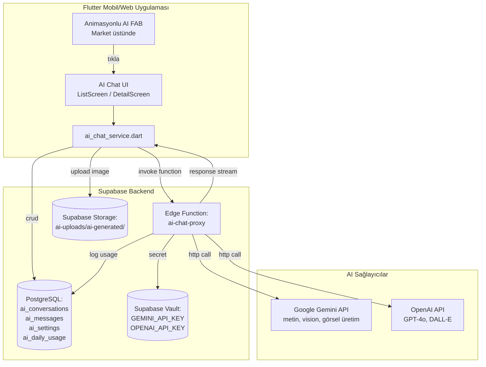

# Yapay Zeka Sohbet Özelliği — Mimari ve Uygulama Planı

> **Hedef**: CizreApp'e kullanıcıların yapay zekayla metin/resim tabanlı sohbet edebileceği, admin tarafından yönetilebilen ve günlük limit ile kontrol edilen bir AI chat sistemi eklemek.
>
> **Sağlayıcılar**: Google Gemini + OpenAI (çoklu sağlayıcı, admin tarafından seçilebilir)
>
> **Özellikler**: Metin, resim yükleme (galeri), doğrudan kamera ile çekme, AI'ın resim üretmesi, geçmiş sohbet yönetimi.
>
> **Güvenlik**: API anahtarları Supabase Vault'ta (env olarak Edge Function üzerinden proxy edilir, istemciye asla sızmaz).
>
> **Mimari**: Flutter (UI) → Supabase Edge Function (proxy + anahtar yönetimi + rate limit) → Gemini/OpenAI API.

---

## 1. Genel Akış Şeması



---

## 2. Veritabanı Şeması (Supabase SQL)

**Dosya**: `supabase/migrations/20260101000002_ai_chat_system.sql`

### 2.1 Tablolar

**`ai_settings`** (sistem geneli tek satır, id=1)
- `id INT PRIMARY KEY DEFAULT 1`
- `enabled BOOLEAN DEFAULT true` (master switch)
- `provider TEXT DEFAULT 'gemini'` (`'gemini' | 'openai'`)
- `text_model TEXT DEFAULT 'gemini-1.5-flash'`
- `vision_model TEXT DEFAULT 'gemini-1.5-flash'`
- `image_model TEXT DEFAULT 'imagen-3.0-generate'`
- `openai_text_model TEXT DEFAULT 'gpt-4o-mini'`
- `openai_vision_model TEXT DEFAULT 'gpt-4o-mini'`
- `openai_image_model TEXT DEFAULT 'dall-e-3'`
- `daily_request_limit_per_user INT DEFAULT 50`
- `daily_token_limit_per_user INT DEFAULT 100000`
- `max_messages_per_conversation INT DEFAULT 100`
- `allow_image_upload BOOLEAN DEFAULT true`
- `allow_image_generation BOOLEAN DEFAULT true`
- `allow_camera_capture BOOLEAN DEFAULT true`
- `system_prompt TEXT` (CizreApp'e özel default)
- `temperature NUMERIC DEFAULT 0.7`
- `max_output_tokens INT DEFAULT 2048`
- `created_at TIMESTAMPTZ DEFAULT now()`
- `updated_at TIMESTAMPTZ DEFAULT now()`
- `updated_by UUID REFERENCES auth.users(id)`

**`ai_conversations`**
- `id UUID PRIMARY KEY DEFAULT gen_random_uuid()`
- `user_id UUID NOT NULL REFERENCES auth.users(id) ON DELETE CASCADE`
- `title TEXT` (ilk kullanıcı mesajından auto-generate)
- `provider TEXT` (o konuşmada kullanılan sağlayıcı)
- `message_count INT DEFAULT 0`
- `last_message_at TIMESTAMPTZ DEFAULT now()`
- `is_archived BOOLEAN DEFAULT false`
- `created_at TIMESTAMPTZ DEFAULT now()`
- INDEX: `(user_id, last_message_at DESC)`, `(user_id, is_archived)`

**`ai_messages`**
- `id UUID PRIMARY KEY DEFAULT gen_random_uuid()`
- `conversation_id UUID NOT NULL REFERENCES ai_conversations(id) ON DELETE CASCADE`
- `user_id UUID NOT NULL REFERENCES auth.users(id) ON DELETE CASCADE`
- `role TEXT NOT NULL CHECK (role IN ('user','assistant','system'))`
- `content TEXT NOT NULL` (metin içeriği veya markdown)
- `attachments JSONB DEFAULT '[]'` (`[{type:'image', url, mime, size}]`)
- `generated_images JSONB DEFAULT '[]'` (AI tarafından üretilen görseller)
- `tokens_used INT DEFAULT 0`
- `provider TEXT` (bu mesaj için kullanılan)
- `model TEXT` (bu mesaj için kullanılan model)
- `error TEXT` (hata varsa)
- `created_at TIMESTAMPTZ DEFAULT now()`
- INDEX: `(conversation_id, created_at)`

**`ai_daily_usage`**
- `id BIGSERIAL PRIMARY KEY`
- `user_id UUID NOT NULL REFERENCES auth.users(id) ON DELETE CASCADE`
- `usage_date DATE NOT NULL DEFAULT CURRENT_DATE`
- `request_count INT DEFAULT 0`
- `token_count INT DEFAULT 0`
- `image_generation_count INT DEFAULT 0`
- `last_request_at TIMESTAMPTZ`
- UNIQUE: `(user_id, usage_date)`

### 2.2 RLS Politikaları
- `ai_settings`: sadece `is_admin()` SELECT/UPDATE (herkes göremez)
- `ai_conversations`, `ai_messages`: kullanıcı sadece kendi kayıtlarını CRUD yapabilir
- `ai_daily_usage`: kullanıcı kendi kullanımını SELECT yapabilir, INSERT/UPDATE sadece service_role

### 2.3 Trigger'lar
- Yeni `ai_messages` INSERT → `ai_conversations.message_count++` ve `last_message_at = now()`
- Yeni `ai_conversations` INSERT → `title` ilk user mesajından 50 karakter auto-generate

### 2.4 `is_admin()` Fonksiyonu (zaten varsa kullan)
```sql
CREATE OR REPLACE FUNCTION public.is_admin()
RETURNS BOOLEAN AS $$
  SELECT EXISTS (
    SELECT 1 FROM public.profiles
    WHERE id = auth.uid() AND role IN ('admin', 'super_admin')
  );
$$ LANGUAGE sql SECURITY DEFINER STABLE;
```

### 2.5 Seed Data
`ai_settings` tablosuna 1 satır default değerlerle INSERT.

### 2.6 Storage Bucket
- `ai-uploads` (private, RLS: kullanıcı kendi klasörünü yazabilir/okuyabilir)
- `ai-generated` (private, sadece service_role yazabilir, kullanıcı kendi üretilenlerini okuyabilir)

---

## 3. Supabase Edge Function: `ai-chat-proxy`

**Dosya**: `supabase/functions/ai-chat-proxy/index.ts`

### 3.1 Sorumluluklar
1. İstemciden gelen mesajı al
2. `auth.uid()` doğrula
3. `ai_settings.enabled` kontrolü
4. `ai_daily_usage` tablosunda günlük limit kontrolü (request_count, token_count)
5. Vault'tan sağlayıcı API anahtarını oku (`GEMINI_API_KEY` veya `OPENAI_API_KEY`)
6. Gemini veya OpenAI API'ye istek gönder (vision veya text)
7. Yanıtı `ai_messages` tablosuna yaz
8. `ai_daily_usage` sayaçlarını güncelle
9. Sonucu (streamed veya toplu) istemciye döndür

### 3.2 Request Format
```typescript
{
  conversation_id?: string,  // yoksa yeni oluşturulur
  message: string,            // kullanıcı metni
  attachments?: [{            // kullanıcının yüklediği resimler
    storage_path: string,     // signed URL'e çevrilecek
    mime_type: string
  }],
  action: 'text' | 'vision' | 'generate_image' | 'stream'
}
```

### 3.3 Response Format
```typescript
{
  conversation_id: string,
  user_message_id: string,
  assistant_message: {
    id: string,
    content: string,
    generated_images: string[],  // public/signed URL'ler
    tokens_used: number
  },
  usage: {
    request_count: number,
    token_count: number,
    daily_limit_remaining: number
  }
}
```

### 3.4 Sağlayıcı Implementasyon Detayları
- **Gemini Text**: `POST https://generativelanguage.googleapis.com/v1beta/models/{model}:generateContent`
- **Gemini Vision**: Aynı endpoint, `inlineData` (base64) eklenir
- **Gemini Image (Imagen 3)**: `POST .../models/imagen-3.0-generate-002:predict`
- **OpenAI Text/Vision**: `POST https://api.openai.com/v1/chat/completions` (gpt-4o vb.)
- **OpenAI Image**: `POST https://api.openai.com/v1/images/generations` (dall-e-3)

### 3.5 Hata Yönetimi
- 429 (rate limit): kullanıcıya anlaşılır Türkçe mesaj
- 401/403 (auth): vault'ta anahtar yoksa admin'e uyarı
- 5xx: tekrar denemeden kullanıcıya mesaj

### 3.6 Günlük Limit Mantığı
- Önce mevcut `ai_daily_usage` satırını SELECT
- Eğer `request_count >= limit` veya `token_count + tahmini > limit` → 429 döndür
- Aksi halde INSERT sonrası sayaçları artır

---

## 4. Flutter Katmanı (İstemci)

### 4.1 Modeller
**`lib/core/models/ai_conversation_model.dart`**
- `id, userId, title, provider, messageCount, lastMessageAt, isArchived, createdAt`
- `fromMap`, `toMap`, `fromJson`, `toJson`

**`lib/core/models/ai_message_model.dart`**
- `id, conversationId, userId, role, content, attachments, generatedImages, tokensUsed, provider, model, error, createdAt`
- `attachment` ve `generatedImage` alt sınıfları

**`lib/core/models/ai_settings_model.dart`**
- Tüm `ai_settings` alanları + yardımcı metotlar

### 4.2 Servis
**`lib/features/ai_chat/services/ai_chat_service.dart`**
- `Future<AIConversation> createConversation()`
- `Future<List<AIConversation>> getConversations({bool includeArchived = false})`
- `Future<void> deleteConversation(String id)`
- `Future<List<AIMessage>> getMessages(String conversationId)`
- `Stream<AIChatResponse> sendMessageStream({...})` (Server-Sent Events benzeri)
- `Future<AIChatResponse> sendMessage({...})` (non-stream fallback)
- `Future<String> uploadImage(File file)` (Supabase Storage'a yazar, public/signed path döner)
- `Future<int> getDailyUsage()` (kalan hak)
- `Future<AISettings> getSettings()` (admin UI için)
- `Future<void> updateSettings(AISettings settings)` (admin)
- `Future<bool> testApiKey(String provider, String apiKey)` (admin)
- `Future<AIUsageStats> getUsageStats()` (admin dashboard)

### 4.3 UI Bileşenleri

**`lib/core/widgets/floating_ai_chat_button.dart`**
- `FloatingMessageButton` üstüne `Positioned` ile yerleştirilecek
- Animasyonlar:
  - Pulse: `AnimationController.repeat(reverse: true)` ile ölçek 1.0 ↔ 1.08
  - Glow: `BoxShadow` spread animasyonu
  - Sıralı parıltı: gradient rotation
- Gradient arka plan (mavi → mor)
- Yapay zeka ikonu: `Icons.auto_awesome` veya `Icons.psychology`
- Tıklanınca `AIChatListScreen`'e push
- Misafir kullanıcı kontrolü (girişe yönlendir)
- `unreadCount` (kırmızı badge) opsiyonel

**`lib/features/ai_chat/screens/ai_chat_list_screen.dart`**
- AppBar: "AI Asistan" başlığı, ayarlar butonu (kullanıcı için)
- "Yeni Sohbet" prominent butonu (gradient arka plan)
- Geçmiş sohbetler listesi:
  - Başlık (ilk mesajdan), preview, tarih, mesaj sayısı
  - Sağa kaydır → sil (Dismissible)
  - Üstte arama çubuğu
  - "Arşivlenmişler" toggle
- Boş state: animasyonlu illustration + "Yeni sohbet başlat" CTA

**`lib/features/ai_chat/screens/ai_chat_detail_screen.dart`**
- AppBar: geri, sohbet başlığı, sağlayıcı chip, menü (geçmişi temizle, sil, paylaş)
- Mesaj listesi (ters kronolojik, aşağı scroll):
  - User mesajı: sağda, primary renk, köşeli (sol alt düz)
  - Assistant mesajı: solda, beyaz/gri, avatar (AI ikonu)
  - Markdown render: `flutter_markdown` paketi (code, bold, list)
  - Üretilen görseller: grid layout, tıklayınca fullscreen
  - Yüklenen görseller: küçük thumbnail + büyüt
  - Typing indicator: 3 nokta bounce animasyonu
- Alt input bar:
  - Çok satırlı TextField (max 5 satır)
  - Sol: ekleme butonu (+) → bottom sheet: Galeri, Kamera, AI ile Görsel Üret, Hızlı Şablonlar
  - Sağ: gönder butonu (yazıyorsa active)
- Kamera çekimi: `image_picker` `ImageSource.camera`
- Galeri: `ImageSource.gallery`
- AI görsel üret: prompt dialog → sonuç grid'i
- Rate limit aşılırsa: özel banner ("Günlük limitiniz doldu, yarın tekrar deneyin")
- Streaming response: kelime kelime yazılma efekti
- Hata durumunda retry butonu

### 4.4 Anasayfa (Market) Entegrasyonu
**`lib/features/market/screens/market_screen.dart`** — `Stack` içinde `FloatingMessageButton`'ın üstüne `FloatingAIChatButton` eklenecek. Y ekseninde ~76px yukarıda (FAB çapı + boşluk).

```dart
Stack(
  children: [
    // ... mevcut içerik
    FloatingMessageButton(...),  // mevcut
    FloatingAIChatButton(         // YENİ
      onTap: () { ... },
    ),
  ],
)
```

### 4.5 Admin Paneli Entegrasyonu

**`lib/features/admin/widgets/ai_management_content.dart`** — Yeni widget:
- **Sağlayıcı Seçimi**: SegmentedButton (Gemini / OpenAI)
- **API Anahtarı Yönetimi**:
  - Her sağlayıcı için ayrı kart
  - "Anahtar ayarla" → admin vault API ile yazar (veya `supabase functions secrets set` için UI rehberi)
  - "Bağlantıyı Test Et" butonu
- **Model Seçimi**: Dropdown'lar (her sağlayıcı için text/vision/image modelleri)
- **Özellik Aç/Kapa**: Switch'ler (image upload, camera, image generation)
- **Günlük Limitler**:
  - Kullanıcı başına istek limiti
  - Kullanıcı başına token limiti
  - Konuşma başına mesaj limiti
- **System Prompt**: Büyük TextArea (varsayılan öneri)
- **Parametreler**: Temperature slider, Max output tokens
- **İstatistikler Kartı**:
  - Bugünkü toplam istek
  - Aktif kullanıcı sayısı (AI kullanan)
  - Toplam token kullanımı
  - Sağlayıcı dağılımı (pie chart benzeri bar)
  - Son 7 gün trendi (mini chart)
- **Tüm Sohbetler Tab** (denetim için): son 50 konuşma, kullanıcı, mesaj sayısı, sil

**`lib/features/admin/widgets/admin_drawer.dart`** — "Yapay Zeka Yönetimi" menüsü (sıra: Sistem Ayarları'ndan sonra, Hakkında'dan önce).

**`lib/features/admin/screens/admin_dashboard_screen.dart`** — `_selectedMenu == 'ai_management'` için `AIManagementContent()` render'ı.

### 4.6 Yeni Bağımlılık (`pubspec.yaml`)
- `flutter_markdown: ^0.7.4` (AI yanıtlarını zengin göstermek için)
- (mevcut: `image_picker`, `cached_network_image`, `flutter_animate` yeterli)

### 4.7 Yardımcı Widget'lar
- `MarkdownMessage` — chat mesajı içeriğini güvenli şekilde render
- `TypingIndicator` — AI yazıyor animasyonu
- `ImageAttachmentPreview` — kullanıcının yüklediği/AI'ın ürettiği görsel kartı
- `DailyLimitBanner` — limit aşımı uyarısı
- `ProviderChip` — mesaj üzerinde sağlayıcı rozeti

---

## 5. Adım Adım Uygulama Sırası

| # | Adım | Çıktı Dosyaları | Bağımlılık |
|---|------|----------------|------------|
| 1 | SQL migration: tablolar + RLS + seed + storage | `supabase/migrations/20260101000002_ai_chat_system.sql`, `supabase/AI_CHAT_VAULT_SETUP.md` | - |
| 2 | Vault'a API anahtarlarını ekleme rehberi + SQL | `supabase/AI_CHAT_VAULT_SETUP.md` | 1 |
| 3 | Edge Function: `ai-chat-proxy` (Gemini+OpenAI) | `supabase/functions/ai-chat-proxy/index.ts` | 1, 2 |
| 4 | Flutter modeller | `lib/core/models/ai_*_model.dart` | 1 |
| 5 | Flutter servis | `lib/features/ai_chat/services/ai_chat_service.dart` | 3, 4 |
| 6 | Animasyonlu FAB | `lib/core/widgets/floating_ai_chat_button.dart` | - |
| 7 | AI sohbet liste ekranı | `lib/features/ai_chat/screens/ai_chat_list_screen.dart` | 4, 5 |
| 8 | AI sohbet detay ekranı + input + görsel | `lib/features/ai_chat/screens/ai_chat_detail_screen.dart`, `lib/features/ai_chat/widgets/*.dart` | 4, 5, 7 |
| 9 | Market ekranı entegrasyonu | `lib/features/market/screens/market_screen.dart` (güncelleme) | 6 |
| 10 | Admin AI yönetim widget'ı | `lib/features/admin/widgets/ai_management_content.dart` | 4, 5 |
| 11 | Admin drawer + dashboard entegrasyonu | `lib/features/admin/widgets/admin_drawer.dart`, `lib/features/admin/screens/admin_dashboard_screen.dart` (güncelleme) | 10 |
| 12 | pubspec.yaml güncelleme + `flutter pub get` | `pubspec.yaml` | - |
| 13 | Build/test doğrulama | `flutter analyze`, `flutter build apk --debug` | 1-12 |

---

## 6. Güvenlik Notları

1. **API Anahtarları**: Asla istemci tarafında. Sadece Edge Function vault'tan okur.
2. **Kullanıcı Kimliği**: `auth.uid()` ile her istek doğrulanır.
3. **Rate Limit**: Kullanıcı + gün bazlı sayaç.
4. **İçerik Filtresi**: Sağlayıcıların kendi moderation'ı + opsiyonel admin kara liste.
5. **Dosya Yükleme**: Tip/boyut validasyonu (max 10MB, sadece image/*), virus taraması (ileride).
6. **Prompt Injection**: System prompt sabit, kullanıcı girdisi asla system prompt'a enjekte edilmez.
7. **PII Saklama**: Üretilen görseller opsiyonel olarak 30 gün sonra otomatik silinir (cron job, opsiyonel).

---

## 7. Test Senaryoları

1. **Misafir**: FAB görünür ama tıklayınca giriş ekranına yönlendirir.
2. **Yeni Sohbet**: Boş liste → "Yeni Sohbet" → konuşma detayı → metin gönder → AI cevabı.
3. **Çoklu Mesaj**: Aynı konuşmada 5 mesaj → bağlam korunur.
4. **Resim Yükleme**: Galeri → önizleme → gönder → AI vision yanıtı.
5. **Kamera**: Web'de yok, mobilde test edilir.
6. **AI Görsel Üret**: Prompt gir → 1-4 görsel üret → indir.
7. **Limit Aşımı**: Limit 5'e düşürülür → 6. istekte banner.
8. **Sağlayıcı Değişimi**: Admin Gemini'den OpenAI'ye geçer, yeni konuşmada OpenAI kullanılır.
9. **Geçmiş**: Eski konuşma → tıkla → mesajlar yüklenir → yeni mesaj eklenir.
10. **Admin Şifre Anahtarı**: Yanlış anahtar → "Test Et" → hata mesajı.
11. **Offline**: İnternet yok → "Bağlantı yok" mesajı.
12. **Streaming**: Kelime kelime yazılma efekti gözlemlenir.
13. **Hata**: API 500 → retry butonu.

---

## 8. Açık Sorular (Mimari Kararlar)

- **Streaming**: Şimdilik non-stream + sonradan yazılma efekti (`typing indicator` → tam yanıt). Gerçek SSE altyapısı v2'de.
- **Görsel Üretimde Kaydetme**: AI ürettiği görselleri Supabase Storage'a mı kopyalayalım, yoksa sağlayıcının geçici URL'si mi kullanılsın? Öneri: ilk etapta sağlayıcı URL'si, v2'de storage kopyalama + cache.
- **Çoklu Sohbet Aynı Anda**: Kullanıcı aynı anda 2 sekme → her sekme kendi conversationId'sini kullanır. Realtime sync v2'de.
- **Misafir Kullanım**: Tamamen kapalı (giriş zorunlu). AI maliyeti yüzünden.

---

## 9. Eklenecek Diğer Eksikler (Kullanıcının "siz de eksikleri tamamlayın" notu)

- **Sohbet Boş Durum**: Yükleme skeleton'ı + illustration.
- **Pull-to-refresh**: Mesaj listesinde.
- **Karanlık Tema Desteği**: Tüm yeni ekranlarda.
- **Erişilebilirlik**: Semantik label'lar, klavye navigasyonu, ekran okuyucu.
- **i18n**: Tüm metinler Türkçe, kolay çeviri için merkezi string'ler.
- **Performance**: Lazy load, resim cache, sonsuz scroll (geçmiş).
- **Analytics**: Admin için token/maliyet tahmini (Gemini fiyatlarına göre).
- **Hata Bildirimi**: Snackbar + opsiyonel "AI'ya bildir" butonu.
- **Çıkış/Kapatma**: Sohbetten çıkarken onay.
- **KVKK**: AI sohbet içeriklerinin kullanıcıya ait olduğunu belirten bilgilendirme.
