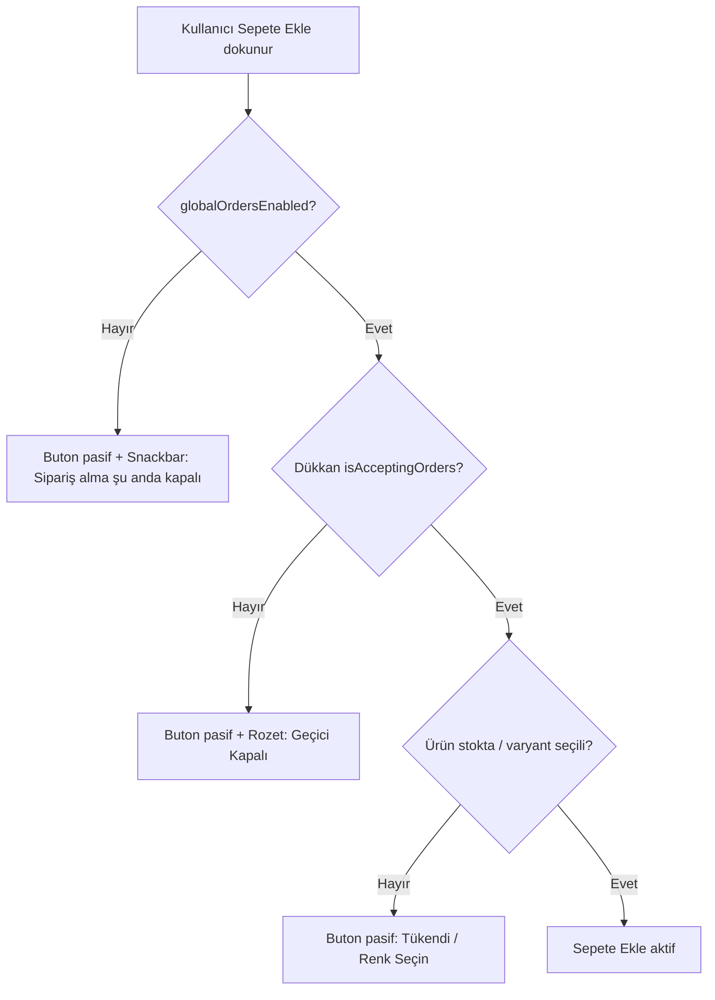

# Geçici Kapalı Dükkanlar - Sepete Ekleme Engeli Planı

## Sorun

Dükkan "Geçici Kapalı" (`is_accepting_orders = false`) veya global sipariş alma kapalı (`global_orders_enabled = false`) olduğunda, bu dükkanların ürünleri yine de sepete eklenebiliyor. Bu durum **iki yerde** yaşanıyor:

1. **Ürün Detayı ekranı** ([`product_detail_screen.dart`](lib/features/market/screens/product_detail_screen.dart:280)) — `_addToCart()` ve `_canAddToCart` metotları `isAcceptingOrders` / `globalOrdersEnabled` kontrolü yapmıyor.
2. **Ürün listesi ekranları** — `_addToCart()` metotlarında hiçbir kontrol yok:
   - [`market_screen.dart`](lib/features/market/screens/market_screen.dart:354)
   - [`search_screen.dart`](lib/features/market/screens/search_screen.dart:99)
   - [`all_discounted_products_screen.dart`](lib/features/market/screens/all_discounted_products_screen.dart:115)
   - [`main_screen.dart`](lib/features/main/screens/main_screen.dart:509)

> Not: [`shop_detail_screen.dart`](lib/features/market/screens/shop_detail_screen.dart:366) ekranı zaten DOĞRU çalışıyor — hem `_globalOrdersEnabled` hem `_shop!.isAcceptingOrders` kontrolü mevcut. Bu ekran referans alınacak.

## Alınan Kararlar (kullanıcı onayı ile)

| # | Karar | Seçilen |
|---|-------|---------|
| 1 | Kapsam | `globalOrdersEnabled` **ve** `shop.isAcceptingOrders` **birlikte** kontrol edilsin (en kapsamlı). Tüm sepete-ekleme girişimleri engellensin. |
| 2 | UX | Sepete Ekle butonu **tamamen pasif/gri** olsun, dokunulamaz. Tıklama denemesinde snackbar ile uyarı verilsin. |
| 3 | Görsel | Her ürün kartında/ürün detayında **"Geçici Kapalı" rozeti/banner** gösterilsin. |
| 4 | Yöntem | Direkt kod yaz (mimari anlaşıldı). |

## Mimari Yaklaşım

Mevcut `shop_detail_screen.dart` başarılı referans modelini tüm ekranlara yaygınlaştıracağız. Her ekranın ihtiyaç duyduğu iki veri parçası:

- `_globalOrdersEnabled` → `app_about_settings` tablosundan `global_orders_enabled` sütunu (zaten market/search/category/all_shops ekranlarında yükleniyor; product_detail ve main_screen'de eksik olabilir).
- `isAcceptingOrders` → her ürünün `shopId`'si üzerinden `Shop` nesnesine erişim.

### Veri Erişim Stratejisi

Ürün listelerinde her ürünün `shopId`'si var ([`product_model.dart`](lib/core/models/product_model.dart:31)) ama `Shop` nesnesi genelde yüklü değil. İki seçenek:

- **A) Önceden yüklü `_shops` listesiyle eşleştirme** — `market_screen.dart` zaten `_shops` listesini yüklüyor. `Map<String, Shop>` oluşturulup `product.shopId` ile eşleştirilir.
- **B) `ShopService.getShopById()` ile lazy erişim** — product_detail zaten bunu yapıyor (`_shop = await _shopService.getShopById(product.shopId)`).

Her ekran için uygun olanı kullanacağız. Ana sayfa/main_screen ve search_screen için product başına shop çekmek yerine, ürünlerin unique `shopId` setini toplayıp toplu sorgu yapmak performans açısından daha doğru olabilir — ancak mevcut `ShopService` tekil getShopById metoduyla cache (30sn) sunduğu için, basitlik adına cache'li getShopById kullanımı yeterli.

> Önemli not: `ShopService.getShopById` 30 snlik cache kullanıyor ([`shop_service.dart`](lib/features/market/services/shop_service.dart:30)). Satıcı sipariş almayı açtığında 30 sn gecikme olabilir. Bu mevcut davranışla uyumlu, kabul edilebilir. İstenirse ürün yükleme akışında shop durumu paralel yenilenebilir.

## Uygulanacak Değişiklikler

### 1. Paylaşılan yardımcı: Sipariş durumu kontrolü

Kod tekrarını önlemek için küçük bir yardımcı oluşturulacak (mevcut proje yapısına uygun, `lib/core/services/` altında veya `lib/core/utils/` altında):

- [`lib/core/services/order_availability_service.dart`](lib/core/services/order_availability_service.dart:1) (YENİ) — iki işlev:
  - `Future<bool> fetchGlobalOrdersEnabled()` → `app_about_settings` tablosundan `global_orders_enabled` okur (mevcut tekrarlanan sorguyu tek noktada toplar). Hata durumunda `true` döner (mevcut davranışla uyumlu — siparişleri yanlışlıkla kapatma).
  - `String orderClosedMessage({bool global, bool shop})` → snackbar mesajını döndürür:
    - Global kapalı: `'Sipariş alma şu anda kapalı'`
    - Shop kapalı: `'Bu dükkan şu anda sipariş almıyor (Geçici Kapalı)'`

Bu sayede mevcut her ekrandaki `_globalOrdersEnabled` yükleme kodu tek servise taşınır (refactor kapsamı küçük tutulur — mevcut kodu bozmaz, opsiyonel).

### 2. Ürün Detayı ekranı — [`product_detail_screen.dart`](lib/features/market/screens/product_detail_screen.dart:1)

- `initState` / `_loadProductData` içinde `_globalOrdersEnabled` yükle (product_detail'de şu an yok).
- `_shop` zaten yükleniyor — `isAcceptingOrders` erişimi hazır.
- `_canAddToCart` getter'ına ([`:247`](lib/features/market/screens/product_detail_screen.dart:247)) ekle:
  ```
  if (!_globalOrdersEnabled) return false;
  if (_shop != null && !_shop!.isAcceptingOrders) return false;
  ```
- `_cartButtonText` getter'ına ([`:265`](lib/features/market/screens/product_detail_screen.dart:265)) ekle:
  - Global kapalı → `'Siparişler Kapalı'`
  - Shop kapalı → `'Geçici Kapalı'`
- Üst kısımda "Geçici Kapalı" banner'ı göster (shop_detail_screen'deki gibi [`:774`](lib/features/market/screens/shop_detail_screen.dart:774) — referans alınacak, aynı görsel dil).
- Pasif buton tıklamasında snackbar: buton `onPressed: null` olduğundan Flutter otomatik tıklamayı engeller, ama kullanıcı geri bildirimi için `onLongPress`/`InkWell` sarmalama yerine, ekran üstünde zaten banner olduğu için yeterli. Snackbar'ı `_addToCart` içinden de gösterebiliriz (güvenlik katmanı olarak `_addToCart` başında da kontrol bırakılacak).

### 3. Ürün Listesi ekranları — sepete ekleme kontrolü + rozet

Her ekran için ortak desen (mevcut `_addToCart` metodu başına koruma eklemek + ürün kartında rozet):

#### a) [`market_screen.dart`](lib/features/market/screens/market_screen.dart:354)
- `_globalOrdersEnabled` zaten yükleniyor ([`:303`](lib/features/market/screens/market_screen.dart:303)).
- `_shops` listesi zaten yüklü ([`:335`](lib/features/market/screens/market_screen.dart:335)) → `Map<String, Shop>` türetilecek (örn. `_shopsById`).
- `_addToCart(product)` başına kontrol ekle: global kapalı veya `product.shopId`'nin shop'u `isAcceptingOrders=false` ise snackbar gösterip `return`.
- Ürün kartı widget'ında (Sepete Ekle butonu render eden yer [`:1743`](lib/features/market/screens/market_screen.dart:1743)): dükkan kapalıysa butonu pasif yapıp "Geçici Kapalı" rozeti ekle.

#### b) [`search_screen.dart`](lib/features/market/screens/search_screen.dart:99)
- `_globalOrdersEnabled` yükleniyor mu kontrol et; yoksa yükle.
- Bu ekranda shop listesi olmayabilir → ürünlerin `shopId` seti için `ShopService.getShopById` (cache'li) ile `Map<String,bool> _shopAcceptingOrders` oluştur. Ürün yükleme bittikten sonra paralel doldur.
- `_addToCart` başına koruma + ürün kartında pasif buton + rozet.

#### c) [`all_discounted_products_screen.dart`](lib/features/market/screens/all_discounted_products_screen.dart:115)
- `_globalOrdersEnabled` yükle (yoksa).
- Shop durumu için `search_screen` ile aynı lazy-yükleme yaklaşımı.
- `_addToCart` başına koruma + pasif buton + rozet.

#### d) [`main_screen.dart`](lib/features/main/screens/main_screen.dart:509)
- `_globalOrdersEnabled` yükle.
- Shop durumu için `getShopById` (cache'li).
- `_addToCart` başına koruma + pasif buton + rozet.

### 4. "Geçici Kapalı" rozet/banner widget'ı (paylaşılan)

Tekrarı önlemek için küçük bir widget:

- [`lib/core/widgets/closed_shop_badge.dart`](lib/core/core/widgets/closed_shop_badge.dart:1) (YENİ) — `ClosedShopBadge` widget'ı: kırmızı/amber renkli yatay etiket, opsiyonel `global` modu. Ürün kartlarında buton üstüne veya ürün adı yanına yerleştirilir.

> Yol: `lib/core/widgets/` (mevcut `settings_sidebar.dart`, `skeleton_loader.dart` burada).

### 5. checkout / cart ekranı (kapsam dışı ama değerlendirilecek)

Kullanıcı kararında sepete ekleme butonları engelleniyor; mevcut sepetteki ürünler veya checkout akışı bu planın **kapsamı dışında** bırakıldı (kullanıcı butonların engellenmesini istedi). Eğer ileride sepette kalan ürünlerle checkout denemesi de engellensin istenirse ayrı bir adım eklenir. Şimdilik buton katmanı yeterli.

## Etkilenen Dosyalar

**Yeni dosyalar (2):**
- [`lib/core/services/order_availability_service.dart`](lib/core/services/order_availability_service.dart:1)
- [`lib/core/widgets/closed_shop_badge.dart`](lib/core/widgets/closed_shop_badge.dart:1)

**Düzenlenecek dosyalar (6):**
- [`lib/features/market/screens/product_detail_screen.dart`](lib/features/market/screens/product_detail_screen.dart:1) — kontrol + banner + pasif buton
- [`lib/features/market/screens/market_screen.dart`](lib/features/market/screens/market_screen.dart:1) — `_shopsById` haritası + kontrol + pasif buton + rozet
- [`lib/features/market/screens/search_screen.dart`](lib/features/market/screens/search_screen.dart:1) — global yükle + shop durumu lazy + kontrol + rozet
- [`lib/features/market/screens/all_discounted_products_screen.dart`](lib/features/market/screens/all_discounted_products_screen.dart:1) — global yükle + shop durumu lazy + kontrol + rozet
- [`lib/features/main/screens/main_screen.dart`](lib/features/main/screens/main_screen.dart:1) — global yükle + shop durumu lazy + kontrol + rozet
- (opsiyonel) Mevcut `_globalOrdersEnabled` yükleme kodları `OrderAvailabilityService`'e taşınır — **mevcut çalışan kodu bozmamak için opsiyonel**, ilk geçişte bırakılabilir.

**Referans (değiştirilmez):**
- [`lib/features/market/screens/shop_detail_screen.dart`](lib/features/market/screens/shop_detail_screen.dart:366) — zaten doğru çalışıyor, desen kaynağı.

## Doğrulama Adımları

1. Satıcı bir dükkanı "Sipariş Kapalı" yapar → ürün detayında ve ürün listelerinde buton pasif, rozet görünür, tıklanmaz.
2. Admin global sipariş almayı kapatır → tüm ürünlerde buton pasif, banner "Siparişler Kapalı".
3. Dükkan tekrar açılır → 30 sn içinde cache yenilenir, buton aktifleşir.
4. `flutter analyze` hatasız geçmeli.

## Akış Diyagramı



## Notlar

- Mevcut `shop_detail_screen.dart`'taki mesaj metinleri korunacak: `"Sipariş alma şu anda kapalı"` ve `"Bu dükkan şu anda sipariş almıyor (Geçici Kapalı)"` — tutarlılık için her yerde aynı metinler kullanılacak.
- `ShopService` 30 sn cache'i mevcut davranış; değiştirilmiyor.