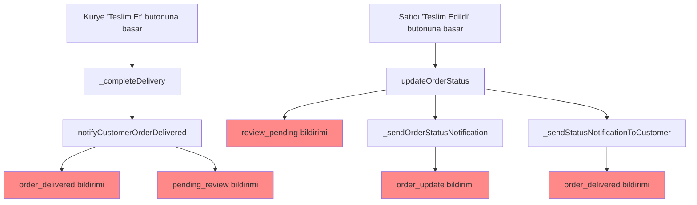
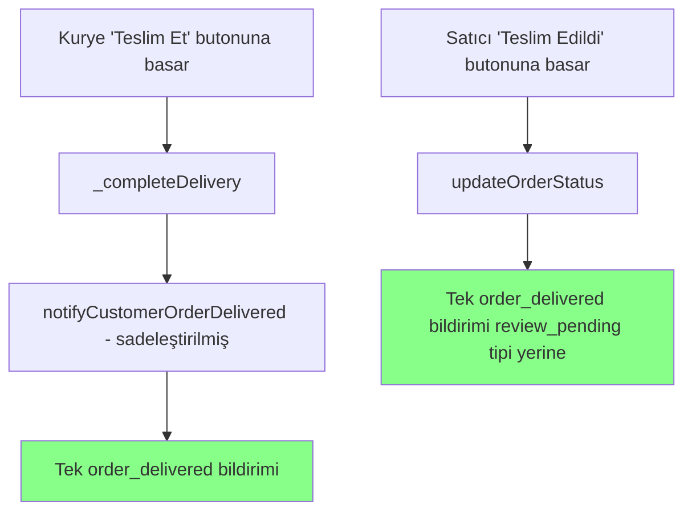
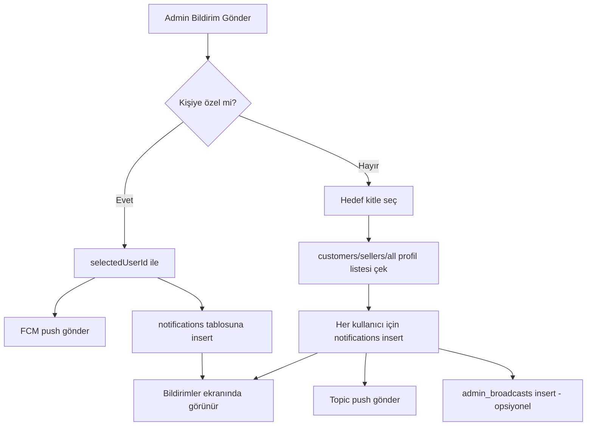

# Sipariş Bildirim & Kurye Bilgisi Düzeltme Planı

Bu plan dört ayrı hatayı kök neden düzeltmesiyle ele alır. Her madde bağımsız olarak test edilebilir.

---

## Görev 1 — Çift "Siparişiniz Teslim Edildi" bildirimi

### Kök neden
Teslim durumunda aynı müşteriye birden fazla yerden bildirim üretiliyor:

| # | Kaynak | Tip | Başlık |
|---|--------|-----|--------|
| 1 | [`order_service.dart:481`](lib/features/shop/services/order_service.dart:481) | `review_pending` | "Siparişiniz Teslim Edildi! 🎉" |
| 2 | [`order_service.dart:725`](lib/features/shop/services/order_service.dart:725) | `order_update` | "Siparişiniz Teslim Edildi" |
| 3 | [`seller_orders_screen.dart:337`](lib/features/seller/screens/seller_orders_screen.dart:337) | `order_delivered` | "✅ Siparişiniz Teslim Edildi!" |
| 4 | [`courier_notification_service.dart:387`](lib/core/services/courier_notification_service.dart:387) | `order_delivered` | "✅ Siparişiniz Teslim Edildi!" |
| 5 | [`courier_notification_service.dart:401`](lib/core/services/courier_notification_service.dart:401) | `pending_review` | "⭐ Siparişinizi Değerlendirin" |

`notification_service.dart:54`'teki duplike temizleme mantığı `entityId + title` anahtarına göre çalışıyor; başlıklar farklı olduğu için temizlenmiyorlar.

### Hedef
Sipariş teslim edildiğinde **yalnızca 1 bildirim** üretilecek: başlık "Siparişiniz Teslim Edildi 🎉", içerik "Değerlendirmek için tıklayın", tip `order_delivered`, entityId = orderId. Değerlendirme hatırlatması `PendingReviewChecker`'dan gelecek.

### Değişiklikler

1. [`order_service.dart:722-732`](lib/features/shop/services/order_service.dart:722) — `_sendOrderStatusNotification` içindeki `OrderStatus.delivered` case'ini tamamen kaldır (`return` ile biten blok). Çünkü 481. satır zaten tek teslim bildirimi oluşturuyor. Açıklayıcı yorum ekle: "Teslim bildirimi updateOrderStatus içinde tek sefer oluşturuluyor."

2. [`seller_orders_screen.dart:336-340`](lib/features/seller/screens/seller_orders_screen.dart:336) — `OrderStatus.delivered` case'ini `_sendStatusNotificationToCustomer` içinde tamamen kaldır (boş return). Çünkü kurye teslim ettiyse zaten kurye akışı bildirimi gönderiyor, satıcı manuel olarak da teslim edebilir — her iki durumda da `updateOrderStatus` bildirimi yeterli.

3. [`courier_notification_service.dart:378-417`](lib/core/services/courier_notification_service.dart:378) — `notifyCustomerOrderDelivered` fonksiyonunu sadeleştir: yalnızca `order_delivered` tipinde "✅ Siparişiniz Teslim Edildi" bildirimi göndersin, `pending_review` insert bloğunu kaldır.

4. [`order_service.dart:481-490`](lib/features/shop/services/order_service.dart:481) — Tipi `order_delivered` olarak değiştir, başlığı standart hale getir:
   ```dart
   type: 'order_delivered',
   title: 'Siparişiniz Teslim Edildi 🎉',
   content: productName != null
       ? '$productName için satıcıyı ve ürünü değerlendirin'
       : 'Satıcıyı ve ürünü değerlendirmek için tıklayın',
   ```

5. Opsiyonel olarak `notification_service.dart:54` duplike temizleme mantığına `order_delivered` tipini de ekleyerek savunma amaçlı ekstra güvenlik katmanı oluştur.

### Doğrulama
- Satıcı "Teslim Edildi" butonuna basınca müşteride **tek** bildirim görünmeli.
- Kurye "Teslim Et"e basınca müşteride **tek** bildirim görünmeli.
- `notifications` tablosunda aynı orderId için birden fazla delivered kaydı oluşmamalı.

---

## Görev 2 — Satıcı panelinde her zaman teslim eden kurye bilgisini göster

### Kök neden
[`seller_orders_screen.dart:1763-1894`](lib/features/seller/screens/seller_orders_screen.dart:1763) bloğu kurye bilgi kartını `if (!_hasOwnCourier && courierInfo != null)` koşulunda gösteriyor. Kullanıcı geri bildirimine göre teslim edildikten sonra kart ya kayboluyor ya da kurye ismi görünmüyor. Sebep: kart bloğu `OrderStatus.onTheWay` gösteriminde render ediliyor ama `OrderStatus.delivered` durumunda kartın üstündeki kurye bilgisi pas geçiliyor olabilir, ya da satıcı kurye teslim ettiyse manuel olarak `delivered`'a basıyor ve `courier_info` hâlâ mevcut olduğu halde kart gösterilmiyor.

### Hedef
- Eğer `courierInfo != null` ve `courierInfo['status'] == 'delivered'` ise (yani kurye teslim etti), kart her zaman gösterilecek — order durumu ne olursa olsun.
- Eğer `courierInfo == null` veya `status != 'delivered'` ise mevcut davranış korunacak.
- Kendi kuryesi olup kendisi teslim eden satıcılarda zaten `courierInfo` null olacağı için gösterilmeyecek — kullanıcının istediği davranış.

### Değişiklikler

1. [`seller_orders_screen.dart:1763-1764`](lib/features/seller/screens/seller_orders_screen.dart:1763) — Koşulu gevşet:
   ```dart
   // Önceki: if (!_hasOwnCourier) { final courierInfo = _courierInfoMap[order.id]; ... }
   // Yeni:
   final courierInfo = _courierInfoMap[order.id];
   if (courierInfo != null && courierInfo['status'] == 'delivered') {
     // Kurye teslim ettiyse her zaman göster
   }
   ```
   Bu şekilde kendi kuryesi olsun olmasın, eğer bir kurye atanıp teslim etmişse bilgisi görünür.

2. Kartın delivered durumu için ek ipucu ekle: teslim zamanı, kurye ismi, telefon. `delivered_at` bilgisini de göster.

3. `OrderStatus.delivered` durumunda mevcut `_buildStatusActions` delivered case'inde (2142-2166) kart görünmüyorsa, bu case'in hemen altında kurye bilgi kartını da göster — veya mevcut kart bloğunun `OrderStatus.delivered`'da da render edilmesini garanti et.

### Doğrulama
- Bir siparişte kurye teslim ettikten sonra satıcı siparişler ekranına döndüğünde kurye ismini görmeli.
- Kendi kuryesi olan satıcıda manuel "Teslim Edildi" basılırsa kurye bilgisi **görünmemeli** (çünkü `courierInfo` null).

---

## Görev 3 — Admin panelinde siparişlerde teslim eden kurye bilgisini göster

### Kök neden
[`admin_dashboard_screen.dart:3251-3364`](lib/features/admin/screens/admin_dashboard_screen.dart:3251) bloğunda `courier_info` varsa gösterim var. Ancak:
- `courier_info == null` ve sipariş durumu `delivered` ise **hiçbir kurye bilgisi gösterilmiyor** (sadece "Platform Kuryesi Atanacak" koşulu false dönüyor ve boş dönüyor).
- Teslim edilen ama `courier_info` henüz yüklenmemiş siparişlerde admin kurye ismini göremiyor.

### Hedef
Teslim edilen tüm siparişlerde, atanmış bir kurye varsa onun adı ve teslim zamanı admin panelinde görünsün. Kurye atanmamışsa mevcut davranış korunsun.

### Değişiklikler

1. [`admin_dashboard_screen.dart:3251`](lib/features/admin/screens/admin_dashboard_screen.dart:3251) bloğunun başındaki `if (courierInfo == null)` dalını genişlet: eğer `courierInfo == null` VE status `delivered` ise ek bir sorgu ile `courier_assignments` tablosundan kurye bilgisini çek. Veya daha basit yol: sorguyu baştan `courier_assignments` ile `left join` yaparak `courier_info` her zaman dolu gelsin.

2. `_loadOrders` / sipariş listesi sorgusunu (`admin_dashboard_screen.dart:8175` civarı) incele ve `courier_assignments(courier:profiles(...))` ilişkisinin select'e dahil edildiğinden emin ol. Eğer zaten varsa ama bazı kayıtlarda null dönüyorsa, sorgu sonrasında `courier_info == null && status == 'delivered'` siparişler için ek fallback sorgu ekle.

3. Kart bloğuna `delivered_at` (teslim zamanı) bilgisini ekle.

### Doğrulama
- Admin paneli siparişler ekranında, kurye tarafından teslim edilmiş bir siparişin kartında kurye ismi, telefonu ve teslim zamanı görünmeli.

---

## Görev 4 — Admin "Bildirim Gönder" → uygulama bildirimler ekranına düşmüyor

### Kök neden
[`notifications_content_v2.dart:1388-1474`](lib/features/admin/widgets/notifications_content_v2.dart:1388):
- **Kişiye özel:** yalnızca FCM push gönderiliyor, `notifications` tablosuna kayıt eklenmiyor.
- **Toplu:** yalnızca topic push + `admin_broadcasts` tablosuna kayıt ekleniyor, `notifications` tablosuna kayıt eklenmiyor.

Sonuç: Push cihaza geliyor ama bildirimler ekranında kalıcı liste kaydı oluşmuyor.

### Hedef
Her iki tipte de (kişisel ve toplu) `notifications` tablosuna her hedef kullanıcı için ayrı kayıt eklenecek. Push gönderimi sürecek ama push + listede görünürlük birlikte sağlanacak.

### Değişiklikler

1. [`notifications_content_v2.dart:1388-1458`](lib/features/admin/widgets/notifications_content_v2.dart:1388) bloğundaki gönderim mantığını yeniden yaz:

   **Kişiye özel:**
   - `send-push` çağrısı korunacak.
   - Ek olarak `notifications` tablosuna insert: `user_id`, `type: 'admin_notification'`, `title`, `content`, `data: {entity_id: 'admin_icon:<iconType>', icon_type: <iconType>}`, `is_read: false`, `created_at`.

   **Toplu:**
   - `send-push-notification` (topic) çağrısı korunacak.
   - Hedef kullanıcılar çekildikten sonra (`customers` / `sellers` / `all` filtresi) her biri için `notifications` tablosuna ayrı insert yapılacak.
   - `admin_broadcasts` tablosuna yazım korunacak (broadcast listesi olarak kalmaya devam edecek).
   - Toplu için `entity_id` formatı: `admin_icon:<iconType>` (mevcut uygulama bu formata göre ikon seçiyor).

2. `notifications_content_v2.dart:1461-1474` — `admin_broadcasts` insert'i hedef kitleye göre filtrelenmemiş, olduğu gibi kalabilir (broadcast'ler herkese açık). Ancak eğer `target_audience` filtresini uygulamak istiyorsanız, `select icon_type, target_audience` ile birlikte filtreyi uygulayacak sorgu değişikliği [`notifications_screen.dart:67`](lib/features/market/screens/notifications_screen.dart:67) tarafında yapılabilir — bu opsiyonel.

3. Gönderim sonrası toast mesajındaki `$sentCount` doğru hesaplanmalı: kişisel için 1, toplu için gerçek kullanıcı sayısı.

### Doğrulama
- Admin panelinden bir müşteriye kişisel bildirim gönderildiğinde, o müşteri uygulamayı açıp "Bildirimler" ekranına girdiğinde bildirimi görmeli.
- Toplu bildirim gönderildiğinde, hedef kitledeki her kullanıcı kendi bildirimler listesinde görmeli.
- Broadcast listesi ayrıca görünmeye devam etmeli (ek bir "Duyurular" bölümü).

---

## Akış Diyagramı

### Mevcut (Sorunlu) Çift Bildirim Akışı



### Hedef (Düzeltilmiş) Tek Bildirim Akışı



### Admin Bildirim Gönderim Akışı (Hedef)



---

## Uygulama Sırası

1. **Görev 1** — Tek teslim bildirimi. En az etki, en yüksek risk azaltma.
2. **Görev 2** — Satıcı paneli kurye bilgisi.
3. **Görev 3** — Admin paneli kurye bilgisi.
4. **Görev 4** — Admin bildirim gönderimi.

Her görev kendi başına dağıtılabilir ve geri alınabilir.
