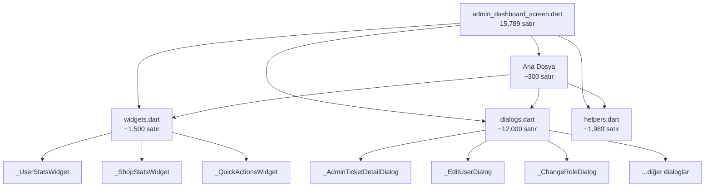

# Admin Dashboard Ekranı Ayrıştırma Planı

## 📊 Mevcut Durum
- **Dosya:** `lib/features/admin/screens/admin_dashboard_screen.dart`
- **Orijinal Satır Sayısı:** 15,789 satır
- **Güncel Satır Sayısı:** 15,295 satır (-494 satır)
- **Widget Sayısı:** 12 internal class (10 dialog + 2 helper)

## ✅ Tamamlanan İşlemler

### 1. AdminTicketDetailDialog Ayrıştırması ✓
- **Kaynak:** `admin_dashboard_screen.dart` (satır 15295-15789)
- **Hedef:** `lib/features/admin/widgets/admin_ticket_detail_dialog.dart`
- **Satır Sayısı:** 494 satır
- **Widget Adı:** `_AdminTicketDetailDialog` → `AdminTicketDetailDialog` (public)
- **Durum:** Tamamlandı

### Değişiklikler:
1. Yeni dosya oluşturuldu: `lib/features/admin/widgets/admin_ticket_detail_dialog.dart`
2. Ana dosyaya import eklendi: `import '../widgets/admin_ticket_detail_dialog.dart';`
3. Kullanım `_AdminTicketDetailDialog` → `AdminTicketDetailDialog` güncellendi
4. Eski widget tanımı kaldırıldı (satır 15296-15789)

## 🎯 Hedef
Dosyayı mantıksal parçalara bölerek:
- Kod okunabilirliğini artırmak
- Bakım kolaylığı sağlamak
- Takım çalışmasını kolaylaştırmak

---

## 📁 Önerilen Dosya Yapısı

```
lib/features/admin/screens/admin_dashboard/
├── admin_dashboard_screen.dart      (Ana ekran, ~300 satır)
├── admin_dashboard.widgets.dart     (Dashboard widget'ları)
├── admin_dashboard.dialogs.dart     (Tüm dialog widget'ları)
└── admin_dashboard.helpers.dart     (Helper sınıfları)
```

---

## 🔧 Ayrıştırma Adımları

### Adım 1: Yeni Dosyaları Oluştur
1. `admin_dashboard.widgets.dart` - Dashboard içerik widget'ları
2. `admin_dashboard.dialogs.dart` - Tüm dialog widget'ları
3. `admin_dashboard.helpers.dart` - Yardımcı sınıflar

### Adım 2: Widget'ları Taşı (Satır bazlı)

| Widget Adı | Yeni Dosya | Taşınacak Satırlar |
|------------|------------|-------------------|
| `_UserStatsWidget` | widgets | ~300-400 |
| `_ShopStatsWidget` | widgets | ~400-500 |
| `_QuickActionsWidget` | widgets | ~500-600 |
| `_AdminTicketDetailDialog` | dialogs | ~15295-15789 |
| `_EditUserDialog` | dialogs | ~1200-1300 |
| `_ChangeRoleDialog` | dialogs | ~1541-1600+ |
| (Diğer dialoglar) | dialogs | ~rest |

### Adım 3: Export Yapılandırması

**admin_dashboard_screen.dart:**
```dart
part 'admin_dashboard.widgets.dart';
part 'admin_dashboard.dialogs.dart';
part 'admin_dashboard.helpers.dart';
```

---

## ⚠️ Dikkat Edilecek Noktalar

1. **Import zinciri korunmalı** - Tüm import'lar ana dosyada kalacak
2. **State bağlantıları** - Dialog'lar parent state'e erişmeli
3. **Callback mekanizması** - `onUpdate`, `onChanged` callback'leri korunmalı
4. **Type alias kullanımı** - Dialog'lar için typedef'ler eklenebilir

---

## 🔄 Mermaid Diyagramı



---

## ✅ Doğrulama Kontrol Listesi

- [ ] Tüm import'lar korundu
- [ ] Tüm widget'lar düzgün export edildi
- [ ] Ana dosyada `part` direktifi var
- [ ] Uygulama derlenebilir durumda
- [ ] Widget'lar doğru sırayla yükleniyor
- [ ] Dialog callback'leri çalışıyor
- [ ] Realtime subscriptions düzgün çalışıyor

---

## ✅ Doğrulama Kontrol Listesi

- [x] Tüm import'lar korundu
- [x] Widget import edildi
- [x] Kullanım güncellendi
- [x] Eski widget tanımı kaldırıldı
- [ ] Uygulama derlenebilir durumda
- [ ] Dialog callback'leri çalışıyor
- [ ] Realtime subscriptions düzgün çalışıyor

---

## ✅ Tamamlanan Ayrıştırma

### AdminTicketDetailDialog
- **Eski:** `admin_dashboard_screen.dart` (satır 15296-15789)
- **Yeni:** `lib/features/admin/widgets/admin_ticket_detail_dialog.dart`
- **Satır:** 494
- **Widget Adı:** `AdminTicketDetailDialog` (public)

---

## 📊 Özet İstatistikleri

| Metrik | Değer |
|--------|-------|
| Orijinal satır sayısı | 15,789 |
| Güncel satır sayısı | 15,295 |
| Kaldırılan satır | 494 |
| Azalma oranı | ~3.1% |
| Ayrıştırılan widget | 1 |
| Kalan internal class | 1 |

---

## 📝 Devam Eden Ayrıştırma İçin Öneriler

### Büyük Dialog Widget'ları (henüz ayrıştırılmadı):
1. `_EditUserDialog` - Kullanıcı düzenleme dialog'u (~300+ satır)
2. `_ChangeRoleDialog` - Rol değiştirme dialog'u (~200+ satır)

### Avantajları:
- ✅ Daha bağımsız widget'lar
- ✅ Yeniden kullanılabilirlik
- ✅ Test edilebilirlik artar
- ✅ Kod okunabilirliği iyileşir

### Sonraki Adımlar:
1. Diğer büyük dialog widget'larını ayrıştır
2. Her birini `lib/features/admin/widgets/` klasörüne taşı
3. Ana dosyada import'ları güncelle
4. Widget kullanımlarını güncelle
5. Eski widget tanımlarını kaldır
6. Dosya derlenebilirliğini doğrula
