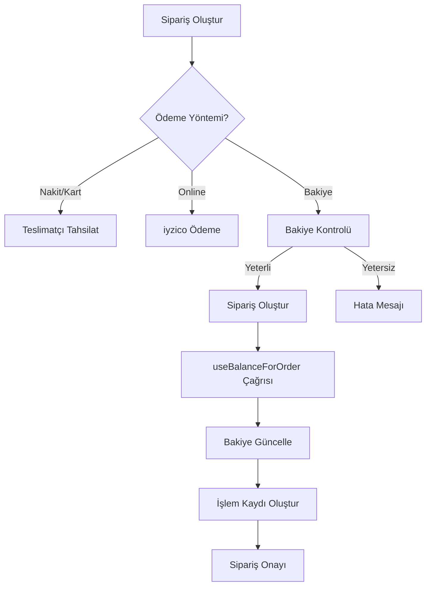

# Siparişlerde Cüzdan Bakiyesi Kullanımı - Uygulama Planı

## Genel Bakış

Kullanıcıların siparişlerinde cüzdan bakiyelerini kullanabilmelerini sağlamak ve bu siparişlerin kurye panelinde doğru şekilde görüntülenmesini sağlamak.

---

## Mevcut Durum Analizi

### 1. checkout_screen.dart ✓
- `_processBalancePayment` metodu mevcut
- `PaymentMethod.balance` seçeneği UI'da gösteriliyor
- **Problem:** Bakiyeden düşme işlemi eksik - sipariş oluşturuluyor ama bakiye düşülmüyor
- `_loadBalanceInfo` ile balanceEnabled kontrolü var

### 2. multi_shop_checkout_screen.dart ⚠️
- **Problem:** `PaymentMethod.balance` seçeneği YOK
- Sadece: cash, cardOnDelivery, online (onlinePaymentEnabled ise)
- Bakiye ile ödeme seçeneği eklenmeli

### 3. order_service.dart ⚠️
- `createOrder` ve `createMultiShopOrder` metodları `PaymentMethod` parametresi alıyor
- **Problem:** `paymentMethod=balance` durumunda bakiyeden otomatik düşme mantığı YOK
- Sipariş oluşturuluyor ama bakiye işlenmiyor

### 4. balance_service.dart ✓
- `useBalanceForOrder` fonksiyonu mevcut
- Supabase Edge Function çağrısı yapılıyor

### 5. Kurye Paneli ✓
- `payment_method` alanı kullanılıyor
- `balance` değeri varsa uygun şekilde gösterilebilir

---

## Yapılacak Değişiklikler

### Adım 1: checkout_screen.dart - _processBalancePayment Düzeltmesi

```dart
/// Bakiye ile ödeme işle
Future<void> _processBalancePayment(Address selectedAddress, CartProvider cartProvider) async {
  final user = Supabase.instance.client.auth.currentUser;
  if (user == null) {
    setState(() => _isPlacingOrder = false);
    return;
  }

  try {
    // Sepeti getir
    final cartSummary = await _cartService.getCartSummary(user.id);
    if (cartSummary.items.isEmpty) {
      throw Exception('Sepetiniz boş');
    }

    final total = cartSummary.total;
    
    // Bakiyeyi kontrol et
    final balanceInfo = await _loadBalanceInfo();
    final availableBalance = (balanceInfo?['balance'] as double?) ?? 0;
    
    if (availableBalance < total) {
      setState(() => _isPlacingOrder = false);
      if (mounted) {
        ScaffoldMessenger.of(context).showSnackBar(
          SnackBar(
            content: Text('Yetersiz bakiye! Mevcut: ₺${availableBalance.toStringAsFixed(2)}, Gerekli: ₺${total.toStringAsFixed(2)}'),
            backgroundColor: Colors.orange,
          ),
        );
      }
      return;
    }

    // Siparişi oluştur
    final order = await _orderService.createOrder(
      // ... mevcut parametreler
      paymentMethod: PaymentMethod.balance,
    );
    
    if (order != null) {
      // Bakiyeden düş
      await _balanceService.useBalanceForOrder(
        orderId: order.id,
        amount: total,
        orderTotal: total,
      );
      
      // Sepeti temizle
      await _cartService.clearCart(user.id);
      await cartProvider.clearCart();
      
      if (mounted) {
        Navigator.of(context).popUntil((route) => route.isFirst);
        Future.delayed(const Duration(milliseconds: 100), () {
          if (context.mounted) {
            context.read<CartProvider>().loadCart();
          }
        });
        ScaffoldMessenger.of(context).showSnackBar(
          const SnackBar(
            content: Text('Siparişiniz bakiyenizden ödenerek oluşturuldu!'),
            backgroundColor: Colors.green,
          ),
        );
      }
    }
  } catch (e) {
    setState(() => _isPlacingOrder = false);
    if (mounted) {
      ScaffoldMessenger.of(context).showSnackBar(
        SnackBar(content: Text('Bakiye ödeme hatası: $e'), backgroundColor: Colors.red),
      );
    }
  }
}
```

### Adım 2: multi_shop_checkout_screen.dart - Bakiye Seçeneği Ekleme

```dart
// State'e balance bilgisi ekle
double _userBalance = 0;
bool _balanceEnabled = false;

// loadPaymentSettings'e balance kontrolü ekle
Future<void> _loadPaymentSettings() async {
  try {
    final settings = await _aboutService.getAboutSettings();
    final balance = await _loadBalanceInfo();
    setState(() {
      _onlinePaymentEnabled = settings?.onlinePaymentEnabled ?? false;
      _balanceEnabled = settings?.balanceEnabled ?? false;
      _userBalance = (balance?['balance'] as double?) ?? 0;
      _isLoadingPaymentSettings = false;
    });
  } catch (e) {
    setState(() => _isLoadingPaymentSettings = false);
  }
}

// _buildPaymentSection'e bakiye seçeneği ekle
if (_balanceEnabled && _userBalance > 0)
  RadioListTile<PaymentMethod>(
    value: PaymentMethod.balance,
    groupValue: _selectedPaymentMethod,
    onChanged: (value) => setState(() => _selectedPaymentMethod = value!),
    title: Row(
      children: [
        const Text('Bakiye ile Ödeme'),
        const SizedBox(width: 8),
        Container(
          padding: const EdgeInsets.symmetric(horizontal: 8, vertical: 4),
          decoration: BoxDecoration(
            color: Colors.green.shade100,
            borderRadius: BorderRadius.circular(12),
          ),
          child: Text(
            '₺${_userBalance.toStringAsFixed(2)}',
            style: TextStyle(color: Colors.green.shade800, fontWeight: FontWeight.bold),
          ),
        ),
      ],
    ),
    subtitle: Text('Mevcut bakiyeniz: ₺${_userBalance.toStringAsFixed(2)}'),
  ),
```

### Adım 3: _placeOrder Metodunu Güncelleme (Multi-Shop)

```dart
Future<void> _placeOrder(Address selectedAddress) async {
  // ...
  
  // Bakiye ile ödeme kontrolü
  if (_selectedPaymentMethod == PaymentMethod.balance) {
    if (_userBalance < _grandTotal) {
      setState(() => _isPlacingOrder = false);
      if (mounted) {
        ScaffoldMessenger.of(context).showSnackBar(
          SnackBar(
            content: Text('Yetersiz bakiye! Mevcut: ₺${_userBalance.toStringAsFixed(2)}'),
            backgroundColor: Colors.orange,
          ),
        );
      }
      return;
    }
  }
  
  // Sipariş oluştur (mevcut kod)
  final result = await _orderService.createMultiShopOrder(
    userId: userId,
    itemsByShop: itemsByShop,
    deliveryAddressText: addressText,
    addressId: selectedAddress.id,
    paymentMethod: _selectedPaymentMethod,
    notes: _notesController.text.trim().isNotEmpty ? _notesController.text.trim() : null,
    customerPhone: selectedAddress.phone,
  );

  // Bakiye ile ödeme ise bakiyeden düş
  if (_selectedPaymentMethod == PaymentMethod.balance && result.orders.isNotEmpty) {
    for (final order in result.orders) {
      try {
        await _balanceService.useBalanceForOrder(
          orderId: order.id,
          amount: order.totalAmount,
          orderTotal: order.totalAmount,
        );
      } catch (e) {
        debugPrint('Bakiye düşme hatası: $e');
      }
    }
  }

  // Sepeti temizle
  await cartProvider.clearCart();
  // ...
}
```

### Adım 4: onay kodu doğrulaması - Bakiye ödemesinde atla

```dart
Future<void> _showConfirmationDialog(Address selectedAddress) async {
  // Kapıda ödeme ise - admin ayarına göre onay kodu iste
  if (_selectedPaymentMethod == PaymentMethod.cash ||
      _selectedPaymentMethod == PaymentMethod.cardOnDelivery) {
    final approvalCodeEnabled = await _checkOrderApprovalCodeEnabled();
    if (approvalCodeEnabled) {
      final verified = await _showVerificationDialog();
      if (verified != true) return;
    }
  }
  // NOT: balance ve online ödemelerde onay kodu gerekmez
  _showOrderConfirmationDialog(selectedAddress);
}
```

### Adım 5: use-balance-for-order Edge Function Kontrolü

Edge Function'ın doğru çalışıp çalışmadığını kontrol et ve gerekirse güncelle.

---

## Dosya Listesi

1. `lib/features/market/screens/checkout_screen.dart`
2. `lib/features/market/screens/multi_shop_checkout_screen.dart`
3. `lib/core/services/balance_service.dart` (kontrol)
4. `supabase/functions/use-balance-for-order/index.ts` (kontrol)

---

## Mermaid Akış Diyagramı



---

## Test Senaryoları

1. ✓ Tek dükkan siparişi - bakiye yeterli
2. ✓ Tek dükkan siparişi - bakiye yetersiz
3. ✓ Çok dükkanlı sipariş - bakiye yeterli
4. ✓ Çok dükkanlı sipariş - bakiye yetersiz
5. ✓ Bakiye siparişinde onay kodu atlanmalı
6. ✓ Kurye panelinde bakiye siparişleri doğru görünmeli
7. ✓ İşlem geçmişinde sipariş ödemesi görünmeli
