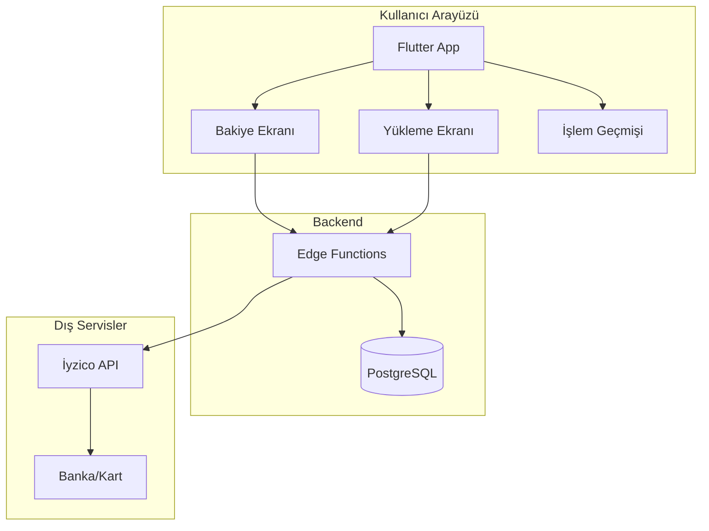

# Bakiye Sistemi Geliştirme Planı

## Genel Bakış
Tam kapsamlı bir bakiye sistemi: kullanıcılar bakiye yükleyebilecek, siparişlerde kullanabilecek, satıcılar kazançlarını çekebilecek ve iadeler otomatik olarak bakiyeye yansıyacak.

---

## Sistem Mimarisi

---

## Veritabanı Tabloları

### 1. user_balances
Kullanıcı bakiyelerini tutar.

| Alan | Tip | Açıklama |
|------|-----|----------|
| id | uuid | Birincil anahtar |
| user_id | uuid | Kullanıcı ID (profiles tablosu ile ilişkili) |
| balance | decimal(12,2) | Mevcut bakiye |
| locked_balance | decimal(12,2) | Kilitli bakiye (işlem bekleyen) |
| total_earned | decimal(12,2) | Toplam kazanılan |
| total_spent | decimal(12,2) | Toplam harcanan |
| total_withdrawn | decimal(12,2) | Toplam çekilen |
| created_at | timestamp | Oluşturma tarihi |
| updated_at | timestamp | Güncelleme tarihi |

### 2. balance_transactions
Tüm bakiye işlemlerini loglar.

| Alan | Tip | Açıklama |
|------|-----|----------|
| id | uuid | Birincil anahtar |
| user_id | uuid | Kullanıcı ID |
| type | enum | topup, order_payment, refund, withdrawal, adjustment |
| amount | decimal(12,2) | İşlem tutarı |
| fee | decimal(12,2) | İşlem ücreti (varsa) |
| net_amount | decimal(12,2) | Net tutar |
| balance_before | decimal(12,2) | İşlem öncesi bakiye |
| balance_after | decimal(12,2) | İşlem sonrası bakiye |
| reference_type | varchar | order, withdrawal, etc. |
| reference_id | uuid | İlgili sipariş/çekim ID |
| status | enum | pending, completed, failed, cancelled |
| description | text | Açıklama |
| payment_method | varchar | kart, havale, etc. |
| payment_reference | varchar | Dış ödeme referansı |
| metadata | jsonb | Ek veriler |
| created_at | timestamp | Oluşturma tarihi |

### 3. seller_withdrawals
Satıcı çekim taleplerini tutar.

| Alan | Tip | Açıklama |
|------|-----|----------|
| id | uuid | Birincil anahtar |
| seller_id | uuid | Satıcı ID |
| amount | decimal(12,2) | Çekim tutarı |
| fee | decimal(12,2) | Çekim ücreti |
| net_amount | decimal(12,2) | Net tutar |
| status | enum | pending, processing, completed, failed, cancelled |
| bank_account_name | varchar | Banka hesap sahibi |
| bank_account_number | varchar | Banka hesap numarası |
| bank_name | varchar | Banka adı |
| iban | varchar | IBAN |
| processed_at | timestamp | İşleme tarihi |
| failure_reason | text | Başarısızlık nedeni |
| admin_notes | text | Admin notları |
| created_at | timestamp | Oluşturma tarihi |
| updated_at | timestamp | Güncelleme tarihi |

### 4. seller_earnings
Satıcı kazançlarını izler.

| Alan | Tip | Açıklama |
|------|-----|----------|
| id | uuid | Birincil anahtar |
| seller_id | uuid | Satıcı ID |
| order_id | uuid | Sipariş ID |
| gross_amount | decimal(12,2) | Brüt tutar |
| commission_amount | decimal(12,2) | Komisyon |
| net_amount | decimal(12,2) | Net tutar (satıcının kazanacağı) |
| status | enum | pending, available, withdrawn, cancelled |
| available_at | timestamp | Çekilebilir tarih |
| withdrawn_at | timestamp | Çekildi tarihi |
| withdrawal_id | uuid | Çekim ID |
| created_at | timestamp | Oluşturma tarihi |

---

## Geliştirme Adımları

### Aşama 1: Veritabanı Tabloları
- [ ] user_balances tablosu ve trigger oluşturma
- [ ] balance_transactions tablosu oluşturma
- [ ] seller_withdrawals tablosu oluşturma
- [ ] seller_earnings tablosu oluşturma
- [ ] RLS politikaları tanımlama
- [ ] İndeksler oluşturma

### Aşama 2: Backend Fonksiyonları
- [ ] get_balance - Kullanıcı bakiyesini getir
- [ ] create_topup - Bakiye yükleme başlat
- [ ] confirm_topup - Bakiye yüklemeyi onayla
- [ ] use_balance_for_order - Siparişte bakiye kullan
- [ ] refund_to_balance - İadeyi bakiyeye yap
- [ ] get_withdrawable_balance - Çekilebilir tutarı hesapla
- [ ] request_withdrawal - Çekim talebi oluştur
- [ ] process_withdrawal - Çekimi işle (admin)
- [ ] get_transaction_history - İşlem geçmişini getir

### Aşama 3: Frontend Modeller ve Servisler
- [ ] Balance model oluşturma
- [ ] BalanceTransaction model oluşturma
- [ ] SellerWithdrawal model oluşturma
- [ ] BalanceService oluşturma
- [ ] WithdrawalService oluşturma

### Aşama 4: Bakiye Ekranları
- [ ] WalletScreen - Ana bakiye görüntüleme
- [ ] TopUpScreen - Bakiye yükleme
- [ ] TransactionHistoryScreen - İşlem geçmişi
- [ ] WithdrawalRequestScreen - Çekim talebi
- [ ] AdminWithdrawalScreen - Admin çekim yönetimi

### Aşama 5: Sipariş Entegrasyonu
- [ ] Checkout'ta bakiye seçeneği ekleme
- [ ] Bakiye yetersizse kısmi ödeme
- [ ] Sipariş tamamlandığında bakiye düşme
- [ ] Sipariş iptal/iadeinde bakiye iadesi

### Aşama 6: Satıcı Entegrasyonu
- [ ] Satıcı kazanç tablosu
- [ ] Kazanç çekme akışı
- [ ] Earning hesaplama (sipariş tamamlandığında)

### Aşama 7: Admin Panel
- [ ] Çekim taleplerini listeleme
- [ ] Çekim onay/reddetme
- [ ] Manuel bakiye düzeltme
- [ ] Sistem ayarları (min yükleme, min çekim, ücretler)

---

## Ödeme Akışları

### Bakiye Yükleme
1. Kullanıcı yüklenecek tutarı seçer/girer
2. İyzico ödeme başlatılır
3. Ödeme başarılı → Bakiye güncellenir
4. İşlem loglanır

### Sipariş Ödeme
1. Kullanıcı ödeme yöntemi olarak "Bakiye" seçer
2. Yeterli bakiye kontrolü
3. Sipariş oluşturulur
4. Bakiye düşülür
5. İşlem loglanır
6. Sipariş onaylanır

### İade
1. Sipariş iptal/teslim edilemez
2. Admin iade onaylar
3. Bakiye + işlem ücreti düşülmeden iade
4. İşlem loglanır

### Satıcı Çekimi
1. Satıcı çekilebilir tutarı görür
2. Çekim talebi oluşturur
3. Admin onaylar
4. Banka transferi yapılır (manual)
5. Çekim tamamlanır
6. Kazanç kaydı güncellenir
7. İşlem loglanır

---

## Sistem Ayarları (app_about_settings)
- min_topup_amount: Minimum yükleme (varsayılan: 10)
- max_topup_amount: Maximum yükleme (varsayılan: 10000)
- withdrawal_fee_percent: Çekim ücreti % (varsayılan: 2)
- min_withdrawal_amount: Minimum çekim (varsayılan: 50)
- withdrawal_processing_days: Çekim işlem süresi gün (varsayılan: 3)
