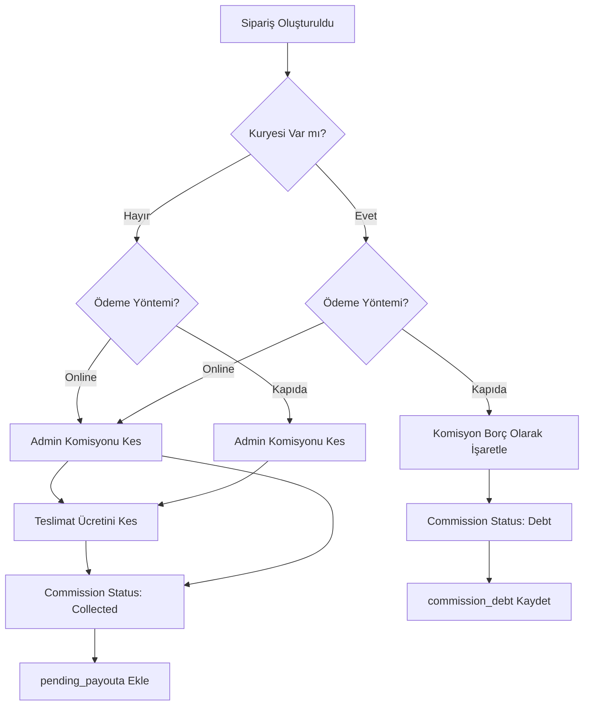
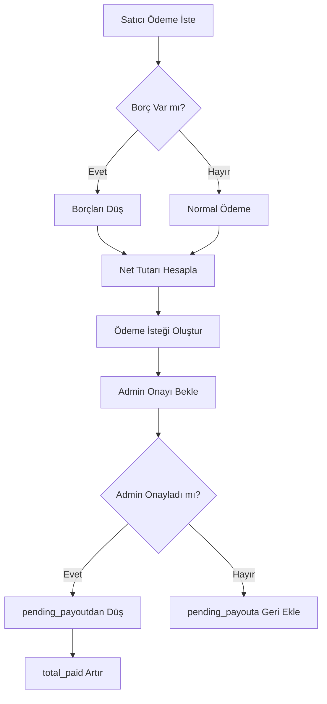

# CizreApp Komisyon Sistemi - Teknik Spesifikasyon

## Sistem Özeti

Komisyon sistemi, siparişlerin ödeme yöntemine ve satıcının kurye durumuna göre admin komisyonu ve teslimat ücreti kesintilerini yönetir.

## Komisyon Mantığı Tablosu

| Satıcı Tipi | Ödeme Yöntemi | Admin Komisyonu | Teslimat Ücreti | Açıklama |
|-------------|---------------|-----------------|-----------------|----------|
| Kuryesi Olmayan | Online | ✅ Kes | ✅ Kes | Online ödemede komisyon ve teslimat ücreti anında kesilir |
| Kuryesi Olmayan | Kapıda | ✅ Kes | ✅ Kes | Kapıda ödemede de komisyon ve teslimat ücreti kesilir |
| Kuryesi Olan | Online | ✅ Kes | ❌ Kes | Sadece komisyon kesilir, teslimat ücreti satıcıda kalır |
| Kuryesi Olan | Kapıda | ⚠️ Borç | ❌ Kes | Komisyon borç olarak işaretlenir, teslimat ücreti satıcıda kalır |

## Veritabanı Değişiklikleri

### 1. Orders Tablosu Eklenecek Alanlar

```sql
-- Komisyon durumu
commission_status VARCHAR DEFAULT 'pending' CHECK (commission_status IN ('pending', 'collected', 'debt', 'waived'))

-- Admin komisyon tutarı (sipariş tutarının %'i)
admin_commission DECIMAL(12, 2) DEFAULT 0

-- Admin teslimat ücreti (kuryesi olmayan satıcılardan kesilen)
admin_delivery_fee DECIMAL(12, 2) DEFAULT 0

-- Satıcıya ödenen net tutar
seller_net_amount DECIMAL(12, 2) DEFAULT 0

-- Komisyon borç tutarı (kuryesi olan + kapıda ödeme)
commission_debt DECIMAL(12, 2) DEFAULT 0
```

### 2. Commission Status Enum Değerleri

- **pending**: Komisyon bekliyor (hesaplandı ama henüz tahsil edilmedi)
- **collected**: Komisyon tahsil edildi
- **debt**: Komisyon borç olarak işaretlendi (kuryesi olan + kapıda ödeme)
- **waived**: Komisyon affedildi (admin tarafından iptal edildi)

### 3. System Settings (Admin Komisyon Oranı)

```sql
-- sistem ayarlarına varsayılan admin komisyon oranı ekle
INSERT INTO system_settings (key, value, description) 
VALUES ('admin_commission_rate', '10', 'Admin komisyon oranı (%)')
ON CONFLICT (key) DO UPDATE SET value = '10';
```

### 4. Komisyon Hesaplama Fonksiyonu

Sipariş oluşturulduğunda otomatik komisyon hesaplayan fonksiyon.

## Dart Modelleri

### OrderModel Güncellemeleri

```dart
class Order {
  // ... mevcut alanlar ...
  
  // Komisyon alanları
  final CommissionStatus? commissionStatus;
  final double? adminCommission;
  final double? adminDeliveryFee;
  final double? sellerNetAmount;
  final double? commissionDebt;
  
  // Satıcı kurye durumu (ilişkili veri)
  final bool? hasOwnCourier;
}

enum CommissionStatus {
  pending,    // Beklemede
  collected,  // Tahsil Edildi
  debt,       // Borç
  waived;     // Affedildi
  
  String get label { ... }
  String get dbValue { ... }
  static CommissionStatus fromString(String value) { ... }
}
```

### ShopModel Güncellemeleri

```dart
class Shop {
  // ... mevcut alanlar ...
  
  // Kurye durumu
  final bool? hasOwnCourier;
  
  // Komisyon oranı
  final double commissionRate;
}
```

## CommissionService

Yeni servis oluşturulacak. İşlevleri:

1. **Komisyon Hesaplama**: Sipariş detaylarına göre komisyon hesapla
2. **Toplam Kazanç Raporu**: Adminin toplam kazancı
3. **Borç Raporu**: Kuryesi olan satıcılardan toplanacak borçlar
4. **Satıcı Kazanç Raporu**: Satıcı bazlı kazanç özeti

```dart
class CommissionService {
  // Komisyon hesapla
  Future<CommissionCalculation> calculateCommission({
    required double totalAmount,
    required double deliveryFee,
    required bool hasOwnCourier,
    required PaymentMethod paymentMethod,
    required double adminCommissionRate,
  });
  
  // Sipariş için komisyon kaydet
  Future<void> saveOrderCommission(Order order);
  
  // Admin komisyon raporu
  Future<CommissionReport> getAdminCommissionReport(DateTimeRange range);
  
  // Satıcı komisyon özeti
  Future<SellerCommissionSummary> getSellerCommissionSummary(String sellerId);
  
  // Borç listesi
  Future<List<Order>> getDebtOrders(String sellerId);
}
```

## Admin Paneli UI

### 1. Komisyon Raporları Sayfası

```
┌─────────────────────────────────────────────────────────────┐
│                      Admin Komisyon Raporları                 │
├─────────────────────────────────────────────────────────────┤
│                                                             │
│  📊 Toplam Kazanç                          ₺15,234.50        │
│                                                             │
│  ┌──────────────┬──────────────┬──────────────┬──────────┐│
│  │   Toplam     │   Tahsil     │    Borç     │  Affedilen││
│  │  Komisyon    │   Edilen     │   Bekleyen  │   Tutar   ││
│  ├──────────────┼──────────────┼──────────────┼──────────┤│
│  │  ₺3,450.00  │  ₺2,890.50  │  ₺559.50    │  ₺0.00   ││
│  └──────────────┴──────────────┴──────────────┴──────────┘│
│                                                             │
│  📅 Tarih Aralığı: [Son 30 Gün ▼]                          │
│                                                             │
│  ┌─────────────────────────────────────────────────────┐  │
│  │ Satıcı Bazlı Özet                                   │  │
│  ├─────────────────────────────────────────────────────┤  │
│  │ Dükkan Adı        │ Sipariş │ Komisyon │ Durum     │  │
│  ├─────────────────────────────────────────────────────┤  │
│  │ Kebapçı Ahmet     │   145   │ ₺1,234  │ ✅       │  │
│  │ Lahmacuncu Ali   │    89   │ ₺890    │ ⚠️ Borç  │  │
│  │ Burger House     │    56   │ ₺560    │ ✅       │  │
│  └─────────────────────────────────────────────────────┘  │
└─────────────────────────────────────────────────────────────┘
```

### 2. Sipariş Detay Komisyon Bilgisi

```
┌─────────────────────────────────────────────┐
│ Sipariş #12345 Detayı                        │
├─────────────────────────────────────────────┤
│                                             │
│ 📦 Sipariş Tutarı:        ₺450.00          │
│ 🚚 Teslimat Ücreti:       ₺30.00           │
│ ─────────────────────────────────────────── │
│ 💰 Toplam Tutar:          ₺480.00          │
│                                             │
│ ━━━━━━━━━━━━━━━━━━━━━━━━━━━━━━━━━━━━━━━━━━ │
│ 💵 Komisyon Detayları                       │
│ ━━━━━━━━━━━━━━━━━━━━━━━━━━━━━━━━━━━━━━━━━━ │
│                                             │
│ Satıcı:                    Kebapçı Ahmet    │
│ Kurye Durumu:              ❌ Kuryesi Yok   │
│ Ödeme Yöntemi:             💳 Online        │
│                                             │
│ Admin Komisyonu (%10):    ₺45.00           │
│ Admin Teslimat Ücreti:    ₺30.00           │
│ ─────────────────────────────────────────── │
│ 📉 Satıcı Net Ödeme:       ₺405.00          │
│                                             │
│ Komisyon Durumu:          ✅ Tahsil Edildi  │
└─────────────────────────────────────────────┘
```

### 3. Komisyon Ayarları Sayfası

```
┌─────────────────────────────────────────────┐
│ Komisyon Ayarları                           │
├─────────────────────────────────────────────┤
│                                             │
│ Varsayılan Admin Komisyon Oranı             │
│ ┌─────────────────────────────────────────┐ │
│ │  [ 10 ] %                               │ │
│ └─────────────────────────────────────────┘ │
│                                             │
│ Bu oran, kuryesi olmayan satıcılardan       │
│ online ödemelerde kesilir.                  │
│                                             │
│ [ Kaydet ]                                  │
└─────────────────────────────────────────────┘
```

## Satıcı Paneli UI

### 1. Sipariş Detayında Komisyon Bilgisi

```
┌─────────────────────────────────────────────┐
│ Sipariş #12345                              │
├─────────────────────────────────────────────┤
│                                             │
│ Sipariş Tutarı:              ₺450.00        │
│ ─────────────────────────────────────────── │
│ Platform Komisyonu:          -₺45.00        │
│ Net Ödeme:                   ₺405.00        │
│                                             │
│ Durum:                        ✅ Ödendi      │
└─────────────────────────────────────────────┘
```

### 2. Kazanç Raporu

```
┌─────────────────────────────────────────────┐
│ Kazanç Raporum                              │
├─────────────────────────────────────────────┤
│                                             │
│ 📊 Bu Ay                                    │
│ ┌─────────────────────────────────────────┐ │
│ │  Toplam Sipariş Tutarı     ₺12,450.00  │ │
│ │  Platform Komisyonu        -₺1,245.00  │ │
│ │  ─────────────────────────────────────  │ │
│ │  Net Kazanç               ₺11,205.00  │ │
│ └─────────────────────────────────────────┘ │
│                                             │
│ ⚠️ Bekleyen Borçlar:        ₺559.50         │
│   (Kapıda ödemelerden tahsil edilecek)     │
│                                             │
│ [ Ödeme İste ]                             │
└─────────────────────────────────────────────┘
```

### 3. Borç Uyarısı

Kuryesi olan satıcı kapıda ödemeli sipariş verdiğinde:

```
┌─────────────────────────────────────────────┐
│ ⚠️ Bilgilendirme                            │
├─────────────────────────────────────────────┤
│                                             │
│ Kapıda ödemeli siparişlerde platform        │
│ komisyonu sonraki ödemelerınızdan           │
│ düşülecektir.                               │
│                                             │
│ Mevcut Borcunuz: ₺559.50                    │
│                                             │
│ [ Tamam ]                                   │
└─────────────────────────────────────────────┘
```

## İş Akışı Diyagramları

### Komisyon Hesaplama Akışı



### Ödeme İsteği Akışı



## API Endpoints (Supabase RPC)

### 1. Komisyon Hesaplama Fonksiyonu

```sql
CREATE OR REPLACE FUNCTION calculate_order_commission(
    p_order_id UUID,
    p_admin_commission_rate DECIMAL DEFAULT 10
) RETURNS TABLE(
    admin_commission DECIMAL,
    admin_delivery_fee DECIMAL,
    seller_net_amount DECIMAL,
    commission_status VARCHAR
) AS $$
DECLARE
    v_order RECORD;
    v_shop RECORD;
    v_admin_comm DECIMAL;
    v_admin_delivery DECIMAL;
    v_net_amount DECIMAL;
    v_comm_status VARCHAR;
BEGIN
    -- Sipariş ve dükkan bilgilerini al
    SELECT * INTO v_order FROM orders WHERE id = p_order_id;
    SELECT * INTO v_shop FROM shops WHERE id = v_order.shop_id;
    
    -- Komisyon hesapla
    v_admin_comm := (v_order.subtotal * p_admin_commission_rate / 100);
    
    -- Kurye durumu ve ödeme yöntemine göre hesapla
    IF v_shop.has_own_courier = false THEN
        -- Kuryesi yok - teslimat ücretini kes
        v_admin_delivery := v_order.delivery_fee;
        v_comm_status := 'collected';
    ELSE
        -- Kuryesi var - teslimat ücretini kesme
        v_admin_delivery := 0;
        
        IF v_order.payment_method IN ('cash', 'cardOnDelivery') THEN
            -- Kapıda ödeme - borç olarak işaretle
            v_comm_status := 'debt';
        ELSE
            -- Online ödeme - tahsil et
            v_comm_status := 'collected';
        END IF;
    END IF;
    
    -- Net tutar hesapla
    v_net_amount := v_order.subtotal - v_admin_comm - v_admin_delivery;
    
    RETURN QUERY SELECT v_admin_comm, v_admin_delivery, v_net_amount, v_comm_status;
END;
$$ LANGUAGE plpgsql;
```

### 2. Admin Komisyon Raporu

```sql
CREATE OR REPLACE FUNCTION get_admin_commission_report(
    p_start_date TIMESTAMPTZ DEFAULT NOW() - INTERVAL '30 days',
    p_end_date TIMESTAMPTZ DEFAULT NOW()
) RETURNS TABLE(
    total_commission DECIMAL,
    collected_amount DECIMAL,
    debt_amount DECIMAL,
    waived_amount DECIMAL,
    total_delivery_fee DECIMAL
) AS $$
BEGIN
    RETURN QUERY
    SELECT 
        COALESCE(SUM(admin_commission), 0) as total_commission,
        COALESCE(SUM(CASE WHEN commission_status = 'collected' THEN admin_commission ELSE 0 END), 0) as collected_amount,
        COALESCE(SUM(CASE WHEN commission_status = 'debt' THEN admin_commission ELSE 0 END), 0) as debt_amount,
        COALESCE(SUM(CASE WHEN commission_status = 'waived' THEN admin_commission ELSE 0 END), 0) as waived_amount,
        COALESCE(SUM(admin_delivery_fee), 0) as total_delivery_fee
    FROM orders
    WHERE created_at BETWEEN p_start_date AND p_end_date
    AND status != 'cancelled';
END;
$$ LANGUAGE plpgsql;
```

## Güvenlik ve RLS

Komisyon verilerine erişim için RLS politikaları:

```sql
-- Adminler tüm komisyon verilerini görebilir
CREATE POLICY "Adminler komisyon verilerini görebilir"
ON orders FOR SELECT
TO authenticated
USING (
    EXISTS (SELECT 1 FROM profiles WHERE id = auth.uid() AND is_admin = true)
);

-- Satıcılar kendi siparişlerinin komisyonunu görebilir
CREATE POLICY "Satıcılar kendi komisyonunu görebilir"
ON orders FOR SELECT
TO authenticated
USING (
    shop_id IN (SELECT id FROM shops WHERE owner_id = auth.uid())
);
```

## Test Senaryoları

### Senaryo 1: Kuryesi Olmayan - Online Ödeme
- Sipariş: ₺500
- Teslimat: ₺30
- Komisyon (%10): ₺50
- Admin Teslimat: ₺30
- Net Ödeme: ₺420
- Durum: Collected

### Senaryo 2: Kuryesi Olmayan - Kapıda Ödeme
- Sipariş: ₺500
- Teslimat: ₺30
- Komisyon (%10): ₺50
- Admin Teslimat: ₺30
- Net Ödeme: ₺420
- Durum: Collected

### Senaryo 3: Kuryesi Olan - Online Ödeme
- Sipariş: ₺500
- Teslimat: ₺30
- Komisyon (%10): ₺50
- Admin Teslimat: ₺0
- Net Ödeme: ₺450
- Durum: Collected

### Senaryo 4: Kuryesi Olan - Kapıda Ödeme
- Sipariş: ₺500
- Teslimat: ₺30
- Komisyon (%10): ₺50
- Admin Teslimat: ₺0
- Komisyon Borcu: ₺50
- Net Ödeme: ₺500 (tahsilatta düşülecek)
- Durum: Debt
