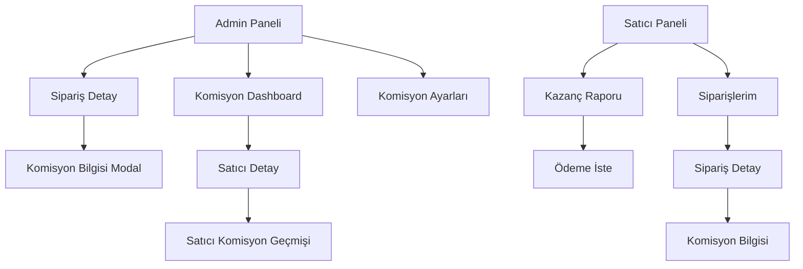

# Komisyon Sistemi - UI Tasarım Planı

## Admin Paneli Ekranları

### 1. Komisyon Dashboard Sayfası

**Dosya:** `lib/features/admin/screens/commission_dashboard_screen.dart`

```
┌─────────────────────────────────────────────────────────────────────┐
│  🏠 Admin Paneli          Komisyon Raporları        🔔              │
├─────────────────────────────────────────────────────────────────────┤
│                                                                     │
│  📊 Platform Komisyon Raporu                                        │
│  ┌──────────────────────────────────────────────────────────────┐  │
│  │                                                               │  │
│  │  ┌─────────────────────────────────────────────────────────┐│  │
│  │  │  💰 Toplam Admin Kazancı               ₺15,234.50        ││  │
│  │  │                                                         ││  │
│  │  │  ┌──────────┬──────────┬──────────┬──────────────────┐ ││  │
│  │  │  │   Toplam │  Tahsil  │   Borç   │    Affedilen    │ ││  │
│  │  │  │ Komisyon │  Edilen  │ Bekleyen │     Tutar       │ ││  │
│  │  │  ├──────────┼──────────┼──────────┼──────────────────┤ ││  │
│  │  │  │₺3,450.00│₺2,890.50│ ₺559.50  │    ₺0.00        │ ││  │
│  │  │  └──────────┴──────────┴──────────┴──────────────────┘ ││  │
│  │  │                                                         ││  │
│  │  │  ┌─────────────────────────────────────────────────┐  ││  │
│  │  │  │  🚚 Toplam Teslimat Ücreti Kazancı: ₺4,230.00  │  ││  │
│  │  │  └─────────────────────────────────────────────────┘  ││  │
│  │  │                                                         ││  │
│  │  │  ┌─────────────────────────────────────────────────┐  ││  │
│  │  │  │  📈 Bu Ay: ₺12,450.00  │  📉 Geçen Ay: ₺11,200  ││  │
│  │  │  └─────────────────────────────────────────────────┘  ││  │
│  │  └─────────────────────────────────────────────────────────┘│  │
│  │                                                               │  │
│  └──────────────────────────────────────────────────────────────┘  │
│                                                                     │
│  📅 Tarih Aralığı: [Son 30 Gün ▼]  [Bugün] [Bu Ay] [Bu Yıl]       │
│                                                                     │
│  📊 Grafik                                                          │
│  ┌──────────────────────────────────────────────────────────────┐  │
│  │  ╭────────────────────────────────────────────────────────╮   │  │
│  │  │ █ ▄▄▄▄▄▄▄▄▄▄ ▄▄▄▄▄▄▄▄▄▄ ▄▄▄▄▄▄▄▄▄▄ ▄▄▄▄▄▄▄▄▄▄     │   │  │
│  │  │ 1 Oca  5 Oca  10 Oca  15 Oca  20 Oca  25 Oca  30 Oca  │   │  │
│  │  ╰────────────────────────────────────────────────────────╯   │  │
│  │  Komisyon Geliri                                             │  │
│  └──────────────────────────────────────────────────────────────┘  │
│                                                                     │
│  🏪 Satıcı Bazlı Komisyon Özeti                                    │
│  ┌──────────────────────────────────────────────────────────────┐  │
│  │ ┌────────────┬──────────┬──────────┬──────────┬──────────┐ │  │
│  │ │ Dükkan     │ Sipariş  │Komisyon  │   Borç   │  Durum   │ │  │
│  │ │ Adı        │ Sayısı   │  Tutarı  │  Tutarı  │          │ │  │
│  │ ├────────────┼──────────┼──────────┼──────────┼──────────┤ │  │
│  │ │ Kebapçı    │   145    │ ₺1,234  │  ₺0.00   │  ✅     │ │  │
│  │ │ Ahmet      │          │          │          │          │ │  │
│  │ │            │          │          │          │          │ │  │
│  │ │ Lahmacuncu │   89     │  ₺890   │ ₺234.50  │  ⚠️     │ │  │
│  │ │ Ali        │          │          │          │  Borç    │ │  │
│  │ │            │          │          │          │          │ │  │
│  │ │ Burger     │   56     │  ₺560   │  ₺0.00   │  ✅     │ │  │
│  │ │ House      │          │          │          │          │ │  │
│  │ └────────────┴──────────┴──────────┴──────────┴──────────┘ │  │
│  └──────────────────────────────────────────────────────────────┘  │
│                                                                     │
│  [📄 Detaylı Rapor]  [⚙️ Ayarlar]  [📥 Excel İndir]                 │
└─────────────────────────────────────────────────────────────────────┘
```

### 2. Sipariş Detayında Komisyon Bilgisi

**Dosya:** `lib/features/admin/screens/order_detail_screen.dart` (mevcut dosyaya ekleme)

```
┌─────────────────────────────────────────────────────────────┐
│ Sipariş #12345 - Kebapçı Ahmet            [Durum: Teslim]  │
├─────────────────────────────────────────────────────────────┤
│                                                             │
│ 📦 Sipariş Bilgileri                                       │
│ ┌─────────────────────────────────────────────────────┐    │
│ │ Sipariş No:         #12345                          │    │
│ │ Müşteri:            Ahmet Yılmaz                    │    │
│ │ Sipariş Tarihi:     31.01.2026 19:30               │    │
│ │ Ödeme Yöntemi:      💳 Online Ödeme                 │    │
│ └─────────────────────────────────────────────────────┘    │
│                                                             │
│ 💰 Tutar Bilgileri                                         │
│ ┌─────────────────────────────────────────────────────┐    │
│ │ Sipariş Tutarı:              ₺450.00               │    │
│ │ Teslimat Ücreti:             ₺30.00                │    │
│ │ ───────────────────────────────────────────────────  │    │
│ │ Toplam Tutar:                ₺480.00               │    │
│ └─────────────────────────────────────────────────────┘    │
│                                                             │
│ ━━━━━━━━━━━━━━━━━━━━━━━━━━━━━━━━━━━━━━━━━━━━━━━━━━━━━━━━ │
│ 💵 Komisyon Detayları                                       │
│ ━━━━━━━━━━━━━━━━━━━━━━━━━━━━━━━━━━━━━━━━━━━━━━━━━━━━━━━━ │
│                                                             │
│ ┌─────────────────────────────────────────────────────┐    │
│ │ Satıcı:                    Kebapçı Ahmet            │    │
│ │ Kurye Durumu:              ❌ Kuryesi Yok           │    │
│ │ Ödeme Yöntemi:             💳 Online Ödeme          │    │
│ │                                                             │
│ │ Admin Komisyon Oranı:      %10                          │    │
│ │ Admin Komisyon Tutarı:     ₺45.00  🔴                 │    │
│ │ Admin Teslimat Ücreti:     ₺30.00  🔴                 │    │
│ │ ───────────────────────────────────────────────────  │    │
│ │ 📉 Satıcı Net Ödeme:        ₺405.00  🟢             │    │
│ │                                                             │
│ │ Komisyon Durumu:          ✅ Tahsil Edildi           │    │
│ │ Komisyon Hesaplama:        31.01.2026 19:30          │    │
│ └─────────────────────────────────────────────────────┘    │
│                                                             │
│ [Düzenle]  [Komisyonu Affet]  [Yazdır]                     │
└─────────────────────────────────────────────────────────────┘
```

### 3. Komisyon Ayarları Sayfası

**Dosya:** `lib/features/admin/screens/commission_settings_screen.dart`

```
┌─────────────────────────────────────────────────────────────┐
│ ⚙️ Komisyon Ayarları                                         │
├─────────────────────────────────────────────────────────────┤
│                                                             │
│ 📊 Platform Komisyon Ayarları                              │
│ ┌─────────────────────────────────────────────────────┐    │
│ │                                                             │
│ │  Varsayılan Admin Komisyon Oranı                        │    │
│ │  ┌─────────────────────────────────────────────┐        │    │
│ │  │  [        10        ] %                      │        │    │
│ │  └─────────────────────────────────────────────┘        │    │
│ │                                                             │
│ │  Bu oran, kuryesi olmayan satıcılardan online            │    │
│ │  ödemelerde ve kuryesi olanlardan online ödemelerde      │    │
│ │  kesilir. Kapıda ödemelerde borç olarak işaretlenir.     │    │
│ │                                                             │
│ │  ┌─────────────────────────────────────────────┐        │    │
│ │  │  💡 Uygulanan Komisyon Mantığı:            │        │    │
│ │  │                                              │        │    │
│ │  │  ┌───────────────┬──────────────┬────────┐ │        │    │
│ │  │  │ Satıcı Tipi   │ Ödeme Yöntemi│ Komis. │ │        │    │
│ │  │  ├───────────────┼──────────────┼────────┤ │        │    │
│ │  │  │ Kuryesi Yok   │ Online       │   ✅   │ │        │    │
│ │  │  │ Kuryesi Yok   │ Kapıda       │   ✅   │ │        │    │
│ │  │  │ Kuryesi Var   │ Online       │   ✅   │ │        │    │
│ │  │  │ Kuryesi Var   │ Kapıda       │ ⚠️ Borç│ │        │    │
│ │  │  └───────────────┴──────────────┴────────┘ │        │    │
│ │  └─────────────────────────────────────────────┘        │    │
│ └─────────────────────────────────────────────────────┘    │
│                                                             │
│ 🚚 Teslimat Ücreti Ayarları                                │
│ ┌─────────────────────────────────────────────────────┐    │
│ │                                                             │
│ │  Varsayılan Teslimat Ücreti                            │    │
│ │  ┌─────────────────────────────────────────────┐        │    │
│ │  │  [        30        ] ₺                      │        │    │
│ │  └─────────────────────────────────────────────┘        │    │
│ │                                                             │
│ │  Bu ücret kuryesi olmayan satıcılardan kesilir.          │    │
│ └─────────────────────────────────────────────────────┘    │
│                                                             │
│ [💾 Kaydet]  [↺ Sıfırla]                                        │
└─────────────────────────────────────────────────────────────┘
```

## Satıcı Paneli Ekranları

### 4. Satıcı Kazanç Raporu Sayfası

**Dosya:** `lib/features/seller/screens/earnings_screen.dart`

```
┌─────────────────────────────────────────────────────────────┐
│ 💰 Kazanç Raporum                                             │
├─────────────────────────────────────────────────────────────┤
│                                                             │
│ 📊 Bu Ay                                                   │
│ ┌─────────────────────────────────────────────────────┐    │
│ │  ┌─────────────────────────────────────────────┐    │    │
│ │  │                                             │    │    │
│ │  │     Toplam Satış              │    │    │    │    │
│ │  │     ═══════════════           │    │    │    │    │
│ │  │     ₺12,450.00               │    │    │    │    │
│ │  │                                             │    │    │
│ │  │  ┌─────────────────────────────────────────┐│    │    │
│ │  │  │  Platform Komisyonu        -₺1,245.00  ││    │    │
│ │  │  │  ─────────────────────────────────────  ││    │    │
│ │  │  │  📉 Net Kazanç            ₺11,205.00  ││    │    │
│ │  │  └─────────────────────────────────────────┘│    │    │
│ │  │                                             │    │    │
│ │  └─────────────────────────────────────────────┘    │    │
│ │                                                           │    │
│ │  📦 Sipariş Sayısı:        89 adet                      │    │
│ │  📈 Ortalama Sepet Tutarı: ₺139.89                      │    │
│ └─────────────────────────────────────────────────────┘    │
│                                                             │
│ ⚠️ Tahsil Edilecek Borçlar                                 │
│ ┌─────────────────────────────────────────────────────┐    │
│ │ ┌─────────────────────────────────────────────────┐  │    │
│ │ │ ⚠️ Kapıda ödemeli siparişlerden tahsil edilecek │  │    │
│ │ │    komisyon borcunuz bulunmaktadır.            │  │    │
│ │ │                                                  │  │    │
│ │ │    💳 Mevcut Borç:        ₺559.50              │  │    │
│ │ │    📊 Tahsil Edilen:      ₺234.00              │  │    │
│ │ │    📉 Kalan Borç:         ₺325.50              │  │    │
│ │ │                                                  │  │    │
│ │ │    [💳 Borçları Öde]                              │  │    │
│ │ └─────────────────────────────────────────────────┘  │    │
│ └─────────────────────────────────────────────────────┘    │
│                                                             │
│ 💵 Bekleyen Ödeme                                          │
│ ┌─────────────────────────────────────────────────────┐    │
│ │                                                           │    │
│ │  ┌───────────────────────────────────────────────┐   │    │
│ │  │  Ödenecek Tutar                    │   │    │    │
│ │  │  ══════════════════                  │   │    │    │
│ │  │  ₺11,205.00                        │   │    │    │
│ │  │                                               │   │    │
│ │  │  Minimum Ödeme Tutarı: ₺100.00               │   │    │
│ │  │                                               │   │    │
│ │  └───────────────────────────────────────────────┘   │    │
│ │                                                           │    │
│ │  [💸 Ödeme İste]                                          │    │
│ └─────────────────────────────────────────────────────┘    │
│                                                             │
│ 📋 Son İşlemler                                            │
│ ┌─────────────────────────────────────────────────────┐    │
│ │ ┌─────────────────────────────────────────────────┐  │    │
│ │ │ Tarih       │ İşlem              │ Tutar        │  │    │
│ │ ├─────────────┼────────────────────┼──────────────┤  │    │
│ │ │ 31.01.2026 │ Sipariş #12345     │ +₺405.00    │  │    │
│ │ │ 31.01.2026 │ Komisyon Kesintisi │ -₺45.00     │  │    │
│ │ │ 30.01.2026 │ Ödeme #PR-001      │ -₺5,000.00  │  │    │
│ │ │ 30.01.2026 │ Sipariş #12300     │ +₺380.00    │  │    │
│ │ └─────────────────────────────────────────────────┘  │    │
│ └─────────────────────────────────────────────────────┘    │
└─────────────────────────────────────────────────────────────┘
```

### 5. Satıcı Sipariş Detayında Komisyon Bilgisi

**Dosya:** `lib/features/seller/screens/seller_order_detail_screen.dart`

```
┌─────────────────────────────────────────────────────────────┐
│ Sipariş #12345                                              │
├─────────────────────────────────────────────────────────────┤
│                                                             │
│ 📦 Sipariş Bilgileri                                       │
│ ┌─────────────────────────────────────────────────────┐    │
│ │ Müşteri:            Ahmet Yılmaz                    │    │
│ │ Sipariş Tarihi:     31.01.2026 19:30               │    │
│ │ Durum:              ✅ Teslim Edildi                │    │
│ │ Ödeme Yöntemi:      💳 Online Ödeme                 │    │
│ └─────────────────────────────────────────────────────┘    │
│                                                             │
│ 💰 Özet                                                    │
│ ┌─────────────────────────────────────────────────────┐    │
│ │ Sipariş Tutarı:              ₺450.00               │    │
│ │ ───────────────────────────────────────────────────  │    │
│ │ Platform Komisyonu:          -₺45.00               │    │
│ │ ───────────────────────────────────────────────────  │    │
│ │ ✅ Net Ödeme:                ₺405.00               │    │
│ └─────────────────────────────────────────────────────┘    │
│                                                             │
│ Komisyon durumu: ✅ Tahsil Edildi (Bekleyen ödemeye eklendi)│
└─────────────────────────────────────────────────────────────┘
```

## Widget Bileşenleri

### 6. Komisyon Kartı Widget

**Dosya:** `lib/core/widgets/commission_card.dart`

```dart
// Admin Paneli İçin
class AdminCommissionCard extends StatelessWidget {
  final double totalCommission;
  final double collectedAmount;
  final double debtAmount;
  final double waivedAmount;
}

// Satıcı Paneli İçin
class SellerCommissionCard extends StatelessWidget {
  final double totalSales;
  final double commissionAmount;
  final double netEarnings;
  final double debtAmount;
  final double pendingPayout;
}
```

### 7. Borç Uyarısı Dialog

**Dosya:** `lib/core/widgets/debt_warning_dialog.dart`

```
┌─────────────────────────────────────────────────────────────┐
│                      ⚠️ Bilgilendirme                        │
├─────────────────────────────────────────────────────────────┤
│                                                             │
│  Kapıda ödemeli siparişlerde platform komisyonu             │
│  sonraki ödemelerınızdan düşülecektir.                      │
│                                                             │
│  ┌─────────────────────────────────────────────────────┐   │
│  │  Mevcut Borç Tutarınız:  ₺559.50                    │   │
│  │  ─────────────────────────────────────────────────   │   │
│  │  Bu sipariş için:        +₺45.00                     │   │
│  │  ─────────────────────────────────────────────────   │   │
│  │  Toplam Borç:           ₺604.50                     │   │
│  └─────────────────────────────────────────────────────┘   │
│                                                             │
│  Borçlarınızı ödemek için kazanç raporu sayfasını          │
│  ziyaret edebilirsiniz.                                     │
│                                                             │
│                    [Anladım]  [Kazanç Rapora Git]          │
└─────────────────────────────────────────────────────────────┘
```

## Renk Paleti

```dart
class CommissionColors {
  static const collected = Color(0xFF4CAF50);  // Yeşil
  static const debt = Color(0xFFFF9800);       // Turuncu
  static const waived = Color(0xFF9E9E9E);     // Gri
  static const pending = Color(0xFF2196F3);    // Mavi
  static const danger = Color(0xFFF44336);     // Kırmızı
  static const success = Color(0xFF4CAF50);    // Yeşil
  static const warning = Color(0xFFFF9800);    // Turuncu
}
```

## Navigasyon Yapısı



## Responsive Düzen

### Mobil (< 768px)
- Kartlar dikey düzen
- Tablo yerine liste görünümü
- Daraltılmış grafikler

### Tablet (768px - 1024px)
- 2 sütunlu kart düzeni
- Basitleştirilmiş grafikler

### Desktop (> 1024px)
- 3-4 sütunlu kart düzeni
- Detaylı grafikler
- Yan panel navigasyon
