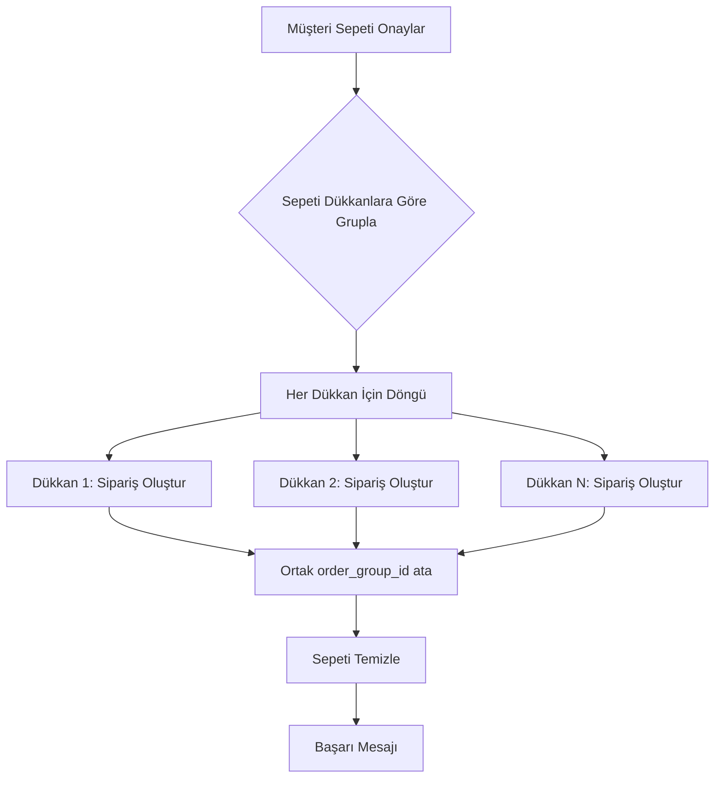

# Çok Dükkanlı Sipariş Sistemi - Teknik Tasarım Dökümanı

## 📋 Genel Bakış

### Mevcut Durum
Şu anda sepette farklı dükkanlardan ürünler olabiliyor ancak sipariş verildiğinde **tek bir sipariş** oluşturuluyor. Bu, her dükkanın kendi siparişlerini görmesini ve yönetmesini zorlaştırıyor.

### Hedef Durum
Her dükkan için **ayrı siparişler** oluşturulacak. Müşteri tek seferde ödeme yapacak ama arka planda her dükkan için bağımsız siparişler oluşacak.

---

## 🔍 Mevcut Sistem Analizi

### Sepet Yapısı
- **Tablo:** `cart`
- **İlişkiler:** 
  - `user_id` → Müşteri
  - `product_id` → Ürün
  - `product.shop_id` → Dükkan (join ile)
- **Özellik:** Sepette birden fazla dükkanın ürünleri olabiliyor ✅

### Sipariş Yapısı
- **Ana Tablo:** `orders`
  - `shop_id` (tek dükkan ID'si) ⚠️ SORUN BURASI
  - `user_id`
  - `total`, `subtotal`, `delivery_fee`
  - `commission_amount`, `admin_commission`
  
- **İlişkili Tablo:** `order_items`
  - `order_id`
  - `product_id`
  - `shop_id` (ürünün dükkanlı) 
  - `shop_name`

### Sorunlar
1. **orders.shop_id** sadece tek bir dükkana işaret ediyor
2. Checkout ekranı sadece bir `shopId` parametresi alıyor
3. Her dükkanın teslimat ücreti farklı olabilir
4. Her dükkanın komisyon oranı farklı

---

## 🎯 Çözüm Tasarımı

### Yaklaşım: "Sipariş Grubu" Konsepti

#### 1. Veritabanı Değişiklikleri

**Option A: Mevcut Yapıyı Kullan (ÖNERİLEN)**
- `orders` tablosuna yeni alan EKLEME
- Her dükkan için ayrı `order` kaydı oluştur
- Aynı müşteri + aynı zaman = İlişkili siparişler

```sql
-- orders tablosuna yeni alanlar ekle
ALTER TABLE orders ADD COLUMN order_group_id UUID;
ALTER TABLE orders ADD COLUMN group_order_number TEXT;

-- İndeks ekle
CREATE INDEX idx_orders_group_id ON orders(order_group_id);
CREATE INDEX idx_orders_group_number ON orders(group_order_number);
```

**Avantajlar:**
- Mevcut RLS policy'leri çalışmaya devam eder
- Her dükkan sadece kendi siparişlerini görür
- Müşteri tüm siparişlerini görür
- Admin tüm siparişleri görür
- Komisyon sistemi değişmez

**Option B: Yeni Tablo Oluştur** ❌ Karmaşık
- `order_groups` tablosu (master)
- `orders` tablosu (detail - her dükkan için)
- Daha kompleks, RLS policy'leri yeniden yazmak gerekir

### 2. Sipariş Oluşturma Akışı



#### Pseudo Code:

```typescript
async function createMultiShopOrder(userId, addressId, paymentMethod) {
  // 1. Sepeti getir
  const cartItems = await getCart(userId);
  
  // 2. Dükkanlara göre grupla
  const itemsByShop = groupBy(cartItems, item => item.shopId);
  
  // 3. Ortak grup ID'si oluştur
  const orderGroupId = uuid();
  const groupOrderNumber = `GRP${Date.now()}`;
  
  // 4. Her dükkan için ayrı sipariş oluştur
  const createdOrders = [];
  for (const [shopId, items] of Object.entries(itemsByShop)) {
    // Dükkan bilgilerini al (teslimat ücreti, komisyon)
    const shop = await getShop(shopId);
    
    // Hesaplamalar
    const subtotal = sum(items.map(i => i.price * i.quantity));
    const deliveryFee = shop.has_own_courier ? shop.delivery_fee : 0;
    const total = subtotal + deliveryFee;
    const commission = subtotal * shop.commission_rate;
    
    // Sipariş oluştur
    const order = await createOrder({
      userId,
      shopId,
      items,
      subtotal,
      deliveryFee,
      total,
      commission,
      addressId,
      paymentMethod,
      orderGroupId,
      groupOrderNumber,
    });
    
    createdOrders.push(order);
  }
  
  // 5. Sepeti temizle
  await clearCart(userId);
  
  return { orderGroupId, orders: createdOrders };
}
```

### 3. Checkout Ekranı Değişiklikleri

**Mevcut:**
```dart
CheckoutScreen({
  required String shopId,  // ❌ Tek dükkan
  required String shopName,
})
```

**Yeni:**
```dart
CheckoutScreen({
  // Parametresiz - sepetteki tüm dükkanları otomatik algıla
})
```

**UI Değişiklikleri:**

```
┌─────────────────────────────────────┐
│ 📍 Teslimat Adresi                 │
│ ━━━━━━━━━━━━━━━━━━━━━━━━━━━━━━━━   │
│ Ev - Ahmet Yılmaz                   │
│ Şirinevler Mah. İstanbul            │
└─────────────────────────────────────┘

┌─────────────────────────────────────┐
│ 🏪 DÜKKAN 1 - Teknoloji Mağazası   │
│ ━━━━━━━━━━━━━━━━━━━━━━━━━━━━━━━━   │
│ • Laptop (x1)         ₺15,000       │
│ • Mouse (x2)          ₺200          │
│                                      │
│ Ara Toplam:           ₺15,200       │
│ Teslimat:             ₺25           │
│ ━━━━━━━━━━━━━━━━━━━━━━━━━━━━━━━━   │
│ Toplam:               ₺15,225       │
└─────────────────────────────────────┘

┌─────────────────────────────────────┐
│ 🏪 DÜKKAN 2 - Giyim Mağazası       │
│ ━━━━━━━━━━━━━━━━━━━━━━━━━━━━━━━━   │
│ • Tişört (x3)         ₺450          │
│                                      │
│ Ara Toplam:           ₺450          │
│ Teslimat:             ₺15           │
│ ━━━━━━━━━━━━━━━━━━━━━━━━━━━━━━━━   │
│ Toplam:               ₺465          │
└─────────────────────────────────────┘

┌─────────────────────────────────────┐
│ 💳 Ödeme Yöntemi                   │
│ ○ Kapıda Nakit                      │
│ ● Kapıda Kredi Kartı                │
│ ○ Kapıda Banka Kartı                │
└─────────────────────────────────────┘

┌─────────────────────────────────────┐
│ GENEL TOPLAM: ₺15,690               │
│ (2 dükkandan toplam)                │
│                                      │
│ [ SİPARİŞİ ONAYLA ]                │
└─────────────────────────────────────┘
```

### 4. E-posta Bildirimleri

**Mevcut:** Tek sipariş için tek e-posta
**Yeni:** Her dükkan için ayrı e-posta

```typescript
// Her sipariş için e-posta gönder
for (const order of createdOrders) {
  await sendOrderEmail({
    orderId: order.id,
    shopId: order.shopId,
    total: order.total,
    // ...
  });
}
```

---

## 🔧 "Kuryem Var" Bildirim Sistemi

### Gereksinimler
1. Satıcı "Kuryem Var" butonuna tıkladığında
2. Admin'e bildirim gitsin
3. Admin onaylayınca `has_own_courier` = `true` olsun

### Veritabanı Değişiklikleri

```sql
-- courier_requests tablosu oluştur
CREATE TABLE courier_requests (
  id UUID PRIMARY KEY DEFAULT uuid_generate_v4(),
  shop_id UUID NOT NULL REFERENCES shops(id) ON DELETE CASCADE,
  seller_id UUID NOT NULL REFERENCES profiles(id),
  status TEXT NOT NULL DEFAULT 'pending' CHECK (status IN ('pending', 'approved', 'rejected')),
  message TEXT,
  admin_notes TEXT,
  created_at TIMESTAMPTZ NOT NULL DEFAULT NOW(),
  updated_at TIMESTAMPTZ NOT NULL DEFAULT NOW(),
  reviewed_at TIMESTAMPTZ,
  reviewed_by UUID REFERENCES profiles(id)
);

-- İndeksler
CREATE INDEX idx_courier_requests_shop ON courier_requests(shop_id);
CREATE INDEX idx_courier_requests_status ON courier_requests(status);

-- RLS Policy'leri
ALTER TABLE courier_requests ENABLE ROW LEVEL SECURITY;

-- Satıcı kendi taleplerini görebilir
CREATE POLICY seller_view_own_requests ON courier_requests
  FOR SELECT USING (seller_id = auth.uid());

-- Satıcı talep oluşturabilir
CREATE POLICY seller_create_request ON courier_requests
  FOR INSERT WITH CHECK (seller_id = auth.uid());

-- Admin tüm talepleri görebilir ve güncelleyebilir
CREATE POLICY admin_manage_requests ON courier_requests
  FOR ALL USING (
    EXISTS (
      SELECT 1 FROM profiles
      WHERE profiles.id = auth.uid()
      AND profiles.role = 'admin'
    )
  );
```

### UI Akışı

**Satıcı Paneli:**
```dart
// shop_settings_screen.dart içinde
if (!_hasOwnCourier && _courierRequestStatus != 'pending') {
  ElevatedButton.icon(
    onPressed: _requestCourier,
    icon: Icon(Icons.delivery_dining),
    label: Text('Kurye Talebinde Bulun'),
    style: ElevatedButton.styleFrom(
      backgroundColor: Colors.green,
    ),
  );
}

if (_courierRequestStatus == 'pending') {
  Container(
    padding: EdgeInsets.all(12),
    color: Colors.orange.shade50,
    child: Row(
      children: [
        Icon(Icons.hourglass_empty, color: Colors.orange),
        SizedBox(width: 8),
        Text('Kurye talebiniz admin onayı bekliyor'),
      ],
    ),
  );
}
```

**Admin Paneli:**
```dart
// Yeni ekran: courier_requests_screen.dart
ListView(
  children: requests.map((request) =>
    Card(
      child: ListTile(
        leading: CircleAvatar(child: Icon(Icons.delivery_dining)),
        title: Text(request.shopName),
        subtitle: Text('Talep Tarihi: ${formatDate(request.createdAt)}'),
        trailing: Row(
          mainAxisSize: MainAxisSize.min,
          children: [
            IconButton(
              icon: Icon(Icons.check, color: Colors.green),
              onPressed: () => _approveRequest(request.id),
            ),
            IconButton(
              icon: Icon(Icons.close, color: Colors.red),
              onPressed: () => _rejectRequest(request.id),
            ),
          ],
        ),
      ),
    )
  ).toList(),
);
```

### Backend Fonksiyonlar

```dart
// courier_request_service.dart
class CourierRequestService {
  // Talep oluştur
  Future<void> createCourierRequest({
    required String shopId,
    String? message,
  }) async {
    await _supabase.from('courier_requests').insert({
      'shop_id': shopId,
      'seller_id': _supabase.auth.currentUser!.id,
      'status': 'pending',
      'message': message,
    });
    
    // Admin'e bildirim gönder
    await _notificationService.notifyAdmins(
      type: 'courier_request',
      title: 'Yeni Kurye Talebi',
      content: 'Bir satıcı kurye talebinde bulundu',
    );
  }
  
  // Talebi onayla (Admin)
  Future<void> approveCourierRequest(String requestId) async {
    // 1. Request'i güncelle
    final request = await _supabase
        .from('courier_requests')
        .select('shop_id, seller_id')
        .eq('id', requestId)
        .single();
    
    await _supabase.from('courier_requests').update({
      'status': 'approved',
      'reviewed_at': DateTime.now().toIso8601String(),
      'reviewed_by': _supabase.auth.currentUser!.id,
    }).eq('id', requestId);
    
    // 2. Shop'u güncelle
    await _supabase.from('shops').update({
      'has_own_courier': true,
    }).eq('id', request['shop_id']);
    
    // 3. Satıcıya bildirim gönder
    await _notificationService.createNotification(
      userId: request['seller_id'],
      type: 'courier_request_approved',
      title: 'Kurye Talebiniz Onaylandı',
      content: 'Artık kendi teslimat ücretinizi belirleyebilirsiniz',
    );
  }
}
```

---

## 📱 Kullanıcı Deneyimi Akışları

### Müşteri Akışı

1. **Sepet Ekranı**
   - Ürünler dükkanlara göre gruplanmış gösterilir
   - Her dükkanın altında teslimat ücreti bilgisi
   - Toplam fiyat tüm dükkanları kapsar

2. **Checkout Ekranı**
   - Tek adres seçimi (tüm dükkanlar için ortak)
   - Tek ödeme yöntemi (tüm dükkanlar için ortak)
   - Dükkanlar ayrı ayrı listelenir, her birinin fiyatı gösterilir
   - Genel toplam en altta

3. **Siparişlerim Ekranı**
   - Grup sipariş numarası ile gruplanmış
   - Her dükkanın siparişi ayrı kart
   - Her siparişin kendi takip numarası
   - Her siparişin kendi durumu

### Satıcı Akışı

1. **Siparişler Ekranı**
   - Sadece kendi dükkanının siparişlerini görür
   - Diğer dükkanların siparişlerini GÖRMEZ
   - Her sipariş bağımsız işlenir

2. **Ayarlar Ekranı**
   - "Kuryem Var" switch (read-only, admin onayı gerektir)
   - "Kurye Talebinde Bulun" butonu
   - Talep durumu göstergesi

### Admin Akışı

1. **Tüm Siparişler**
   - Grup siparişleri birlikte gösterilir
   - Her siparişe ayrı müdahale edilebilir

2. **Kurye Talepleri**
   - Bekleyen talepler listesi
   - Onay/Red işlemleri
   - Talep geçmişi

---

## 🚀 İmplementasyon Adımları

### Faz 1: Veritabanı (1. Gün)
- [ ] `orders` tablosuna `order_group_id`, `group_order_number` ekle
- [ ] `courier_requests` tablosu oluştur
- [ ] RLS policy'leri ekle
- [ ] Migration dosyaları oluştur
- [ ] `payment_method` enum'una `cardOnDelivery` ekle

### Faz 2: Backend Servisler (2. Gün)
- [ ] `OrderService.createMultiShopOrder()` fonksiyonu
- [ ] `CartService.groupByShop()` fonksiyonu
- [ ] `CourierRequestService` oluştur
- [ ] E-posta sistemini çoklu sipariş için güncelle

### Faz 3: Checkout UI (3. Gün)
- [ ] `CheckoutScreen` yeniden tasarla
- [ ] Dükkanlara göre gruplu görünüm
- [ ] Her dükkan için ayrı fiyat kartları
- [ ] Genel toplam gösterimi
- [ ] Onay dialog'unu güncelle

### Faz 4: Sipariş Görüntüleme (4. Gün)
- [ ] Müşteri siparişlerim ekranını güncelle
- [ ] Grup sipariş gösterimi
- [ ] Satıcı paneli değişiklik GEREKTIRMEZ
- [ ] Admin paneli grup sipariş görünümü

### Faz 5: Kurye Talep Sistemi (5. Gün)
- [ ] Satıcı ayarlar ekranına "Kurye Talebi" butonu
- [ ] Talep oluşturma UI
- [ ] Admin kurye talepleri ekranı
- [ ] Onay/Red işlemleri
- [ ] Bildirimler

### Faz 6: Test & Bug Fix (6. Gün)
- [ ] End-to-end test
- [ ] Her dükkanın doğru siparişi aldığını doğrula
- [ ] Komisyon hesaplamalarını kontrol et
- [ ] E-posta bildirimlerini test et
- [ ] Kurye talep akışını test et

---

## ⚠️ Dikkat Edilmesi Gerekenler

### Kritik Noktalar
1. **Transaction Yönetimi**: Tüm siparişler başarılı olmalı, biri başarısız olursa tümü rollback
2. **Stok Yönetimi**: Her ürün için stok kontrolü ayrı yapılmalı
3. **Komisyon Hesaplama**: Her dükkana ayrı komisyon hesabı
4. **E-posta Flood**: Çok fazla e-posta gönderilmemeli (rate limiting)

### Geriye Uyumluluk
- Mevcut tek dükkan siparişleri çalışmaya devam eder
- `order_group_id` NULL olabilir (eski siparişler için)
- RLS policy'leri mevcut yapıyı destekler

### Performans
- Çok sayıda INSERT işlemi (her dükkan için sipariş + order_items)
- Batch insert kullan
- Asenkron e-posta gönderimi

---

## 📊 Veri Modeli Örnekleri

### Örnek Sipariş Grubu

```json
// Müşteri tek seferde sipariş veriyor
{
  "order_group_id": "123e4567-e89b-12d3-a456-426614174000",
  "group_order_number": "GRP1738762800000",
  "user_id": "user-uuid",
  "created_at": "2026-02-05T14:00:00Z"
}

// Arka planda 2 ayrı sipariş oluşuyor
{
  "orders": [
    {
      "id": "order-1-uuid",
      "order_number": "ORD1738762800001",
      "order_group_id": "123e4567-e89b-12d3-a456-426614174000",
      "group_order_number": "GRP1738762800000",
      "shop_id": "shop-1-uuid",
      "shop_name": "Teknoloji Mağazası",
      "subtotal": 15200,
      "delivery_fee": 25,
      "total": 15225,
      "commission_amount": 1520,
      "status": "pending"
    },
    {
      "id": "order-2-uuid",
      "order_number": "ORD1738762800002",
      "order_group_id": "123e4567-e89b-12d3-a456-426614174000",
      "group_order_number": "GRP1738762800000",
      "shop_id": "shop-2-uuid",
      "shop_name": "Giyim Mağazası",
      "subtotal": 450,
      "delivery_fee": 15,
      "total": 465,
      "commission_amount": 45,
      "status": "pending"
    }
  ]
}
```

---

## ✅ Başarı Kriterleri

1. ✅ Müşteri farklı dükkanlardan ürün ekleyip tek seferde ödeme yapabilmeli
2. ✅ Her dükkan sadece kendi siparişini görmeli
3. ✅ Admin tüm siparişleri görebilmeli
4. ✅ Her siparişin ayrı takip numarası olmalı
5. ✅ Her dükkana ayrı e-posta gitmeli
6. ✅ Komisyon hesaplamaları doğru olmalı
7. ✅ Satıcı kurye talebinde bulunabilmeli
8. ✅ Admin kurye taleplerini onaylayabilmeli

---

## 🎨 Wireframe'ler

### Checkout Ekranı (Yeni)

```
╔═══════════════════════════════════════╗
║  Sipariş Onayı                    [X] ║
╠═══════════════════════════════════════╣
║                                       ║
║  📍 Teslimat Adresi                  ║
║  ┌─────────────────────────────────┐ ║
║  │ Ev - Ahmet Yılmaz              │ ║
║  │ Şirinevler Mah. İstanbul       │ ║
║  │ [Değiştir]                      │ ║
║  └─────────────────────────────────┘ ║
║                                       ║
║  🏪 Teknoloji Mağazası               ║
║  ┌─────────────────────────────────┐ ║
║  │ • Laptop x1          ₺15,000   │ ║
║  │ • Mouse x2           ₺200      │ ║
║  │                                 │ ║
║  │ Ara Toplam:          ₺15,200   │ ║
║  │ Teslimat:            ₺25       │ ║
║  │ ─────────────────────────────── │ ║
║  │ Toplam:              ₺15,225   │ ║
║  └─────────────────────────────────┘ ║
║                                       ║
║  🏪 Giyim Mağazası                   ║
║  ┌─────────────────────────────────┐ ║
║  │ • Tişört x3          ₺450      │ ║
║  │                                 │ ║
║  │ Ara Toplam:          ₺450      │ ║
║  │ Teslimat:            ₺15       │ ║
║  │ ─────────────────────────────── │ ║
║  │ Toplam:              ₺465      │ ║
║  └─────────────────────────────────┘ ║
║                                       ║
║  💳 Ödeme Yöntemi                    ║
║  ○ Kapıda Nakit                      ║
║  ● Kapıda Kredi Kartı                ║
║  ○ Kapıda Banka Kartı                ║
║                                       ║
║  ┌─────────────────────────────────┐ ║
║  │ GENEL TOPLAM: ₺15,690          │ ║
║  │ (2 dükkandan toplam)            │ ║
║  │                                 │ ║
║  │  [ SİPARİŞİ ONAYLA ]           │ ║
║  └─────────────────────────────────┘ ║
╚═══════════════════════════════════════╝
```

---

Bu plan, sistemin tüm yönlerini kapsamaktadır. Sıradaki adım implementasyon başlamak için onay alınmasıdır.

**Tahmini Süre:** 5-6 gün  
**Öncelik:** Yüksek  
**Risk Seviyesi:** Orta (mevcut siparişler etkilenmeyecek)
