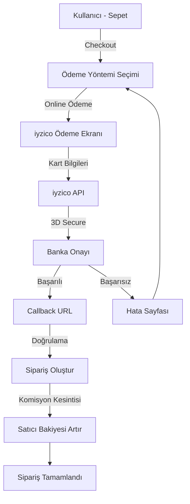
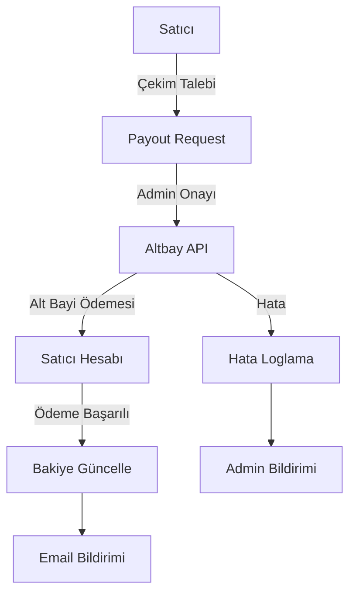

# Online Ödeme ve Pazaryeri Entegrasyon Planı
## iyzico + Altbay Marketplace Sistemi

**Tarih:** 2026-02-12  
**Proje:** Cizreapp - E-ticaret Marketplace  
**Kapsam:** Kullanıcı online ödeme + Satıcı bakiye çekimi (iyzico/altbay)

---

## 📊 Mevcut Durum Analizi

### Mevcut Ödeme Sistemi
- ✅ **Kapıda ödeme sistemi çalışıyor** (nakit/kart)
- ✅ `PaymentMethod` enum tanımlı: `cash`, `cardOnDelivery`, `online`, `creditCard`, `debitCard`
- ✅ Komisyon hesaplama mekanizması mevcut (`admin_commission`, `seller_net_amount`)
- ✅ Çoklu dükkan sipariş desteği var (`order_group_id`, `group_order_number`)
- ⚠️ **Online ödeme altyapısı YOK** - sadece enum tanımlı

### Mevcut Satıcı Ödeme Sistemi
- ✅ `payout_requests` tablosu mevcut
- ✅ Satıcı bakiye takibi var (`shops.balance`, `shops.courier_balance`)
- ⚠️ **Ödeme entegrasyonu YOK** - manuel işlem

### Teknik Stack
- **Backend:** Supabase (PostgreSQL + Edge Functions)
- **Frontend:** Flutter
- **HTTP:** `dio` package mevcut
- **Mevcut servisler:** `OrderService`, `CartService`, `EmailService`

---

## 🎯 Hedef Mimari

### 1. Kullanıcı Online Ödeme Akışı (iyzico)



### 2. Satıcı Bakiye Çekimi (Altbay Marketplace)



---

## 🗄️ Database Schema Değişiklikleri

### Yeni Tablolar

#### 1. `payment_transactions` (Ödeme işlem kayıtları)
```sql
CREATE TABLE payment_transactions (
  id UUID PRIMARY KEY DEFAULT gen_random_uuid(),
  order_id UUID REFERENCES orders(id) ON DELETE CASCADE,
  user_id UUID REFERENCES profiles(id) NOT NULL,
  
  -- iyzico bilgileri
  payment_id VARCHAR(100) UNIQUE, -- iyzico payment ID
  conversation_id VARCHAR(100), -- iyzico conversation ID
  payment_status VARCHAR(50) NOT NULL, -- pending, success, failure, refunded
  
  -- Tutar bilgileri
  amount DECIMAL(10,2) NOT NULL,
  paid_price DECIMAL(10,2), -- Ödenen tutar (komisyon dahil)
  currency VARCHAR(3) DEFAULT 'TRY',
  
  -- Kart bilgileri (maskeli)
  card_type VARCHAR(50), -- credit_card, debit_card
  card_association VARCHAR(50), -- VISA, MASTERCARD, vb.
  card_family VARCHAR(50), -- Bonus, Axess, vb.
  card_bank_name VARCHAR(100),
  last_four_digits VARCHAR(4), -- Son 4 hane
  
  -- 3D Secure bilgileri
  fraud_status INTEGER DEFAULT 1, -- 1: güvenli, -1: riskli
  three_d_secure_html TEXT, -- 3D Secure HTML formu
  
  -- Callback bilgileri
  callback_received_at TIMESTAMPTZ,
  callback_data JSONB, -- iyzico callback raw data
  
  -- Hata bilgileri
  error_code VARCHAR(50),
  error_message TEXT,
  error_group VARCHAR(50),
  
  -- Log
  ip_address INET,
  user_agent TEXT,
  
  created_at TIMESTAMPTZ DEFAULT NOW(),
  updated_at TIMESTAMPTZ DEFAULT NOW()
);

CREATE INDEX idx_payment_transactions_order_id ON payment_transactions(order_id);
CREATE INDEX idx_payment_transactions_user_id ON payment_transactions(user_id);
CREATE INDEX idx_payment_transactions_payment_id ON payment_transactions(payment_id);
CREATE INDEX idx_payment_transactions_status ON payment_transactions(payment_status);
```

#### 2. `payout_transactions` (Satıcı çekim işlemleri)
```sql
CREATE TABLE payout_transactions (
  id UUID PRIMARY KEY DEFAULT gen_random_uuid(),
  payout_request_id UUID REFERENCES payout_requests(id),
  shop_id UUID REFERENCES shops(id) NOT NULL,
  
  -- Altbay bilgileri
  altbay_transaction_id VARCHAR(100) UNIQUE,
  altbay_status VARCHAR(50) NOT NULL, -- pending, completed, failed, cancelled
  
  -- Tutar bilgileri
  amount DECIMAL(10,2) NOT NULL,
  commission DECIMAL(10,2) DEFAULT 0, -- Altbay komisyonu
  net_amount DECIMAL(10,2) NOT NULL, -- Satıcıya geçen net tutar
  currency VARCHAR(3) DEFAULT 'TRY',
  
  -- Banka bilgileri (şifreli)
  bank_name VARCHAR(100),
  iban VARCHAR(34),
  account_holder_name VARCHAR(200),
  
  -- Callback bilgileri
  altbay_callback_data JSONB,
  completed_at TIMESTAMPTZ,
  
  -- Hata bilgileri
  error_code VARCHAR(50),
  error_message TEXT,
  
  -- Admin onayı
  approved_by UUID REFERENCES profiles(id),
  approved_at TIMESTAMPTZ,
  approval_notes TEXT,
  
  created_at TIMESTAMPTZ DEFAULT NOW(),
  updated_at TIMESTAMPTZ DEFAULT NOW()
);

CREATE INDEX idx_payout_transactions_shop_id ON payout_transactions(shop_id);
CREATE INDEX idx_payout_transactions_status ON payout_transactions(altbay_status);
CREATE INDEX idx_payout_transactions_request_id ON payout_transactions(payout_request_id);
```

#### 3. `seller_bank_accounts` (Satıcı banka hesapları)
```sql
CREATE TABLE seller_bank_accounts (
  id UUID PRIMARY KEY DEFAULT gen_random_uuid(),
  shop_id UUID REFERENCES shops(id) NOT NULL,
  
  -- Banka bilgileri (ŞİFRELİ - AES-256)
  encrypted_iban TEXT NOT NULL, -- Şifreli IBAN
  encrypted_account_holder TEXT NOT NULL, -- Şifreli hesap sahibi
  bank_name VARCHAR(100) NOT NULL,
  branch_name VARCHAR(100),
  
  -- Doğrulama
  is_verified BOOLEAN DEFAULT FALSE,
  verified_at TIMESTAMPTZ,
  verified_by UUID REFERENCES profiles(id),
  
  -- Durum
  is_active BOOLEAN DEFAULT TRUE,
  is_default BOOLEAN DEFAULT FALSE,
  
  -- KYC (Know Your Customer)
  identity_number_last_4 VARCHAR(4), -- TC/Vergi no son 4 hane
  kyc_status VARCHAR(50) DEFAULT 'pending', -- pending, approved, rejected
  kyc_notes TEXT,
  
  created_at TIMESTAMPTZ DEFAULT NOW(),
  updated_at TIMESTAMPTZ DEFAULT NOW(),
  
  UNIQUE(shop_id, encrypted_iban)
);

CREATE INDEX idx_seller_bank_accounts_shop_id ON seller_bank_accounts(shop_id);
```

### Mevcut Tablolara Eklemeler

#### `orders` tablosuna ekle:
```sql
ALTER TABLE orders 
ADD COLUMN payment_transaction_id UUID REFERENCES payment_transactions(id),
ADD COLUMN iyzico_payment_id VARCHAR(100),
ADD COLUMN iyzico_conversation_id VARCHAR(100);

CREATE INDEX idx_orders_payment_transaction_id ON orders(payment_transaction_id);
```

#### `payout_requests` tablosuna ekle:
```sql
ALTER TABLE payout_requests
ADD COLUMN payout_transaction_id UUID REFERENCES payout_transactions(id),
ADD COLUMN bank_account_id UUID REFERENCES seller_bank_accounts(id),
ADD COLUMN altbay_transaction_id VARCHAR(100);
```

---

## 📡 API Katmanı (Supabase Edge Functions)

### 1. `iyzico-payment-init` (Ödeme başlatma)
**Endpoint:** `POST /functions/v1/iyzico-payment-init`

**Request:**
```json
{
  "user_id": "uuid",
  "order_data": {
    "shop_id": "uuid",
    "items": [...],
    "delivery_address_text": "string",
    "total": 150.00,
    "subtotal": 130.00,
    "delivery_fee": 20.00
  },
  "buyer": {
    "id": "uuid",
    "name": "string",
    "surname": "string",
    "email": "string",
    "phone": "string",
    "identity_number": "string",
    "address": "string",
    "city": "string",
    "country": "Turkey"
  },
  "billing_address": {...},
  "shipping_address": {...}
}
```

**Response:**
```json
{
  "status": "success",
  "payment_page_url": "https://sandbox-api.iyzipay.com/payment/iyzipos/checkoutform/auth/easypos/...",
  "token": "payment-token-xxx",
  "conversation_id": "conv-xxx",
  "payment_transaction_id": "uuid"
}
```

**İşlemler:**
1. iyzico API'ye checkout form isteği gönder
2. `payment_transactions` tablosuna kayıt oluştur (status: pending)
3. Ödeme sayfası URL'i döndür
4. Frontend'e yönlendir

---

### 2. `iyzico-payment-callback` (Ödeme sonucu)
**Endpoint:** `POST /functions/v1/iyzico-payment-callback`

**Request (iyzico'dan):**
```json
{
  "token": "payment-token-xxx",
  "status": "success" // veya "failure"
}
```

**İşlemler:**
1. Token ile iyzico'dan ödeme sonucunu sorgula
2. `payment_transactions` tablosunu güncelle
3. Başarılıysa:
   - Sipariş oluştur (`orders` tablosu)
   - Satıcı bakiyesini artır (komisyon kesintisi ile)
   - Stok düşür
   - Email/push notification gönder
4. Başarısızsa:
   - Hata logla
   - Kullanıcıya bildir

---

### 3. `altbay-payout-init` (Çekim başlatma)
**Endpoint:** `POST /functions/v1/altbay-payout-init`

**Request:**
```json
{
  "payout_request_id": "uuid",
  "shop_id": "uuid",
  "amount": 1000.00,
  "bank_account_id": "uuid",
  "admin_user_id": "uuid"
}
```

**Response:**
```json
{
  "status": "success",
  "altbay_transaction_id": "ALTBAY-XXX",
  "payout_transaction_id": "uuid",
  "estimated_completion": "2026-02-15T10:00:00Z"
}
```

**İşlemler:**
1. Admin yetkisi kontrol et
2. Satıcı bakiyesini doğrula
3. Banka hesabını decrypt et
4. Altbay API'ye ödeme talebi gönder
5. `payout_transactions` tablosuna kayıt oluştur
6. Bakiyeden düş (status: pending)

---

### 4. `altbay-payout-callback` (Çekim sonucu)
**Endpoint:** `POST /functions/v1/altbay-payout-callback`

**Request (Altbay'dan):**
```json
{
  "transaction_id": "ALTBAY-XXX",
  "status": "completed", // veya "failed"
  "amount": 1000.00
}
```

**İşlemler:**
1. Transaction ID doğrula
2. `payout_transactions` tablosunu güncelle
3. Başarılıysa:
   - `payout_requests.status = 'completed'`
   - Email bildirimi gönder
4. Başarısızsa:
   - Bakiyeyi geri yükle
   - Admin'e bildir

---

## 🔐 Güvenlik Önlemleri

### 1. iyzico Entegrasyonu
- ✅ **API Key & Secret Key** `.env` dosyasında sakla
- ✅ **Webhook secret** ile callback doğrulama
- ✅ **IP whitelist** (iyzico IP'lerinden geleni kabul et)
- ✅ **Token validation** (Her callback'te token doğrula)
- ✅ **Idempotency** (Aynı işlem tekrar çalışmasın)

### 2. Altbay Entegrasyonu
- ✅ **API authentication** (Bearer token)
- ✅ **IBAN encryption** (AES-256 ile şifrele)
- ✅ **Two-factor approval** (Admin onayı + SMS OTP)
- ✅ **Transaction limits** (Günlük/aylık limit)
- ✅ **Fraud detection** (Şüpheli işlem kontrolü)

### 3. Genel Güvenlik
- ✅ **HTTPS only**
- ✅ **Rate limiting** (DDoS koruması)
- ✅ **SQL injection prevention** (Parametreli sorgular)
- ✅ **XSS prevention** (Input sanitization)
- ✅ **CORS policy** (Sadece kendi domain'den)

---

## 📱 Flutter Katmanı

### 1. Payment Service
**Dosya:** `lib/core/services/payment_service.dart`

```dart
class PaymentService {
  final Dio _dio;
  final SupabaseClient _supabase;

  // İyzico ödeme başlat
  Future<PaymentInitResult> initializePayment({
    required OrderData orderData,
    required BuyerInfo buyer,
    required Address billingAddress,
    required Address shippingAddress,
  });

  // Ödeme sonucunu kontrol et
  Future<PaymentResult> checkPaymentResult(String token);

  // 3D Secure sayfasını aç
  Future<void> openPaymentPage(String url);
}
```

### 2. Payout Service
**Dosya:** `lib/features/shop/services/payout_service.dart`

```dart
class PayoutService {
  // Banka hesabı ekle
  Future<BankAccount> addBankAccount({
    required String shopId,
    required String iban,
    required String accountHolder,
    required String bankName,
  });

  // Çekim talebi oluştur
  Future<PayoutRequest> requestPayout({
    required String shopId,
    required double amount,
    required String bankAccountId,
  });

  // Çekim geçmişi
  Future<List<PayoutTransaction>> getPayoutHistory(String shopId);
}
```

### 3. UI Ekranları

#### a. `payment_screen.dart` (Ödeme yöntemi seçimi)
```dart
class PaymentScreen extends StatefulWidget {
  // Ödeme yöntemi seçimi
  // - Kapıda Nakit
  // - Kapıda Kart
  // - Online Ödeme (iyzico) ← YENİ
}
```

#### b. `payment_webview_screen.dart` (3D Secure)
```dart
class PaymentWebViewScreen extends StatefulWidget {
  final String paymentUrl;
  
  // WebView içinde iyzico ödeme sayfası
  // Callback URL'i dinle
  // Başarı/hata durumunu handle et
}
```

#### c. `payout_request_screen.dart` (Satıcı çekim)
```dart
class PayoutRequestScreen extends StatefulWidget {
  // Mevcut bakiye gösterimi
  // Banka hesabı seçimi
  // Çekim tutarı girişi
  // Minimum/maksimum kontrol
}
```

#### d. `bank_account_management_screen.dart` (Banka hesapları)
```dart
class BankAccountManagementScreen extends StatefulWidget {
  // Banka hesaplarını listele
  // Yeni hesap ekle
  // Varsayılan hesap seç
  // IBAN doğrulama
}
```

---

## 🔄 İş Akışları

### Senaryo 1: Kullanıcı Online Ödeme Yapar

1. **Checkout ekranı**
   - Kullanıcı "Online Ödeme" seçer
   - Sepet ve teslimat bilgileri girilir

2. **Ödeme başlatma**
   - `PaymentService.initializePayment()` çağrılır
   - Edge Function → iyzico API
   - Ödeme sayfası URL'i döner

3. **3D Secure**
   - WebView'da iyzico sayfası açılır
   - Kullanıcı kart bilgilerini girer
   - Banka 3D Secure onayı

4. **Callback**
   - iyzico → Edge Function callback
   - Ödeme doğrulanır
   - Sipariş oluşturulur

5. **Sonuç**
   - Başarılı: Sipariş onay sayfası
   - Başarısız: Hata mesajı + yeniden deneme

### Senaryo 2: Satıcı Bakiye Çeker

1. **Çekim talebi**
   - Satıcı dashboard'da "Bakiye Çek" butonuna tıklar
   - Banka hesabı seçer
   - Tutar girer

2. **Talep oluşturma**
   - `PayoutService.requestPayout()` çağrılır
   - `payout_requests` tablosuna kayıt (status: pending)
   - Admin bildirim alır

3. **Admin onayı**
   - Admin panelde talebi inceler
   - Onaylar/reddeder
   - Onaylanırsa → Edge Function çağrılır

4. **Altbay işlemi**
   - Edge Function → Altbay API
   - Ödeme başlatılır
   - `payout_transactions` kaydı oluşturulur

5. **Callback**
   - Altbay → Edge Function callback
   - Başarılı: Satıcıya email
   - Başarısız: Bakiye geri yüklenir

---

## 📋 Uygulama Adımları

### Faz 1: Database Setup (1 gün)
- [ ] Yeni tabloları oluştur (`payment_transactions`, `payout_transactions`, `seller_bank_accounts`)
- [ ] Mevcut tablolara sütunlar ekle (`orders`, `payout_requests`)
- [ ] Index'leri oluştur
- [ ] RLS policy'leri ayarla
- [ ] Migration test et

### Faz 2: iyzico Entegrasyonu - Backend (2 gün)
- [ ] iyzico sandbox hesabı aç
- [ ] Edge Function: `iyzico-payment-init`
- [ ] Edge Function: `iyzico-payment-callback`
- [ ] Webhook doğrulama
- [ ] Error handling
- [ ] Test (sandbox environment)

### Faz 3: iyzico Entegrasyonu - Frontend (2 gün)
- [ ] `PaymentService` oluştur
- [ ] `PaymentScreen` UI
- [ ] `PaymentWebViewScreen` (3D Secure)
- [ ] Callback handling
- [ ] Success/error sayfaları
- [ ] Test (sandbox)

### Faz 4: Altbay Entegrasyonu - Backend (2 gün)
- [ ] Altbay API dökümanı incele
- [ ] IBAN encryption implementasyonu
- [ ] Edge Function: `altbay-payout-init`
- [ ] Edge Function: `altbay-payout-callback`
- [ ] Admin approval mekanizması
- [ ] Test

### Faz 5: Altbay Entegrasyonu - Frontend (2 gün)
- [ ] `PayoutService` oluştur
- [ ] `BankAccountManagementScreen`
- [ ] `PayoutRequestScreen`
- [ ] Admin approval UI
- [ ] Payout history ekranı
- [ ] Test

### Faz 6: Güvenlik & Test (1 gün)
- [ ] API key encryption
- [ ] Rate limiting
- [ ] Fraud detection
- [ ] End-to-end test
- [ ] Sandbox → Production geçiş

### Faz 7: Production Deployment (1 gün)
- [ ] iyzico production keys
- [ ] Altbay production API
- [ ] Environment variables
- [ ] Monitoring & logging
- [ ] Kullanıcı dökümanı

---

## ⚠️ Dikkat Edilmesi Gerekenler

### İyzico
1. **Komisyon oranları:** iyzico %1.99 + 0.25₺ alır (güncel fiyatı kontrol et)
2. **3D Secure zorunlu:** Türkiye'de zorunlu, her işlem 3D Secure'den geçmeli
3. **Sandbox test kartları:** Test için iyzico'nun verdiği kartları kullan
4. **Webhook IP whitelist:** Sadece iyzico IP'lerinden gelen webhook'ları kabul et
5. **Timeout handling:** iyzico API bazen yavaş, 30sn timeout koy

### Altbay
1. **Minimum çekim tutarı:** Belirli bir minimum altında çekim yapılamaz
2. **İşlem süresi:** Genelde 1-3 iş günü sürer
3. **Banka tatilleri:** Hafta sonu/resmi tatillerde işlem yapılmaz
4. **KYC gerekliliği:** İlk çekimde kimlik doğrulama şart
5. **Günlük limit:** Fraud önlemi için günlük çekim limiti koy

### Genel
1. **Test environment:** Önce sandbox'ta tüm senaryoları test et
2. **Error logging:** Her hatayı detaylı logla (Sentry entegrasyonu)
3. **Email bildirimleri:** Her önemli işlemde email gönder
4. **Backup plan:** Ödeme sağlayıcı çökerse alternatif plan
5. **Compliance:** PCI-DSS, KVKK uyumluluğunu sağla

---

## 📈 Performans Optimizasyonları

1. **Database connection pooling**
2. **Redis cache** (Sık sorgulanan veriler için)
3. **Async processing** (Email, push notification)
4. **Transaction batching** (Toplu çekim işlemleri)
5. **CDN** (Static assets için)

---

## 📊 Monitoring & Analytics

1. **Ödeme başarı oranı** (KPI)
2. **Ortalama ödeme süresi**
3. **3D Secure başarı oranı**
4. **Çekim talep süresi**
5. **Altbay işlem başarı oranı**
6. **Hata oranları** (Payment gateway errors)
7. **Fraud attempt sayısı**

---

## 🔗 API Döküman Linkleri

- **İyzico API:** https://dev.iyzipay.com/tr
- **İyzico Sandbox:** https://sandbox-merchant.iyzipay.com/
- **Altbay API:** (Altbay'dan döküman talep edilmeli)

---

## 💰 Maliyet Tahmini

### İyzico Komisyonları
- **Kredi Kartı:** %1.99 + 0.25₺ / işlem
- **Banka Kartı:** %1.49 + 0.25₺ / işlem
- **3D Secure:** Ek ücret yok (zorunlu)

### Altbay Komisyonları
- **Alt bayi ödemesi:** Genelde %0.5 - %1 arası
- **Minimum işlem ücreti:** 5₺ / işlem

### Toplam Komisyon (Örnek: 100₺ sipariş)
- Müşteri: 100₺ öder
- iyzico: -2.24₺
- Platform komisyonu: -10₺ (%10)
- Altbay: -0.50₺ (%0.5)
- **Satıcıya kalan:** 87.26₺

---

## ✅ Kabul Kriterleri

### Kullanıcı Ödemeleri
- [ ] Kullanıcı online ödeme yapabiliyor
- [ ] 3D Secure başarıyla çalışıyor
- [ ] Ödeme başarısız olursa hata mesajı gösteriliyor
- [ ] Sipariş oluşturuluyor ve komisyon kesiliyor
- [ ] Email bildirimi gidiyor

### Satıcı Çekimleri
- [ ] Satıcı banka hesabı ekleyebiliyor
- [ ] Çekim talebi oluşturabiliyor
- [ ] Admin onay sürecinde bakiye beklemede
- [ ] Altbay ödemesi başarıyla tamamlanıyor
- [ ] Email bildirimi gidiyor

### Güvenlik
- [ ] Tüm API çağrıları şifreli (HTTPS)
- [ ] Banka bilgileri şifreli saklanıyor
- [ ] Webhook'lar doğrulanıyor
- [ ] Rate limiting aktif

---

**Plan Hazırlayan:** AI Architect  
**Gözden Geçirme:** İnsan onayı bekleniyor  
**Tahmini Süre:** 11 iş günü  
**Risk Seviyesi:** Orta (Üçüncü parti API bağımlılığı)
